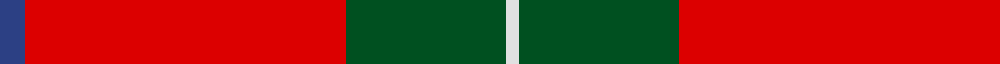

This page is one **sett** — a single exact thread-count. It belongs to the [tartan](/tartans/db4r50dg25w2/)
(the same proportion at any scale), whose colour order is pattern [BRGW](/stripes/brgw/).

Sourced from register-of-tartans.  It is a [4 stripe tartan](/stripes/stripes4/).

Original link https://www.tartanregister.gov.uk/tartanDetails.aspx?ref=4310

## Also known as

This cloth is also recorded under:

- Unidentified, Locket

## Register references

External register numbers recorded for this tartan.

- Scottish Register of Tartans: [4310](https://www.tartanregister.gov.uk/tartanDetails.aspx?ref=4310)
- Scottish Tartans World Register: 2040

## Thread count
B/8 R100 G50 LN/4

## Palette

Palette: <strong>Tartan Register</strong>
<table><thead><tr><th>Colour</th><th>Threads</th><th>Shade</th><th>Base</th><th>OKLCh</th></tr></thead><tbody><tr><td>B/</td><td style="text-align:right;font-variant-numeric:tabular-nums">8</td><td><code style="background-color:#2C4084;">#2C4084</code> <small style="color:#888">#2C4084</small></td><td>B <code style="background-color:#2A418A;">#2A418A</code></td><td><small style="color:#888">oklch(39.4% 0.117 268.3)</small></td></tr><tr><td>R</td><td style="text-align:right;font-variant-numeric:tabular-nums">100</td><td><code style="background-color:#DC0000;">#DC0000</code> <small style="color:#888">#DC0000</small></td><td>R <code style="background-color:#CC0000;">#CC0000</code></td><td><small style="color:#888">oklch(56.2% 0.230 29.2)</small></td></tr><tr><td>G</td><td style="text-align:right;font-variant-numeric:tabular-nums">50</td><td><code style="background-color:#005020;">#005020</code> <small style="color:#888">#005020</small></td><td>G <code style="background-color:#006100;">#006100</code></td><td><small style="color:#888">oklch(37.7% 0.105 149.6)</small></td></tr><tr><td>LN/</td><td style="text-align:right;font-variant-numeric:tabular-nums">4</td><td><code style="background-color:#E0E0E0;">#E0E0E0</code> <small style="color:#888">#E0E0E0</small></td><td>W <code style="background-color:#F7F7F7;">#F7F7F7</code></td><td><small style="color:#888">oklch(90.7% 0.000 89.9)</small></td></tr></tbody></table>

# Sample pattern

## Nearest tartans

The nearest existing variants by ΔTartan distance, with this tartan at the top so the swatches line up against it.

ΔTartan

Tartan

Sett

—

<a href="/ttd/edit/#slug=db4r50dg25w2~x2">Unidentified Locket</a> <a class="nn-out" href="/setts/s4/db4r50dg25w2~x2/" title="open its dictionary page">↗</a>

0.71

<a href="/ttd/edit/#slug=db4r50g25w2~x2">Unidentified, Locket</a> <a class="nn-out" href="/setts/s4/db4r50g25w2~x2/" title="open its dictionary page">↗</a>

1.03

<a href="/ttd/edit/#slug=r60k2w3dg20r10dg20~x2">Greig (Personal)</a> <a class="nn-out" href="/setts/s6/r60k2w3dg20r10dg20~x2/" title="open its dictionary page">↗</a>

1.07

<a href="/ttd/edit/#slug=r35dg16r5dg5w2k3~x2">MacGregor</a> <a class="nn-out" href="/setts/s6/r35dg16r5dg5w2k3~x2/" title="open its dictionary page">↗</a>

1.12

<a href="/ttd/edit/#slug=r36dg18r4dg6k1w2~x2">MacGregor #3</a> <a class="nn-out" href="/setts/s6/r36dg18r4dg6k1w2~x2/" title="open its dictionary page">↗</a>

1.20

<a href="/ttd/edit/#slug=r80t40k5lo6">Broberg (Scania) (Personal)</a> <a class="nn-out" href="/setts/s4/r80t40k5lo6/" title="open its dictionary page">↗</a>

1.22

<a href="/ttd/edit/#slug=r32dg8lb4ly1">MacLaine of Lochbuie</a> <a class="nn-out" href="/setts/s4/r32dg8lb4ly1/" title="open its dictionary page">↗</a>

1.23

<a href="/ttd/edit/#slug=r36dg18r4dg6k1lb2">MacGregor</a> <a class="nn-out" href="/setts/s6/r36dg18r4dg6k1lb2/" title="open its dictionary page">↗</a>

1.26

<a href="/ttd/edit/#slug=r41g19r7g8k1w3~x2">MacGregor #4</a> <a class="nn-out" href="/setts/s6/r41g19r7g8k1w3~x2/" title="open its dictionary page">↗</a>

1.29

<a href="/ttd/edit/#slug=r68db18r9dg34r9db3~x2">MacKintosh #2</a> <a class="nn-out" href="/setts/s6/r68db18r9dg34r9db3~x2/" title="open its dictionary page">↗</a>

1.29

<a href="/ttd/edit/#slug=r48k12o7k5w3~x2">Turner (Personal)</a> <a class="nn-out" href="/setts/s5/r48k12o7k5w3~x2/" title="open its dictionary page">↗</a>

## Neighbour map

Every grey dot is one of 14299 variants placed by the first two principal components of the ΔTartan feature space (44% of its variance). Red is this tartan; blue dots are its nearest — click one to open its page.

<svg viewBox="0 0 640 380" role="img" style="max-width:100%;height:auto;border:1px solid #e0e0e0;border-radius:4px;display:block" xmlns="http://www.w3.org/2000/svg"><image href="/nn/cloud.v1.png" width="640" height="380"/><a href="/setts/s4/db4r50g25w2~x2/"><circle cx="419.9" cy="181.7" r="4" fill="#3465a4"><title>Unidentified, Locket</title></circle></a><a href="/setts/s6/r60k2w3dg20r10dg20~x2/"><circle cx="419.6" cy="150.9" r="4" fill="#3465a4"><title>Greig (Personal)</title></circle></a><a href="/setts/s6/r35dg16r5dg5w2k3~x2/"><circle cx="387.6" cy="160.5" r="4" fill="#3465a4"><title>MacGregor</title></circle></a><a href="/setts/s6/r36dg18r4dg6k1w2~x2/"><circle cx="422.0" cy="134.2" r="4" fill="#3465a4"><title>MacGregor #3</title></circle></a><a href="/setts/s4/r80t40k5lo6/"><circle cx="406.5" cy="203.6" r="4" fill="#3465a4"><title>Broberg (Scania) (Personal)</title></circle></a><a href="/setts/s4/r32dg8lb4ly1/"><circle cx="490.6" cy="155.4" r="4" fill="#3465a4"><title>MacLaine of Lochbuie</title></circle></a><a href="/setts/s6/r36dg18r4dg6k1lb2/"><circle cx="426.0" cy="139.6" r="4" fill="#3465a4"><title>MacGregor</title></circle></a><a href="/setts/s6/r41g19r7g8k1w3~x2/"><circle cx="428.4" cy="137.8" r="4" fill="#3465a4"><title>MacGregor #4</title></circle></a><a href="/setts/s6/r68db18r9dg34r9db3~x2/"><circle cx="412.7" cy="180.5" r="4" fill="#3465a4"><title>MacKintosh #2</title></circle></a><a href="/setts/s5/r48k12o7k5w3~x2/"><circle cx="395.1" cy="161.0" r="4" fill="#3465a4"><title>Turner (Personal)</title></circle></a><circle cx="414.8" cy="174.9" r="5" fill="#c00000"/></svg>

ID: /setts/s4/db4r50dg25w2~x2/
