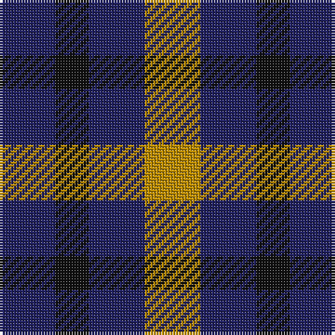

**Bands:** [BKBY](/stripes/bkby/) · **Stripes:** [DB K DB LO](/stripes/stripes4/) DB K DB LO

This was sourced from register-of-tartans.  It is a [4 band tartan](/bands/bands4/).

Original link https://www.tartanregister.gov.uk/tartanDetails.aspx?ref=5137

## Register references

External register numbers recorded for this tartan.

- Scottish Register of Tartans: [5137](https://www.tartanregister.gov.uk/tartanDetails.aspx?ref=5137)
- Scottish Tartans Authority (ITI): 3096

## Thread count
DB/20 K12 DB20 DY/20

## Palette
Each colour and its ΔE from the base-6 reference it is a variant of.

| Colour | Shade | Base | ΔE (OKLab) |
|---|---|---|---|
| DB | <code style="background-color:#202060;">#202060</code> `#202060` | B <code style="background-color:#2A418A;">#2A418A</code> | 0.11 |
| DY | <code style="background-color:#BC8C00;">#BC8C00</code> `#BC8C00` | Y <code style="background-color:#F2BF00;">#F2BF00</code> | 0.16 |
| K | <code style="background-color:#101010;">#101010</code> `#101010` | K <code style="background-color:#000000;">#000000</code> | 0.17 |

# Sample pattern

## Nearest tartans

The nearest existing variants by ΔTartan distance.

1. [Wilson's No.198](/setts/s3/r4k7t4~x2/) — ΔT 1.43
1. [Wilson's No.094](/setts/s4/g4k5g4r2~x2/) — ΔT 1.64
1. [Kazakhstan Relic (Artefact)](/setts/s3/lo5db5k3~x4/) — ΔT 1.77
1. [Wilson's No.061](/setts/s3/r4dg7t4~x2/) — ΔT 1.79
1. [Wilson's No.209](/setts/s4/g4dp5g4t2~x2/) — ΔT 1.81
1. [Allen, Nicholas (Personal)](/setts/s3/dt1k2r1~x42/) — ΔT 1.90
1. [Wilson's No.200](/setts/s3/g4k7r4~x2/) — ΔT 1.99
1. [Daks (Black)](/setts/s5/r3k6dy4k6y3~x2/) — ΔT 2.00
1. [Wilson's, No 209](/setts/s3/p5g4t2~x2/) — ΔT 2.00
1. [Daks, Black (Fashion)](/setts/s5/ly3k6dy4k6r3~x2/) — ΔT 2.02

## Neighbour map

Every grey dot is one of 14313 variants placed by the first two principal components of the ΔTartan feature space (44% of its variance). Red is this tartan; blue dots are its nearest — click one to open its page.

<svg viewBox="0 0 640 380" role="img" style="max-width:100%;height:auto;border:1px solid #e0e0e0;border-radius:4px;display:block" xmlns="http://www.w3.org/2000/svg"><image href="/nn/cloud.v1.png" width="640" height="380"/><a href="/setts/s3/r4k7t4~x2/"><circle cx="142.0" cy="366.0" r="4" fill="#3465a4"><title>Wilson's No.198</title></circle></a><a href="/setts/s4/g4k5g4r2~x2/"><circle cx="200.0" cy="359.5" r="4" fill="#3465a4"><title>Wilson's No.094</title></circle></a><a href="/setts/s3/lo5db5k3~x4/"><circle cx="94.0" cy="366.0" r="4" fill="#3465a4"><title>Kazakhstan Relic (Artefact)</title></circle></a><a href="/setts/s3/r4dg7t4~x2/"><circle cx="161.7" cy="366.0" r="4" fill="#3465a4"><title>Wilson's No.061</title></circle></a><a href="/setts/s4/g4dp5g4t2~x2/"><circle cx="217.2" cy="366.0" r="4" fill="#3465a4"><title>Wilson's No.209</title></circle></a><a href="/setts/s3/dt1k2r1~x42/"><circle cx="207.4" cy="366.0" r="4" fill="#3465a4"><title>Allen, Nicholas (Personal)</title></circle></a><a href="/setts/s3/g4k7r4~x2/"><circle cx="158.9" cy="366.0" r="4" fill="#3465a4"><title>Wilson's No.200</title></circle></a><a href="/setts/s5/r3k6dy4k6y3~x2/"><circle cx="184.7" cy="348.3" r="4" fill="#3465a4"><title>Daks (Black)</title></circle></a><a href="/setts/s3/p5g4t2~x2/"><circle cx="185.6" cy="361.5" r="4" fill="#3465a4"><title>Wilson's, No 209</title></circle></a><a href="/setts/s5/ly3k6dy4k6r3~x2/"><circle cx="146.8" cy="327.2" r="4" fill="#3465a4"><title>Daks, Black (Fashion)</title></circle></a><circle cx="171.4" cy="366.0" r="5" fill="#c00000"/></svg>

ID: /setts/s4/db5k3db5lo5~x4/
