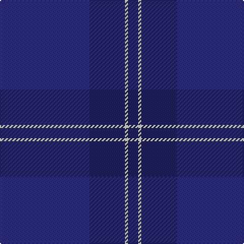

This page is one **sett** — a single exact thread-count. It belongs to the [tartan](/tartans/db88dba35ln3dba10/)
(the same proportion at any scale), whose colour order is pattern [BBWB](/stripes/bbwb/).

Sourced from house-of-tartan.  It is a [4 stripe tartan](/stripes/stripes4/).

Original link http://www.house-of-tartan.scotland.net/house/TartanViewjs.asp?colr=Def&tnam=2099

## Thread count
DB/88 DBa35 LN3 DBa/10

## Palette
Each colour and the base-6 reference it is a variant of.

| Colour | Shade | Base |
|---|---|---|
| DB | <code style="background-color:#2C2C80;">#2C2C80</code> `oklch(35.0% 0.138 276.6)` <small>#2C2C80</small> | B <code style="background-color:#2A418A;">#2A418A</code> |
| DBa | <code style="background-color:#202060;">#202060</code> `oklch(28.9% 0.111 276.9)` <small>#202060</small> | B <code style="background-color:#2A418A;">#2A418A</code> |
| LN | <code style="background-color:#E0E0E0;">#E0E0E0</code> `oklch(90.7% 0.000 89.9)` <small>#E0E0E0</small> | W <code style="background-color:#F7F7F7;">#F7F7F7</code> |

# Sample pattern

## Nearest tartans

The nearest existing variants by ΔTartan distance, with this tartan at the top so the swatches line up against it.

ΔTartan

Tartan

Sett

—

<a href="/ttd/edit/#slug=db88db35w3db10">Scottish Tourist Board (1990) Corporate Tartan Tartan Number: 2099. Earliest known date: 1990 This is in fact the second Scottish Tourist Board tartan and was designed in Navy, White and Blue in keeping with the new logo adopted this year by the Scottish Tourist Board. This supercedes the first tartan which was designed many years ago and reflected different colourings. See products available Copyright © Blair Urquhart, Comrie, 2015</a> <a class="nn-out" href="/setts/s4/db88db35w3db10/" title="open its dictionary page">↗</a>

0.62

<a href="/ttd/edit/#slug=db88dt35w3dt10">Scottish Tourist Board (1990)</a> <a class="nn-out" href="/setts/s4/db88dt35w3dt10/" title="open its dictionary page">↗</a>

2.85

<a href="/ttd/edit/#slug=dt4k43k20dt7y2~x2">Deighan (Edinburgh)</a> <a class="nn-out" href="/setts/s5/dt4k43k20dt7y2~x2/" title="open its dictionary page">↗</a>

3.28

<a href="/ttd/edit/#slug=db28db49ly3db49db28w4~x2">MacKerrell of Hillhouse Htg Family Tartan Tartan Number: 1758. Earliest known date: 1975 A MacKerral tartan was recorded by the Scottish Tartans Society in 1975. The Lyon Court Books contain the note &quot;Wefted in scarlet&quot;, referring to an unusual feature, that of replacing the yellow warp stripe with red in the weft. The name, MacKerrell or MacKerral, was recorded in Ayrshire in the 12th century. See products available Copyright © Blair Urquhart, Comrie, 2015</a> <a class="nn-out" href="/setts/s6/db28db49ly3db49db28w4~x2/" title="open its dictionary page">↗</a>

3.29

<a href="/ttd/edit/#slug=dt104db16w8db66r3db16">US Navy Edzell</a> <a class="nn-out" href="/setts/s6/dt104db16w8db66r3db16/" title="open its dictionary page">↗</a>

3.32

<a href="/ttd/edit/#slug=db8g5db72db72m5db16m5db72db72g5db8">Gravesend Grammar School (Corp)</a> <a class="nn-out" href="/setts/s11/db8g5db72db72m5db16m5db72db72g5db8/" title="open its dictionary page">↗</a>

3.37

<a href="/ttd/edit/#slug=r3dt32db2dt3db4dt2db16w1db1~x2">Dauphinee, Andrew Hunter (Personal)</a> <a class="nn-out" href="/setts/s9/r3dt32db2dt3db4dt2db16w1db1~x2/" title="open its dictionary page">↗</a>

3.44

<a href="/ttd/edit/#slug=dg23db3k8db4dg4db56dy8">Tern House</a> <a class="nn-out" href="/setts/s7/dg23db3k8db4dg4db56dy8/" title="open its dictionary page">↗</a>

3.46

<a href="/ttd/edit/#slug=db36db3db3db33w3db5w3db33db3db3db36db3~x2">Argentina Argentinian District Tartan Tartan Number: 2487. Earliest known date: 1998 Original notes said: Designed by the St Andrew's Society of the River Plate for Scots living in Argentina. But in May 2005 notes were submitted by the designer Edward Macrae, a Scottish-Argentinian who designed the Argentina District Tartan in 1998. It is based in the sett of the Robertson tartan honouring John and William Robertson two Scotsmen from Kelso who started the first settlement of Scottish immigrants in Argentina. 220 emigrants left the port of Leith on board of the Symmetry and arrived in Buenos Aires on August 8, 1825 settling in a ranch 20 miles south-west of the city in the area of Monte Grande and called Santa Catalina. The tartan combines the colours of the Argentine and Scottish flags. Blue, navy blue and white are part of the iconography used in sports and national symbols representing Argentina. See products available Copyright © Blair Urquhart, Comrie, 2015</a> <a class="nn-out" href="/setts/s12/db36db3db3db33w3db5w3db33db3db3db36db3~x2/" title="open its dictionary page">↗</a>

3.46

<a href="/ttd/edit/#slug=do2dg11dt27dg8r2~x2">Hector, James (Corporate)</a> <a class="nn-out" href="/setts/s5/do2dg11dt27dg8r2~x2/" title="open its dictionary page">↗</a>

3.50

<a href="/ttd/edit/#slug=g4db34dt20db4dt8db6r2db5dt2db3g4">Hughes Welsh Name Tartan Tartan Number: 5756. Earliest known date: 2002 The tartan for this Welsh surname and its variations, Hugh, Hullin, Hullyn, Huws, Pugh, Tugh, Hoell, is actually woven in Wales at the Cambrian Woollen Mill, weaving on the same site since 1830. This tartan differs from many traditional patterns in that the warp and weft differ, giving the finished worsted wool cloth more of a predominant stripe, vertically noticeable in the finished Kilt, or Cilt in Wales. See products available Copyright © Blair Urquhart, Comrie, 2015</a> <a class="nn-out" href="/setts/s11/g4db34dt20db4dt8db6r2db5dt2db3g4/" title="open its dictionary page">↗</a>

## Neighbour map

Every grey dot is one of 14299 variants placed by the first two principal components of the ΔTartan feature space (44% of its variance). Red is this tartan; blue dots are its nearest — click one to open its page.

<svg viewBox="0 0 640 380" role="img" style="max-width:100%;height:auto;border:1px solid #e0e0e0;border-radius:4px;display:block" xmlns="http://www.w3.org/2000/svg"><image href="/nn/cloud.v1.png" width="640" height="380"/><a href="/setts/s4/db88dt35w3dt10/"><circle cx="611.6" cy="307.1" r="4" fill="#3465a4"><title>Scottish Tourist Board (1990)</title></circle></a><a href="/setts/s5/dt4k43k20dt7y2~x2/"><circle cx="533.0" cy="302.7" r="4" fill="#3465a4"><title>Deighan (Edinburgh)</title></circle></a><a href="/setts/s6/db28db49ly3db49db28w4~x2/"><circle cx="455.8" cy="282.8" r="4" fill="#3465a4"><title>MacKerrell of Hillhouse Htg Family Tartan Tartan Number: 1758. Earliest known date: 1975 A MacKerral tartan was recorded by the Scottish Tartans Society in 1975. The Lyon Court Books contain the note &quot;Wefted in scarlet&quot;, referring to an unusual feature, that of replacing the yellow warp stripe with red in the weft. The name, MacKerrell or MacKerral, was recorded in Ayrshire in the 12th century. See products available Copyright © Blair Urquhart, Comrie, 2015</title></circle></a><a href="/setts/s6/dt104db16w8db66r3db16/"><circle cx="458.5" cy="228.8" r="4" fill="#3465a4"><title>US Navy Edzell</title></circle></a><a href="/setts/s11/db8g5db72db72m5db16m5db72db72g5db8/"><circle cx="463.0" cy="264.4" r="4" fill="#3465a4"><title>Gravesend Grammar School (Corp)</title></circle></a><a href="/setts/s9/r3dt32db2dt3db4dt2db16w1db1~x2/"><circle cx="529.3" cy="204.8" r="4" fill="#3465a4"><title>Dauphinee, Andrew Hunter (Personal)</title></circle></a><a href="/setts/s7/dg23db3k8db4dg4db56dy8/"><circle cx="527.1" cy="265.1" r="4" fill="#3465a4"><title>Tern House</title></circle></a><a href="/setts/s12/db36db3db3db33w3db5w3db33db3db3db36db3~x2/"><circle cx="448.6" cy="260.3" r="4" fill="#3465a4"><title>Argentina Argentinian District Tartan Tartan Number: 2487. Earliest known date: 1998 Original notes said: Designed by the St Andrew's Society of the River Plate for Scots living in Argentina. But in May 2005 notes were submitted by the designer Edward Macrae, a Scottish-Argentinian who designed the Argentina District Tartan in 1998. It is based in the sett of the Robertson tartan honouring John and William Robertson two Scotsmen from Kelso who started the first settlement of Scottish immigrants in Argentina. 220 emigrants left the port of Leith on board of the Symmetry and arrived in Buenos Aires on August 8, 1825 settling in a ranch 20 miles south-west of the city in the area of Monte Grande and called Santa Catalina. The tartan combines the colours of the Argentine and Scottish flags. Blue, navy blue and white are part of the iconography used in sports and national symbols representing Argentina. See products available Copyright © Blair Urquhart, Comrie, 2015</title></circle></a><a href="/setts/s5/do2dg11dt27dg8r2~x2/"><circle cx="491.9" cy="310.5" r="4" fill="#3465a4"><title>Hector, James (Corporate)</title></circle></a><a href="/setts/s11/g4db34dt20db4dt8db6r2db5dt2db3g4/"><circle cx="477.4" cy="239.4" r="4" fill="#3465a4"><title>Hughes Welsh Name Tartan Tartan Number: 5756. Earliest known date: 2002 The tartan for this Welsh surname and its variations, Hugh, Hullin, Hullyn, Huws, Pugh, Tugh, Hoell, is actually woven in Wales at the Cambrian Woollen Mill, weaving on the same site since 1830. This tartan differs from many traditional patterns in that the warp and weft differ, giving the finished worsted wool cloth more of a predominant stripe, vertically noticeable in the finished Kilt, or Cilt in Wales. See products available Copyright © Blair Urquhart, Comrie, 2015</title></circle></a><circle cx="618.5" cy="310.4" r="5" fill="#c00000"/></svg>

ID: /setts/s4/db88db35w3db10/
