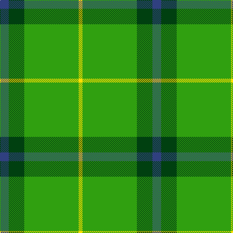

This page is one **sett** — a single exact thread-count. It belongs to the [tartan](/tartans/db9dg16g56ly4/)
(the same proportion at any scale), whose colour order is pattern [BGGY](/stripes/bggy/).

Sourced from weddslist.  It is a [4 stripe tartan](/stripes/stripes4/).

Original link http://www.weddslist.com/cgi-bin/tartans/pg.pl?source=sts

## Thread count
B/18 DG32 G112 Y/8

## Palette

Palette: <strong>custom</strong>
<table><thead><tr><th>Colour</th><th>Threads</th><th>Shade</th><th>Base</th><th>OKLCh</th></tr></thead><tbody><tr><td>B/</td><td style="text-align:right;font-variant-numeric:tabular-nums">18</td><td><code style="background-color:#304080;">#304080</code> <small style="color:#888">#304080</small></td><td>B <code style="background-color:#2A418A;">#2A418A</code></td><td><small style="color:#888">oklch(39.4% 0.109 270.2)</small></td></tr><tr><td>DG</td><td style="text-align:right;font-variant-numeric:tabular-nums">32</td><td><code style="background-color:#004010;">#004010</code> <small style="color:#888">#004010</small></td><td>G <code style="background-color:#006100;">#006100</code></td><td><small style="color:#888">oklch(32.3% 0.098 146.3)</small></td></tr><tr><td>G</td><td style="text-align:right;font-variant-numeric:tabular-nums">112</td><td><code style="background-color:#30A010;">#30A010</code> <small style="color:#888">#30A010</small></td><td>G <code style="background-color:#006100;">#006100</code></td><td><small style="color:#888">oklch(61.9% 0.195 140.5)</small></td></tr><tr><td>Y/</td><td style="text-align:right;font-variant-numeric:tabular-nums">8</td><td><code style="background-color:#FFE000;">#FFE000</code> <small style="color:#888">#FFE000</small></td><td>Y <code style="background-color:#F2BF00;">#F2BF00</code></td><td><small style="color:#888">oklch(90.5% 0.188 99.1)</small></td></tr></tbody></table>

# Sample pattern

## Nearest tartans

The nearest existing variants by ΔTartan distance, with this tartan at the top so the swatches line up against it.

ΔTartan

Tartan

Sett

—

<a href="/ttd/edit/#slug=db9dg16g56ly4~x2">Oxford University</a> <a class="nn-out" href="/setts/s4/db9dg16g56ly4~x2/" title="open its dictionary page">↗</a>

1.10

<a href="/ttd/edit/#slug=g56dy13ly13w5~x2">Colonial Marine (Aliens Legacy)</a> <a class="nn-out" href="/setts/s4/g56dy13ly13w5~x2/" title="open its dictionary page">↗</a>

1.31

<a href="/ttd/edit/#slug=g14ly7g14dg50g64w6g7">Freedom of Derry</a> <a class="nn-out" href="/setts/s7/g14ly7g14dg50g64w6g7/" title="open its dictionary page">↗</a>

1.46

<a href="/ttd/edit/#slug=t1db4g10w1~x2">Wilson's, No 205</a> <a class="nn-out" href="/setts/s4/t1db4g10w1~x2/" title="open its dictionary page">↗</a>

1.54

<a href="/ttd/edit/#slug=k3lb1g15g6k2dr3lb2~x2">Leach Hunting</a> <a class="nn-out" href="/setts/s7/k3lb1g15g6k2dr3lb2~x2/" title="open its dictionary page">↗</a>

1.65

<a href="/ttd/edit/#slug=dt5lo5dy13g41r3~x2">Clare, Richard (Personal)</a> <a class="nn-out" href="/setts/s5/dt5lo5dy13g41r3~x2/" title="open its dictionary page">↗</a>

1.71

<a href="/ttd/edit/#slug=k3lb1g21k2dr3lb2~x2">Leach Htg (Name)</a> <a class="nn-out" href="/setts/s6/k3lb1g21k2dr3lb2~x2/" title="open its dictionary page">↗</a>

1.75

<a href="/ttd/edit/#slug=k2ly1g7t1~x2">Wilson's No.140</a> <a class="nn-out" href="/setts/s4/k2ly1g7t1~x2/" title="open its dictionary page">↗</a>

1.79

<a href="/ttd/edit/#slug=g9ly20g40w5~x2">O'Neill Irish Family Tartan Tartan Number: 2464. Earliest known date: 1985 O'Neill is an Irish family tartan. The dark yellow stripe is mustard or dark saffron. See products available Copyright © Blair Urquhart, Comrie, 2015</a> <a class="nn-out" href="/setts/s4/g9ly20g40w5~x2/" title="open its dictionary page">↗</a>

1.81

<a href="/ttd/edit/#slug=g8w4g50k12g4k15lo5~x2">Instakilt, Green (Fashion)</a> <a class="nn-out" href="/setts/s7/g8w4g50k12g4k15lo5~x2/" title="open its dictionary page">↗</a>

1.81

<a href="/ttd/edit/#slug=db1r3g11r2db5g11ly1~x2">MacKintosh, hunting</a> <a class="nn-out" href="/setts/s7/db1r3g11r2db5g11ly1~x2/" title="open its dictionary page">↗</a>

## Neighbour map

Every grey dot is one of 14359 variants placed by the first two principal components of the ΔTartan feature space (44% of its variance). Red is this tartan; blue dots are its nearest — click one to open its page.

<svg viewBox="0 0 640 380" role="img" style="max-width:100%;height:auto;border:1px solid #e0e0e0;border-radius:4px;display:block" xmlns="http://www.w3.org/2000/svg"><image href="/nn/cloud.v1.png" width="640" height="380"/><a href="/setts/s4/g56dy13ly13w5~x2/"><circle cx="363.8" cy="225.2" r="4" fill="#3465a4"><title>Colonial Marine (Aliens Legacy)</title></circle></a><a href="/setts/s7/g14ly7g14dg50g64w6g7/"><circle cx="336.3" cy="205.7" r="4" fill="#3465a4"><title>Freedom of Derry</title></circle></a><a href="/setts/s4/t1db4g10w1~x2/"><circle cx="359.7" cy="240.7" r="4" fill="#3465a4"><title>Wilson's, No 205</title></circle></a><a href="/setts/s7/k3lb1g15g6k2dr3lb2~x2/"><circle cx="351.1" cy="180.2" r="4" fill="#3465a4"><title>Leach Hunting</title></circle></a><a href="/setts/s5/dt5lo5dy13g41r3~x2/"><circle cx="359.4" cy="196.9" r="4" fill="#3465a4"><title>Clare, Richard (Personal)</title></circle></a><a href="/setts/s6/k3lb1g21k2dr3lb2~x2/"><circle cx="386.6" cy="154.2" r="4" fill="#3465a4"><title>Leach Htg (Name)</title></circle></a><a href="/setts/s4/k2ly1g7t1~x2/"><circle cx="336.9" cy="248.6" r="4" fill="#3465a4"><title>Wilson's No.140</title></circle></a><a href="/setts/s4/g9ly20g40w5~x2/"><circle cx="361.9" cy="261.2" r="4" fill="#3465a4"><title>O'Neill Irish Family Tartan Tartan Number: 2464. Earliest known date: 1985 O'Neill is an Irish family tartan. The dark yellow stripe is mustard or dark saffron. See products available Copyright © Blair Urquhart, Comrie, 2015</title></circle></a><a href="/setts/s7/g8w4g50k12g4k15lo5~x2/"><circle cx="337.8" cy="177.2" r="4" fill="#3465a4"><title>Instakilt, Green (Fashion)</title></circle></a><a href="/setts/s7/db1r3g11r2db5g11ly1~x2/"><circle cx="364.6" cy="218.0" r="4" fill="#3465a4"><title>MacKintosh, hunting</title></circle></a><circle cx="384.0" cy="221.3" r="5" fill="#c00000"/></svg>

ID: /setts/s4/db9dg16g56ly4~x2/
