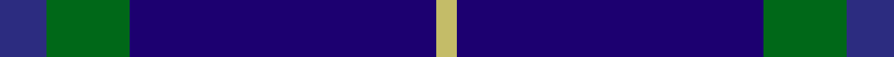
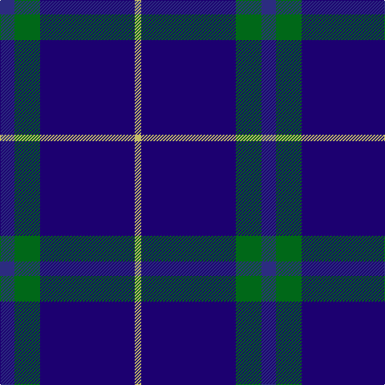

This page is one **sett** — a single exact thread-count. It belongs to the [tartan](/tartans/dbi9g16db59ly4/)
(the same proportion at any scale), whose colour order is pattern [BGBY](/stripes/bgby/).

Sourced from tartans-authority.  It is a [4 stripe tartan](/stripes/stripes4/).

Original link http://www.tartansauthority.com/tartan-ferret/display/2652/

## Register references

External register numbers recorded for this tartan.

- Scottish Tartans Authority (ITI): 2652

## Thread count
DB/18 G32 DBa118 LG/8

## Palette

Palette: <strong>Tartan Register</strong>
<table><thead><tr><th>Colour</th><th>Threads</th><th>Shade</th><th>Base</th><th>OKLCh</th></tr></thead><tbody><tr><td>DB/</td><td style="text-align:right;font-variant-numeric:tabular-nums">18</td><td><code style="background-color:#2C2C80;">#2C2C80</code> <small style="color:#888">#2C2C80</small></td><td>B <code style="background-color:#2A418A;">#2A418A</code></td><td><small style="color:#888">oklch(35.0% 0.138 276.6)</small></td></tr><tr><td>G</td><td style="text-align:right;font-variant-numeric:tabular-nums">32</td><td><code style="background-color:#006818;">#006818</code> <small style="color:#888">#006818</small></td><td>G <code style="background-color:#006100;">#006100</code></td><td><small style="color:#888">oklch(45.0% 0.142 145.0)</small></td></tr><tr><td>DBa</td><td style="text-align:right;font-variant-numeric:tabular-nums">118</td><td><code style="background-color:#1C0070;">#1C0070</code> <small style="color:#888">#1C0070</small></td><td>B <code style="background-color:#2A418A;">#2A418A</code></td><td><small style="color:#888">oklch(26.3% 0.162 277.1)</small></td></tr><tr><td>LG/</td><td style="text-align:right;font-variant-numeric:tabular-nums">8</td><td><code style="background-color:#C4BC68;">#C4BC68</code> <small style="color:#888">#C4BC68</small></td><td>Y <code style="background-color:#F2BF00;">#F2BF00</code></td><td><small style="color:#888">oklch(78.4% 0.107 103.7)</small></td></tr></tbody></table>

# Sample pattern

## Nearest tartans

The nearest existing variants by ΔTartan distance, with this tartan at the top so the swatches line up against it.

ΔTartan

Tartan

Sett

—

<a href="/ttd/edit/#slug=dbi9g16db59ly4~x2">Oxford University (Corporate)</a> <a class="nn-out" href="/setts/s4/dbi9g16db59ly4~x2/" title="open its dictionary page">↗</a>

1.00

<a href="/ttd/edit/#slug=db14k3r3w1~x2">Bacon, Blue</a> <a class="nn-out" href="/setts/s4/db14k3r3w1~x2/" title="open its dictionary page">↗</a>

1.28

<a href="/ttd/edit/#slug=g16db59ly4db59g16dbi9~x2">Oxford University</a> <a class="nn-out" href="/setts/s6/g16db59ly4db59g16dbi9~x2/" title="open its dictionary page">↗</a>

1.42

<a href="/ttd/edit/#slug=db24n13db4n4w2~x2">Gallaecia - Galicia National</a> <a class="nn-out" href="/setts/s5/db24n13db4n4w2~x2/" title="open its dictionary page">↗</a>

1.45

<a href="/ttd/edit/#slug=r1db9k4lb1~x4">Scottish Nuclear (Corporate)</a> <a class="nn-out" href="/setts/s4/r1db9k4lb1~x4/" title="open its dictionary page">↗</a>

1.47

<a href="/ttd/edit/#slug=dg1db2dbi5db11ly1~x4">Open Championship, The</a> <a class="nn-out" href="/setts/s5/dg1db2dbi5db11ly1~x4/" title="open its dictionary page">↗</a>

1.48

<a href="/ttd/edit/#slug=k1lo2k3db12k18w1~x2">Jon's Theme (Fashion)</a> <a class="nn-out" href="/setts/s6/k1lo2k3db12k18w1~x2/" title="open its dictionary page">↗</a>

1.51

<a href="/ttd/edit/#slug=k1ly2k3n12k18w1~x2">Jon's Theme</a> <a class="nn-out" href="/setts/s6/k1ly2k3n12k18w1~x2/" title="open its dictionary page">↗</a>

1.53

<a href="/ttd/edit/#slug=w4t34db60ly3~x2">MacKerral Family Tartan Tartan Number: 1757. Earliest known date: 1975 A sample was presented to the Scottish Tartans Society by John Drummond Bowman. This version of the tartan has the unusual feature of exchanging red for yellow in the weft. It is larger than the sett recorded in the Lyon Court Books in 1982. The name, MacKerral or MacKerrell, is recorded in Ayrshire in the 12th century. See products available Copyright © Blair Urquhart, Comrie, 2015</a> <a class="nn-out" href="/setts/s4/w4t34db60ly3~x2/" title="open its dictionary page">↗</a>

1.56

<a href="/ttd/edit/#slug=dg20r7db40w2~x2">McNiff, Kevin (Personal)</a> <a class="nn-out" href="/setts/s4/dg20r7db40w2~x2/" title="open its dictionary page">↗</a>

1.57

<a href="/ttd/edit/#slug=w4t28db49ly3~x2">McKerrell of Hillhouse</a> <a class="nn-out" href="/setts/s4/w4t28db49ly3~x2/" title="open its dictionary page">↗</a>

## Neighbour map

Every grey dot is one of 14359 variants placed by the first two principal components of the ΔTartan feature space (44% of its variance). Red is this tartan; blue dots are its nearest — click one to open its page.

<svg viewBox="0 0 640 380" role="img" style="max-width:100%;height:auto;border:1px solid #e0e0e0;border-radius:4px;display:block" xmlns="http://www.w3.org/2000/svg"><image href="/nn/cloud.v1.png" width="640" height="380"/><a href="/setts/s4/db14k3r3w1~x2/"><circle cx="412.0" cy="225.3" r="4" fill="#3465a4"><title>Bacon, Blue</title></circle></a><a href="/setts/s6/g16db59ly4db59g16dbi9~x2/"><circle cx="454.3" cy="231.7" r="4" fill="#3465a4"><title>Oxford University</title></circle></a><a href="/setts/s5/db24n13db4n4w2~x2/"><circle cx="397.1" cy="255.0" r="4" fill="#3465a4"><title>Gallaecia - Galicia National</title></circle></a><a href="/setts/s4/r1db9k4lb1~x4/"><circle cx="346.3" cy="244.7" r="4" fill="#3465a4"><title>Scottish Nuclear (Corporate)</title></circle></a><a href="/setts/s5/dg1db2dbi5db11ly1~x4/"><circle cx="424.2" cy="249.6" r="4" fill="#3465a4"><title>Open Championship, The</title></circle></a><a href="/setts/s6/k1lo2k3db12k18w1~x2/"><circle cx="373.9" cy="194.9" r="4" fill="#3465a4"><title>Jon's Theme (Fashion)</title></circle></a><a href="/setts/s6/k1ly2k3n12k18w1~x2/"><circle cx="366.0" cy="187.5" r="4" fill="#3465a4"><title>Jon's Theme</title></circle></a><a href="/setts/s4/w4t34db60ly3~x2/"><circle cx="380.2" cy="208.0" r="4" fill="#3465a4"><title>MacKerral Family Tartan Tartan Number: 1757. Earliest known date: 1975 A sample was presented to the Scottish Tartans Society by John Drummond Bowman. This version of the tartan has the unusual feature of exchanging red for yellow in the weft. It is larger than the sett recorded in the Lyon Court Books in 1982. The name, MacKerral or MacKerrell, is recorded in Ayrshire in the 12th century. See products available Copyright © Blair Urquhart, Comrie, 2015</title></circle></a><a href="/setts/s4/dg20r7db40w2~x2/"><circle cx="370.3" cy="222.2" r="4" fill="#3465a4"><title>McNiff, Kevin (Personal)</title></circle></a><a href="/setts/s4/w4t28db49ly3~x2/"><circle cx="345.4" cy="211.7" r="4" fill="#3465a4"><title>McKerrell of Hillhouse</title></circle></a><circle cx="422.5" cy="231.1" r="5" fill="#c00000"/></svg>

ID: /setts/s4/dbi9g16db59ly4~x2/
