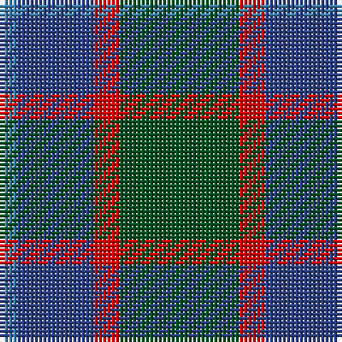

In pattern [BBRG](/stripes/bbrg/).

This was sourced from register-of-tartans.  It is a [4 stripe tartan](/stripes/stripes4/).

Original link https://www.tartanregister.gov.uk/tartanDetails.aspx?ref=4205

## Register references

External register numbers recorded for this tartan.

- Scottish Register of Tartans: [4205](https://www.tartanregister.gov.uk/tartanDetails.aspx?ref=4205)
- Scottish Tartans World Register: 70

## Thread count
G/28 R6 Ba18 B/4

## Palette
Each colour and the base-6 reference it is a variant of.

| Colour | Shade | Base |
|---|---|---|
| B | <code style="background-color:#3C82AF;">#3C82AF</code> `oklch(58.1% 0.099 239.8)` <small>#3C82AF</small> | B <code style="background-color:#2A418A;">#2A418A</code> |
| Ba | <code style="background-color:#2C4084;">#2C4084</code> `oklch(39.4% 0.117 268.3)` <small>#2C4084</small> | B <code style="background-color:#2A418A;">#2A418A</code> |
| G | <code style="background-color:#005020;">#005020</code> `oklch(37.7% 0.105 149.6)` <small>#005020</small> | G <code style="background-color:#006100;">#006100</code> |
| R | <code style="background-color:#DC0000;">#DC0000</code> `oklch(56.2% 0.230 29.2)` <small>#DC0000</small> | R <code style="background-color:#CC0000;">#CC0000</code> |

# Sample pattern

## Nearest tartans

The nearest existing variants by ΔTartan distance.

1. [MacNab](/setts/s4/dg15r3db11t2~x2/) — ΔT 0.68
1. [Harbour Town Hilton Head, The](/setts/s6/dt3g11dt3dr11dt18lo3~x2/) — ΔT 1.06
1. [Bethlehem, City of (District)](/setts/s5/db3o10g9r1g3~x4/) — ΔT 1.13
1. [Unidentified 10](/setts/s4/g14r3db9t2~x2/) — ΔT 1.22
1. [Flower of Scotland Commemorative Tartan Tartan Number: 2059. Earliest known date: September 1990 Designed as a tribute to Roy Williamson, writer of the words and music of 'The Flower of Scotland'. Roy wore the Gunn tartan which has been used as the framework of the new tartan. Cornflower blue and Zephyr green have been used to suggest the bluebell and the thistle. Worn by the Seafield and District pipe band, Strathallan Games, 1994 (UK Reg. Design No.600421) See products available Copyright © Blair Urquhart, Comrie, 2015](/setts/s6/o1b7k4b1g7b1~x4/) — ΔT 1.25
1. [Flower of Scotland MINI Tartan Tartan Number: 20599. Earliest known date: Dupion Silk. Generated only for display purposes. reduced copy of the original 2059 Flower of Scotland. See products available Copyright © Blair Urquhart, Comrie, 2015](/setts/s6/o1b7k4b1g7b1~x2/) — ΔT 1.25
1. [Thompson/Thomson/MacTavish Hunting](/setts/s6/t4dy28dg6t12k12t3~x2/) — ΔT 1.35
1. [Scott Green (Sir Walter)](/setts/s6/g3t1db7t1g3k1~x8/) — ΔT 1.39
1. [Scottish Airports](/setts/s6/n4g18n3k17n18p4~x2/) — ΔT 1.44
1. [Bean of Freeport Htg (Corporate)](/setts/s7/dt6r15g41r15dt20g41db6/) — ΔT 1.45

## Neighbour map

Every grey dot is one of 14299 variants placed by the first two principal components of the ΔTartan feature space (44% of its variance). Red is this tartan; blue dots are its nearest — click one to open its page.

<svg viewBox="0 0 640 380" role="img" style="max-width:100%;height:auto;border:1px solid #e0e0e0;border-radius:4px;display:block" xmlns="http://www.w3.org/2000/svg"><image href="/nn/cloud.v1.png" width="640" height="380"/><a href="/setts/s4/dg15r3db11t2~x2/"><circle cx="282.7" cy="277.8" r="4" fill="#3465a4"><title>MacNab</title></circle></a><a href="/setts/s6/dt3g11dt3dr11dt18lo3~x2/"><circle cx="278.0" cy="277.7" r="4" fill="#3465a4"><title>Harbour Town Hilton Head, The</title></circle></a><a href="/setts/s5/db3o10g9r1g3~x4/"><circle cx="279.6" cy="255.3" r="4" fill="#3465a4"><title>Bethlehem, City of (District)</title></circle></a><a href="/setts/s4/g14r3db9t2~x2/"><circle cx="267.6" cy="271.4" r="4" fill="#3465a4"><title>Unidentified 10</title></circle></a><a href="/setts/s6/o1b7k4b1g7b1~x4/"><circle cx="238.7" cy="252.6" r="4" fill="#3465a4"><title>Flower of Scotland Commemorative Tartan Tartan Number: 2059. Earliest known date: September 1990 Designed as a tribute to Roy Williamson, writer of the words and music of 'The Flower of Scotland'. Roy wore the Gunn tartan which has been used as the framework of the new tartan. Cornflower blue and Zephyr green have been used to suggest the bluebell and the thistle. Worn by the Seafield and District pipe band, Strathallan Games, 1994 (UK Reg. Design No.600421) See products available Copyright © Blair Urquhart, Comrie, 2015</title></circle></a><a href="/setts/s6/o1b7k4b1g7b1~x2/"><circle cx="238.7" cy="252.6" r="4" fill="#3465a4"><title>Flower of Scotland MINI Tartan Tartan Number: 20599. Earliest known date: Dupion Silk. Generated only for display purposes. reduced copy of the original 2059 Flower of Scotland. See products available Copyright © Blair Urquhart, Comrie, 2015</title></circle></a><a href="/setts/s6/t4dy28dg6t12k12t3~x2/"><circle cx="249.9" cy="241.5" r="4" fill="#3465a4"><title>Thompson/Thomson/MacTavish Hunting</title></circle></a><a href="/setts/s6/g3t1db7t1g3k1~x8/"><circle cx="249.7" cy="252.0" r="4" fill="#3465a4"><title>Scott Green (Sir Walter)</title></circle></a><a href="/setts/s6/n4g18n3k17n18p4~x2/"><circle cx="211.4" cy="275.0" r="4" fill="#3465a4"><title>Scottish Airports</title></circle></a><a href="/setts/s7/dt6r15g41r15dt20g41db6/"><circle cx="305.0" cy="258.2" r="4" fill="#3465a4"><title>Bean of Freeport Htg (Corporate)</title></circle></a><circle cx="292.1" cy="284.5" r="5" fill="#c00000"/></svg>

ID: /setts/s4/dg14r3db9t2~x2/
