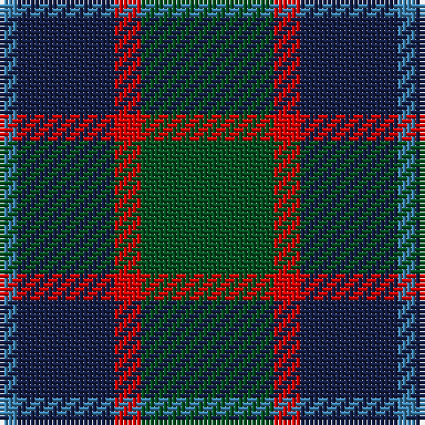

**Bands:** [BBRG](/stripes/bbrg/) · **Stripes:** [T DB R DG](/stripes/stripes4/) T DB R DG

This was sourced from register-of-tartans.  It is a [4 band tartan](/bands/bands4/).

Original link https://www.tartanregister.gov.uk/tartanDetails.aspx?ref=2664

## Register references

External register numbers recorded for this tartan.

- Scottish Register of Tartans: [2664](https://www.tartanregister.gov.uk/tartanDetails.aspx?ref=2664)
- Scottish Tartans World Register: 69

## Variants

Other setts woven to the same stripe pattern.

- [Unidentified #4](/setts/s4/dg14r3db9t2~x2/)

## Thread count
B/4 DB22 R6 G/30

## Palette
Each colour and its ΔE from the base-6 reference it is a variant of.

| Colour | Shade | Base | ΔE (OKLab) |
|---|---|---|---|
| B | <code style="background-color:#3C82AF;">#3C82AF</code> `#3C82AF` | B <code style="background-color:#2A418A;">#2A418A</code> | 0.19 |
| DB | <code style="background-color:#141E46;">#141E46</code> `#141E46` | B <code style="background-color:#2A418A;">#2A418A</code> | 0.16 |
| G | <code style="background-color:#005020;">#005020</code> `#005020` | G <code style="background-color:#006100;">#006100</code> | 0.07 |
| R | <code style="background-color:#DC0000;">#DC0000</code> `#DC0000` | R <code style="background-color:#CC0000;">#CC0000</code> | 0.03 |

# Sample pattern

## Nearest tartans

The nearest existing variants by ΔTartan distance.

1. [Unidentified #4](/setts/s4/dg14r3db9t2~x2/) — ΔT 0.68
1. [MacArthur of Milton (Clan)](/setts/s6/g7db1g1k4dp4k1~x4/) — ΔT 1.19
1. [Wilson's No.062](/setts/s4/g13r2db13r2~x2/) — ΔT 1.20
1. [Bethlehem, City of](/setts/s5/db3o10dg9r1dg3~x4/) — ΔT 1.21
1. [Mayer, Chris (Personal)](/setts/s4/db1n6k6r1~x10/) — ΔT 1.22
1. [Wilson's Folio 131](/setts/s5/db12k17dg19w2k5~x2/) — ΔT 1.22
1. [Thompson/Thomson/MacTavish Hunting](/setts/s6/t4dy28dg6t12k12t3~x2/) — ΔT 1.23
1. [MacKay (Bonner)](/setts/s6/dg1db5dg1k5dg6ly1~x2/) — ΔT 1.23
1. [Trafalgar (Fashion)](/setts/s6/g3db1g8db7k3ly1~x2/) — ΔT 1.26
1. [Unidentified 10](/setts/s4/g14r3db9t2~x2/) — ΔT 1.26

## Neighbour map

Every grey dot is one of 14313 variants placed by the first two principal components of the ΔTartan feature space (44% of its variance). Red is this tartan; blue dots are its nearest — click one to open its page.

<svg viewBox="0 0 640 380" role="img" style="max-width:100%;height:auto;border:1px solid #e0e0e0;border-radius:4px;display:block" xmlns="http://www.w3.org/2000/svg"><image href="/nn/cloud.v1.png" width="640" height="380"/><a href="/setts/s4/dg14r3db9t2~x2/"><circle cx="292.1" cy="284.6" r="4" fill="#3465a4"><title>Unidentified #4</title></circle></a><a href="/setts/s6/g7db1g1k4dp4k1~x4/"><circle cx="233.2" cy="248.6" r="4" fill="#3465a4"><title>MacArthur of Milton (Clan)</title></circle></a><a href="/setts/s4/g13r2db13r2~x2/"><circle cx="273.1" cy="284.6" r="4" fill="#3465a4"><title>Wilson's No.062</title></circle></a><a href="/setts/s5/db3o10dg9r1dg3~x4/"><circle cx="256.4" cy="242.9" r="4" fill="#3465a4"><title>Bethlehem, City of</title></circle></a><a href="/setts/s4/db1n6k6r1~x10/"><circle cx="253.7" cy="274.7" r="4" fill="#3465a4"><title>Mayer, Chris (Personal)</title></circle></a><a href="/setts/s5/db12k17dg19w2k5~x2/"><circle cx="222.4" cy="268.2" r="4" fill="#3465a4"><title>Wilson's Folio 131</title></circle></a><a href="/setts/s6/t4dy28dg6t12k12t3~x2/"><circle cx="249.9" cy="241.4" r="4" fill="#3465a4"><title>Thompson/Thomson/MacTavish Hunting</title></circle></a><a href="/setts/s6/dg1db5dg1k5dg6ly1~x2/"><circle cx="212.7" cy="265.6" r="4" fill="#3465a4"><title>MacKay (Bonner)</title></circle></a><a href="/setts/s6/g3db1g8db7k3ly1~x2/"><circle cx="248.8" cy="247.5" r="4" fill="#3465a4"><title>Trafalgar (Fashion)</title></circle></a><a href="/setts/s4/g14r3db9t2~x2/"><circle cx="267.6" cy="271.5" r="4" fill="#3465a4"><title>Unidentified 10</title></circle></a><circle cx="282.6" cy="277.9" r="5" fill="#c00000"/></svg>

ID: /setts/s4/dg15r3db11t2~x2/
