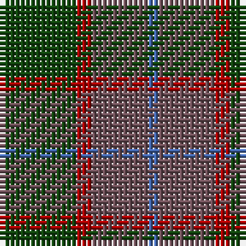

This page is one **sett** — a single exact thread-count. It belongs to the [tartan](/tartans/dg15r3n11b2/)
(the same proportion at any scale), whose colour order is pattern [BBRG](/stripes/bbrg/).

Sourced from weddslist.  It is a [4 stripe tartan](/stripes/stripes4/).

Original link http://www.weddslist.com/cgi-bin/tartans/pg.pl?source=x

## Also known as

This cloth is also recorded under:

- MacNab WI 2

## Thread count
DG/15 DR3 N11 B/2

## Palette

Palette: <strong>custom</strong>
<table><thead><tr><th>Colour</th><th>Threads</th><th>Shade</th><th>Base</th><th>OKLCh</th></tr></thead><tbody><tr><td>DG/</td><td style="text-align:right;font-variant-numeric:tabular-nums">15</td><td><code style="background-color:#11450D;">#11450D</code> <small style="color:#888">#11450D</small></td><td>G <code style="background-color:#006100;">#006100</code></td><td><small style="color:#888">oklch(34.4% 0.101 142.1)</small></td></tr><tr><td>DR</td><td style="text-align:right;font-variant-numeric:tabular-nums">3</td><td><code style="background-color:#AA0000;">#AA0000</code> <small style="color:#888">#AA0000</small></td><td>R <code style="background-color:#CC0000;">#CC0000</code></td><td><small style="color:#888">oklch(46.3% 0.190 29.2)</small></td></tr><tr><td>N</td><td style="text-align:right;font-variant-numeric:tabular-nums">11</td><td><code style="background-color:#6E5058;">#6E5058</code> <small style="color:#888">#6E5058</small></td><td>B <code style="background-color:#2A418A;">#2A418A</code></td><td><small style="color:#888">oklch(46.6% 0.042 1.2)</small></td></tr><tr><td>B/</td><td style="text-align:right;font-variant-numeric:tabular-nums">2</td><td><code style="background-color:#4367AE;">#4367AE</code> <small style="color:#888">#4367AE</small></td><td>B <code style="background-color:#2A418A;">#2A418A</code></td><td><small style="color:#888">oklch(52.2% 0.120 262.7)</small></td></tr></tbody></table>

# Sample pattern

## Nearest tartans

The nearest existing variants by ΔTartan distance, with this tartan at the top so the swatches line up against it.

ΔTartan

Tartan

Sett

—

<a href="/ttd/edit/#slug=dg15r3n11b2">MacNab WI2</a> <a class="nn-out" href="/setts/s4/dg15r3n11b2/" title="open its dictionary page">↗</a>

0.00

<a href="/ttd/edit/#slug=dg15r3n11b2~x2">MacNab WI 2</a> <a class="nn-out" href="/setts/s4/dg15r3n11b2~x2/" title="open its dictionary page">↗</a>

1.39

<a href="/ttd/edit/#slug=r1dg8dy8w1~x2">MacKinnon Hunting #2</a> <a class="nn-out" href="/setts/s4/r1dg8dy8w1~x2/" title="open its dictionary page">↗</a>

1.49

<a href="/ttd/edit/#slug=dy4lg11dy14o30r4~x2">Trinity Bicycles</a> <a class="nn-out" href="/setts/s5/dy4lg11dy14o30r4~x2/" title="open its dictionary page">↗</a>

1.51

<a href="/ttd/edit/#slug=dt1dy1dt7dy5y7lr1~x4">Dewar (WCWM)</a> <a class="nn-out" href="/setts/s6/dt1dy1dt7dy5y7lr1~x4/" title="open its dictionary page">↗</a>

1.55

<a href="/ttd/edit/#slug=dg1dr8dg8r1dg8dr8lr1~x4">MacKinnon Hunting</a> <a class="nn-out" href="/setts/s7/dg1dr8dg8r1dg8dr8lr1~x4/" title="open its dictionary page">↗</a>

1.55

<a href="/ttd/edit/#slug=dg1dr8dg8r1dg8dr8lr1~x2">MacKinnon Hunting</a> <a class="nn-out" href="/setts/s7/dg1dr8dg8r1dg8dr8lr1~x2/" title="open its dictionary page">↗</a>

1.58

<a href="/ttd/edit/#slug=dy46g23b23r4ly4~x2">McMoosie Htg (Fashion)</a> <a class="nn-out" href="/setts/s5/dy46g23b23r4ly4~x2/" title="open its dictionary page">↗</a>

1.58

<a href="/ttd/edit/#slug=dg2dp10dy15dg10dp2~x4">Harmony 6</a> <a class="nn-out" href="/setts/s5/dg2dp10dy15dg10dp2~x4/" title="open its dictionary page">↗</a>

1.58

<a href="/ttd/edit/#slug=g7dy6dt7dy1dt2~x6">Bright of Garth (Personal)</a> <a class="nn-out" href="/setts/s5/g7dy6dt7dy1dt2~x6/" title="open its dictionary page">↗</a>

1.60

<a href="/ttd/edit/#slug=dy1db3dy1dg3dy4r1~x2">Fraser Hunting #2</a> <a class="nn-out" href="/setts/s6/dy1db3dy1dg3dy4r1~x2/" title="open its dictionary page">↗</a>

## Neighbour map

Every grey dot is one of 14299 variants placed by the first two principal components of the ΔTartan feature space (44% of its variance). Red is this tartan; blue dots are its nearest — click one to open its page.

<svg viewBox="0 0 640 380" role="img" style="max-width:100%;height:auto;border:1px solid #e0e0e0;border-radius:4px;display:block" xmlns="http://www.w3.org/2000/svg"><image href="/nn/cloud.v1.png" width="640" height="380"/><a href="/setts/s4/dg15r3n11b2~x2/"><circle cx="335.6" cy="299.8" r="4" fill="#3465a4"><title>MacNab WI 2</title></circle></a><a href="/setts/s4/r1dg8dy8w1~x2/"><circle cx="309.1" cy="277.8" r="4" fill="#3465a4"><title>MacKinnon Hunting #2</title></circle></a><a href="/setts/s5/dy4lg11dy14o30r4~x2/"><circle cx="317.4" cy="270.2" r="4" fill="#3465a4"><title>Trinity Bicycles</title></circle></a><a href="/setts/s6/dt1dy1dt7dy5y7lr1~x4/"><circle cx="256.2" cy="272.5" r="4" fill="#3465a4"><title>Dewar (WCWM)</title></circle></a><a href="/setts/s7/dg1dr8dg8r1dg8dr8lr1~x4/"><circle cx="361.8" cy="281.9" r="4" fill="#3465a4"><title>MacKinnon Hunting</title></circle></a><a href="/setts/s7/dg1dr8dg8r1dg8dr8lr1~x2/"><circle cx="361.8" cy="281.9" r="4" fill="#3465a4"><title>MacKinnon Hunting</title></circle></a><a href="/setts/s5/dy46g23b23r4ly4~x2/"><circle cx="283.5" cy="238.9" r="4" fill="#3465a4"><title>McMoosie Htg (Fashion)</title></circle></a><a href="/setts/s5/dg2dp10dy15dg10dp2~x4/"><circle cx="304.7" cy="309.3" r="4" fill="#3465a4"><title>Harmony 6</title></circle></a><a href="/setts/s5/g7dy6dt7dy1dt2~x6/"><circle cx="292.3" cy="332.0" r="4" fill="#3465a4"><title>Bright of Garth (Personal)</title></circle></a><a href="/setts/s6/dy1db3dy1dg3dy4r1~x2/"><circle cx="270.9" cy="323.6" r="4" fill="#3465a4"><title>Fraser Hunting #2</title></circle></a><circle cx="335.6" cy="299.8" r="5" fill="#c00000"/></svg>

ID: /setts/s4/dg15r3n11b2/
