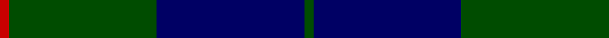
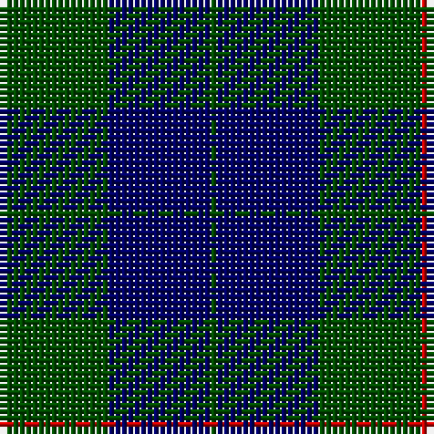

**Bands:** [RGBG](/stripes/rgbg/) · **Stripes:** [R DG DB DG](/stripes/stripes4/) R DG DB DG

This was sourced from weddslist.  It is a [4 band tartan](/bands/bands4/).

Original link http://www.weddslist.com/cgi-bin/tartans/pg.pl?source=rb

## Also known as

This cloth is also recorded under:

- Barclay Htg

## Attestations

This cloth appears in 2 source records; the oldest owns this page.

- undated — Barclay Hunting (weddslist, [record](http://www.weddslist.com/cgi-bin/tartans/pg.pl?source=rb))
- undated — Barclay Hunting (weddslist, [record](http://www.weddslist.com/cgi-bin/tartans/pg.pl?source=x))

## Register references

External register numbers recorded for this tartan.

- Scottish Register of Tartans: [1166](https://www.tartanregister.gov.uk/tartanDetails.aspx?ref=1166)
- Scottish Register of Tartans: [1758](https://www.tartanregister.gov.uk/tartanDetails.aspx?ref=1758)
- Scottish Register of Tartans: [2307](https://www.tartanregister.gov.uk/tartanDetails.aspx?ref=2307)
- Scottish Register of Tartans: [2540](https://www.tartanregister.gov.uk/tartanDetails.aspx?ref=2540)
- Scottish Register of Tartans: [2625](https://www.tartanregister.gov.uk/tartanDetails.aspx?ref=2625)
- Scottish Register of Tartans: [2666](https://www.tartanregister.gov.uk/tartanDetails.aspx?ref=2666)
- Scottish Register of Tartans: [2862](https://www.tartanregister.gov.uk/tartanDetails.aspx?ref=2862)
- Scottish Register of Tartans: [3808](https://www.tartanregister.gov.uk/tartanDetails.aspx?ref=3808)
- Scottish Register of Tartans: [982](https://www.tartanregister.gov.uk/tartanDetails.aspx?ref=982)
- Scottish Tartans Authority (ITI): 1429
- Scottish Tartans Authority (ITI): 218
- Scottish Tartans World Register: 1010
- Scottish Tartans World Register: 1042
- Scottish Tartans World Register: 127
- Scottish Tartans World Register: 1429
- Scottish Tartans World Register: 1585
- Scottish Tartans World Register: 218
- Scottish Tartans World Register: 2218
- Scottish Tartans World Register: 737
- Scottish Tartans World Register: 897

## Variants

Other setts woven to the same stripe pattern.

- [Barclay Hunting](/setts/s4/dg1db16dg16r1~x2/)
- [Barwell](/setts/s4/dg1db3dg3r1~x4/)

## Thread count
R/1 G16 DB16 G/1

## Palette
Each colour and its ΔE from the base-6 reference it is a variant of.

| Colour | Shade | Base | ΔE (OKLab) |
|---|---|---|---|
| DB | <code style="background-color:#000064;">#000064</code> `#000064` | B <code style="background-color:#2A418A;">#2A418A</code> | 0.18 |
| G | <code style="background-color:#004C00;">#004C00</code> `#004C00` | G <code style="background-color:#006100;">#006100</code> | 0.07 |
| R | <code style="background-color:#C80000;">#C80000</code> `#C80000` | R <code style="background-color:#CC0000;">#CC0000</code> | 0.01 |

# Sample pattern

## Nearest tartans

The nearest existing variants by ΔTartan distance.

1. [Barclay Hunting](/setts/s4/dg1db16dg16r1~x2/) — ΔT 0.65
1. [Barclay](/setts/s4/r1g16db16g1~x2/) — ΔT 0.94
1. [Barclay Htg (Clan)](/setts/s4/r1g16db16g1~x4/) — ΔT 0.94
1. [Wcwm 1255-1](/setts/s5/db4db1dg14db14r1~x4/) — ΔT 1.16
1. [Campbell of Loch Awe](/setts/s5/k2g11k26b11k2~x2/) — ΔT 1.39
1. [Hutton](/setts/s6/k2dg7db2dg7db16r1~x6/) — ΔT 1.48
1. [St. Andrews Old Course Hotel (Corp)](/setts/s6/g26db10k3db2dy2db10~x4/) — ΔT 1.50
1. [MacKay (Blue) #2](/setts/s5/k15db4k15db28r2~x2/) — ΔT 1.55
1. [Gallaecia - Galicia National](/setts/s5/db24n13db4n4w2~x2/) — ΔT 1.56
1. [Press & Journal](/setts/s5/k9n3k28n25w2~x2/) — ΔT 1.58

## Neighbour map

Every grey dot is one of 14299 variants placed by the first two principal components of the ΔTartan feature space (44% of its variance). Red is this tartan; blue dots are its nearest — click one to open its page.

<svg viewBox="0 0 640 380" role="img" style="max-width:100%;height:auto;border:1px solid #e0e0e0;border-radius:4px;display:block" xmlns="http://www.w3.org/2000/svg"><image href="/nn/cloud.v1.png" width="640" height="380"/><a href="/setts/s4/dg1db16dg16r1~x2/"><circle cx="400.5" cy="269.2" r="4" fill="#3465a4"><title>Barclay Hunting</title></circle></a><a href="/setts/s4/r1g16db16g1~x2/"><circle cx="385.6" cy="256.1" r="4" fill="#3465a4"><title>Barclay</title></circle></a><a href="/setts/s4/r1g16db16g1~x4/"><circle cx="385.6" cy="256.1" r="4" fill="#3465a4"><title>Barclay Htg (Clan)</title></circle></a><a href="/setts/s5/db4db1dg14db14r1~x4/"><circle cx="360.2" cy="242.5" r="4" fill="#3465a4"><title>Wcwm 1255-1</title></circle></a><a href="/setts/s5/k2g11k26b11k2~x2/"><circle cx="350.4" cy="244.0" r="4" fill="#3465a4"><title>Campbell of Loch Awe</title></circle></a><a href="/setts/s6/k2dg7db2dg7db16r1~x6/"><circle cx="360.6" cy="234.7" r="4" fill="#3465a4"><title>Hutton</title></circle></a><a href="/setts/s6/g26db10k3db2dy2db10~x4/"><circle cx="315.7" cy="217.5" r="4" fill="#3465a4"><title>St. Andrews Old Course Hotel (Corp)</title></circle></a><a href="/setts/s5/k15db4k15db28r2~x2/"><circle cx="378.4" cy="270.1" r="4" fill="#3465a4"><title>MacKay (Blue) #2</title></circle></a><a href="/setts/s5/db24n13db4n4w2~x2/"><circle cx="397.4" cy="254.0" r="4" fill="#3465a4"><title>Gallaecia - Galicia National</title></circle></a><a href="/setts/s5/k9n3k28n25w2~x2/"><circle cx="370.8" cy="241.7" r="4" fill="#3465a4"><title>Press &amp; Journal</title></circle></a><circle cx="381.9" cy="260.3" r="5" fill="#c00000"/></svg>

ID: /setts/s4/dg1db16dg16r1/
