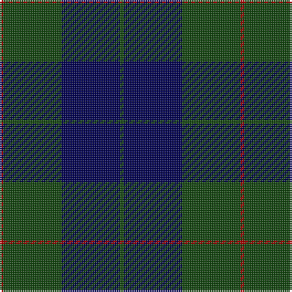

In pattern [GBGR](/stripes/gbgr/).

This was sourced from weddslist.  It is a [4 stripe tartan](/stripes/stripes4/).

Original link http://www.weddslist.com/cgi-bin/tartans/pg.pl?source=tinsel

## Register references

External register numbers recorded for this tartan.

- Scottish Register of Tartans: [1166](https://www.tartanregister.gov.uk/tartanDetails.aspx?ref=1166)
- Scottish Register of Tartans: [1510](https://www.tartanregister.gov.uk/tartanDetails.aspx?ref=1510)
- Scottish Register of Tartans: [1758](https://www.tartanregister.gov.uk/tartanDetails.aspx?ref=1758)
- Scottish Register of Tartans: [2307](https://www.tartanregister.gov.uk/tartanDetails.aspx?ref=2307)
- Scottish Register of Tartans: [2349](https://www.tartanregister.gov.uk/tartanDetails.aspx?ref=2349)
- Scottish Register of Tartans: [2540](https://www.tartanregister.gov.uk/tartanDetails.aspx?ref=2540)
- Scottish Register of Tartans: [2582](https://www.tartanregister.gov.uk/tartanDetails.aspx?ref=2582)
- Scottish Register of Tartans: [2585](https://www.tartanregister.gov.uk/tartanDetails.aspx?ref=2585)
- Scottish Register of Tartans: [2625](https://www.tartanregister.gov.uk/tartanDetails.aspx?ref=2625)
- Scottish Register of Tartans: [2730](https://www.tartanregister.gov.uk/tartanDetails.aspx?ref=2730)
- Scottish Register of Tartans: [2862](https://www.tartanregister.gov.uk/tartanDetails.aspx?ref=2862)
- Scottish Register of Tartans: [3072](https://www.tartanregister.gov.uk/tartanDetails.aspx?ref=3072)
- Scottish Register of Tartans: [3555](https://www.tartanregister.gov.uk/tartanDetails.aspx?ref=3555)
- Scottish Register of Tartans: [4925](https://www.tartanregister.gov.uk/tartanDetails.aspx?ref=4925)
- Scottish Register of Tartans: [696](https://www.tartanregister.gov.uk/tartanDetails.aspx?ref=696)
- Scottish Register of Tartans: [697](https://www.tartanregister.gov.uk/tartanDetails.aspx?ref=697)
- Scottish Register of Tartans: [982](https://www.tartanregister.gov.uk/tartanDetails.aspx?ref=982)
- Scottish Tartans Authority (ITI): 1277
- Scottish Tartans Authority (ITI): 1429
- Scottish Tartans Authority (ITI): 218
- Scottish Tartans Authority (ITI): 977
- Scottish Tartans World Register: 1042
- Scottish Tartans World Register: 127
- Scottish Tartans World Register: 1277
- Scottish Tartans World Register: 1399
- Scottish Tartans World Register: 1429
- Scottish Tartans World Register: 1593
- Scottish Tartans World Register: 218
- Scottish Tartans World Register: 2218
- Scottish Tartans World Register: 3061
- Scottish Tartans World Register: 441
- Scottish Tartans World Register: 737
- Scottish Tartans World Register: 858
- Scottish Tartans World Register: 864
- Scottish Tartans World Register: 873
- Scottish Tartans World Register: 897
- Scottish Tartans World Register: 977
- Scottish Tartans World Register: 978

## Thread count
DR/2 DG32 DB32 DG/2

## Palette
Each colour and its ΔE from the base-6 reference it is a variant of.

| Colour | Shade | Base | ΔE (OKLab) |
|---|---|---|---|
| DB | <code style="background-color:#000052;">#000052</code> `#000052` | B <code style="background-color:#2A418A;">#2A418A</code> | 0.20 |
| DG | <code style="background-color:#11450D;">#11450D</code> `#11450D` | G <code style="background-color:#006100;">#006100</code> | 0.09 |
| DR | <code style="background-color:#AA0000;">#AA0000</code> `#AA0000` | R <code style="background-color:#CC0000;">#CC0000</code> | 0.07 |

# Sample pattern

## Nearest tartans

The nearest existing variants by ΔTartan distance.

1. [Barclay Hunting](/setts/s4/dg1db16dg16r1/) — ΔT 0.65
1. [Barclay](/setts/s4/r1g16db16g1~x2/) — ΔT 1.14
1. [Barclay Htg (Clan)](/setts/s4/r1g16db16g1~x4/) — ΔT 1.14
1. [Wcwm 1255-1](/setts/s5/db4db1dg14db14r1~x4/) — ΔT 1.27
1. [Hutton](/setts/s6/k2dg7db2dg7db16r1~x6/) — ΔT 1.34
1. [MacKay (Blue) #2](/setts/s5/k15db4k15db28r2~x2/) — ΔT 1.35
1. [Perthshire, New /Tourist Board](/setts/s6/db37r10dg22db11dg3r3~x2/) — ΔT 1.46
1. [Unidentified Tweed](/setts/s6/dg4db1dg12db12w1db4~x2/) — ΔT 1.58
1. [Wellington Variation](/setts/s4/k3db23k17r2~x2/) — ΔT 1.59
1. [St. Andrews International Golf Club](/setts/s4/dg43k14dt14r2~x2/) — ΔT 1.72

## Neighbour map

Every grey dot is one of 14299 variants placed by the first two principal components of the ΔTartan feature space (44% of its variance). Red is this tartan; blue dots are its nearest — click one to open its page.

<svg viewBox="0 0 640 380" role="img" style="max-width:100%;height:auto;border:1px solid #e0e0e0;border-radius:4px;display:block" xmlns="http://www.w3.org/2000/svg"><image href="/nn/cloud.v1.png" width="640" height="380"/><a href="/setts/s4/dg1db16dg16r1/"><circle cx="381.9" cy="260.3" r="4" fill="#3465a4"><title>Barclay Hunting</title></circle></a><a href="/setts/s4/r1g16db16g1~x2/"><circle cx="385.6" cy="256.1" r="4" fill="#3465a4"><title>Barclay</title></circle></a><a href="/setts/s4/r1g16db16g1~x4/"><circle cx="385.6" cy="256.1" r="4" fill="#3465a4"><title>Barclay Htg (Clan)</title></circle></a><a href="/setts/s5/db4db1dg14db14r1~x4/"><circle cx="360.2" cy="242.5" r="4" fill="#3465a4"><title>Wcwm 1255-1</title></circle></a><a href="/setts/s6/k2dg7db2dg7db16r1~x6/"><circle cx="360.6" cy="234.7" r="4" fill="#3465a4"><title>Hutton</title></circle></a><a href="/setts/s5/k15db4k15db28r2~x2/"><circle cx="378.4" cy="270.1" r="4" fill="#3465a4"><title>MacKay (Blue) #2</title></circle></a><a href="/setts/s6/db37r10dg22db11dg3r3~x2/"><circle cx="387.9" cy="265.7" r="4" fill="#3465a4"><title>Perthshire, New /Tourist Board</title></circle></a><a href="/setts/s6/dg4db1dg12db12w1db4~x2/"><circle cx="385.7" cy="269.5" r="4" fill="#3465a4"><title>Unidentified Tweed</title></circle></a><a href="/setts/s4/k3db23k17r2~x2/"><circle cx="394.5" cy="285.2" r="4" fill="#3465a4"><title>Wellington Variation</title></circle></a><a href="/setts/s4/dg43k14dt14r2~x2/"><circle cx="399.1" cy="246.8" r="4" fill="#3465a4"><title>St. Andrews International Golf Club</title></circle></a><circle cx="400.5" cy="269.2" r="5" fill="#c00000"/></svg>

ID: /setts/s4/dg1db16dg16r1~x2/
