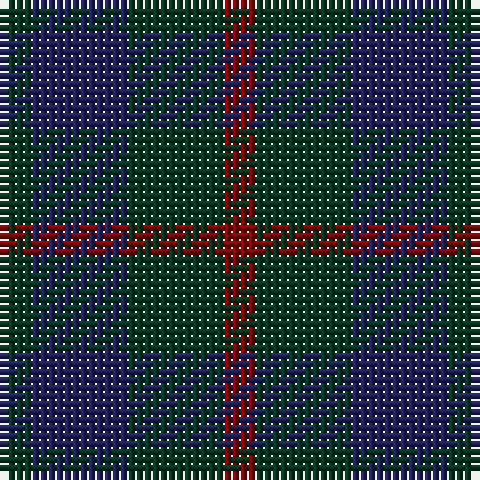

**Bands:** [GBGR](/stripes/gbgr/) · **Stripes:** [DG DB DG R](/stripes/stripes4/) DG DB DG R

This was sourced from register-of-tartans.  It is a [4 band tartan](/bands/bands4/).

Original link https://www.tartanregister.gov.uk/tartanDetails.aspx?ref=4966

## Register references

External register numbers recorded for this tartan.

- Scottish Register of Tartans: [4966](https://www.tartanregister.gov.uk/tartanDetails.aspx?ref=4966)
- Scottish Tartans Authority (ITI): 3660

## Variants

Other setts woven to the same stripe pattern.

- [Barclay Hunting](/setts/s4/dg1db16dg16r1~x2/)

## Thread count
DG/4 DB12 DG12 DR/4

## Palette
Each colour and its ΔE from the base-6 reference it is a variant of.

| Colour | Shade | Base | ΔE (OKLab) |
|---|---|---|---|
| DB | <code style="background-color:#202060;">#202060</code> `#202060` | B <code style="background-color:#2A418A;">#2A418A</code> | 0.11 |
| DG | <code style="background-color:#003820;">#003820</code> `#003820` | G <code style="background-color:#006100;">#006100</code> | 0.15 |
| DR | <code style="background-color:#880000;">#880000</code> `#880000` | R <code style="background-color:#CC0000;">#CC0000</code> | 0.15 |

# Sample pattern

## Nearest tartans

The nearest existing variants by ΔTartan distance.

1. [Unidentified #29](/setts/s5/k5dg14k16db12dg4~x2/) — ΔT 1.51
1. [Wilson's No.116](/setts/s4/dg4dp4dg1dp1~x4/) — ΔT 1.59
1. [Fraser Hunting #2](/setts/s6/dy1db3dy1dg3dy4r1~x2/) — ΔT 1.95
1. [Unidentified no. 54](/setts/s6/db2dg6db6dp5db1dp2~x2/) — ΔT 1.97
1. [Sutherland 42nd](/setts/s6/db1k1db3k3dg3k1~x4/) — ΔT 1.97
1. [Bright of Garth (Personal)](/setts/s5/g7dy6dt7dy1dt2~x6/) — ΔT 2.19
1. [Unidentified No 63](/setts/s7/k3dg4k1dg4k3db4k1~x2/) — ΔT 2.19
1. [Ferguson](/setts/s3/db6dg5r1~x4/) — ΔT 2.21
1. [Auchincloss (Personal)](/setts/s4/k34db13k7db14~x2/) — ΔT 2.33
1. [Ferguson (Old)](/setts/s3/dg17r2db15~x2/) — ΔT 2.35

## Neighbour map

Every grey dot is one of 14313 variants placed by the first two principal components of the ΔTartan feature space (44% of its variance). Red is this tartan; blue dots are its nearest — click one to open its page.

<svg viewBox="0 0 640 380" role="img" style="max-width:100%;height:auto;border:1px solid #e0e0e0;border-radius:4px;display:block" xmlns="http://www.w3.org/2000/svg"><image href="/nn/cloud.v1.png" width="640" height="380"/><a href="/setts/s5/k5dg14k16db12dg4~x2/"><circle cx="264.2" cy="364.2" r="4" fill="#3465a4"><title>Unidentified #29</title></circle></a><a href="/setts/s4/dg4dp4dg1dp1~x4/"><circle cx="418.0" cy="366.0" r="4" fill="#3465a4"><title>Wilson's No.116</title></circle></a><a href="/setts/s6/dy1db3dy1dg3dy4r1~x2/"><circle cx="270.9" cy="323.5" r="4" fill="#3465a4"><title>Fraser Hunting #2</title></circle></a><a href="/setts/s6/db2dg6db6dp5db1dp2~x2/"><circle cx="289.4" cy="332.7" r="4" fill="#3465a4"><title>Unidentified no. 54</title></circle></a><a href="/setts/s6/db1k1db3k3dg3k1~x4/"><circle cx="233.4" cy="348.8" r="4" fill="#3465a4"><title>Sutherland 42nd</title></circle></a><a href="/setts/s5/g7dy6dt7dy1dt2~x6/"><circle cx="292.1" cy="332.0" r="4" fill="#3465a4"><title>Bright of Garth (Personal)</title></circle></a><a href="/setts/s7/k3dg4k1dg4k3db4k1~x2/"><circle cx="235.2" cy="344.1" r="4" fill="#3465a4"><title>Unidentified No 63</title></circle></a><a href="/setts/s3/db6dg5r1~x4/"><circle cx="331.0" cy="344.3" r="4" fill="#3465a4"><title>Ferguson</title></circle></a><a href="/setts/s4/k34db13k7db14~x2/"><circle cx="440.6" cy="366.0" r="4" fill="#3465a4"><title>Auchincloss (Personal)</title></circle></a><a href="/setts/s3/dg17r2db15~x2/"><circle cx="365.6" cy="334.8" r="4" fill="#3465a4"><title>Ferguson (Old)</title></circle></a><circle cx="333.9" cy="366.0" r="5" fill="#c00000"/></svg>

ID: /setts/s4/dg1db3dg3r1~x4/
