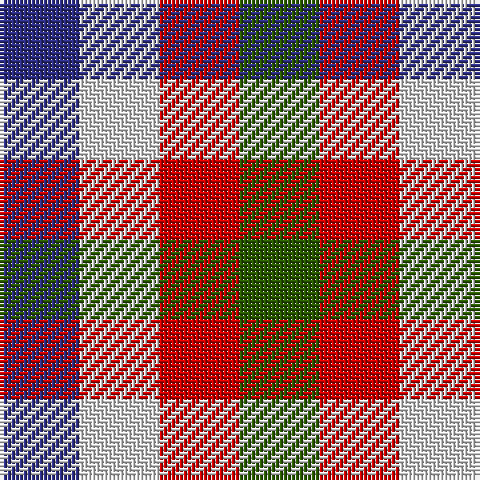

In pattern [BWRG](/stripes/bwrg/).

This was sourced from register-of-tartans.  It is a [4 stripe tartan](/stripes/stripes4/).

Original link https://www.tartanregister.gov.uk/tartanDetails.aspx?ref=50

## Register references

External register numbers recorded for this tartan.

- Scottish Register of Tartans: [50](https://www.tartanregister.gov.uk/tartanDetails.aspx?ref=50)
- Scottish Tartans Authority (ITI): 5705

## Thread count
DB/20 LN20 R20 G/20

## Palette
Each colour and the base-6 reference it is a variant of.

| Colour | Shade | Base |
|---|---|---|
| DB | <code style="background-color:#2C2C80;">#2C2C80</code> `oklch(35.0% 0.138 276.6)` <small>#2C2C80</small> | B <code style="background-color:#2A418A;">#2A418A</code> |
| G | <code style="background-color:#285800;">#285800</code> `oklch(41.0% 0.122 135.8)` <small>#285800</small> | G <code style="background-color:#006100;">#006100</code> |
| LN | <code style="background-color:#E0E0E0;">#E0E0E0</code> `oklch(90.7% 0.000 89.9)` <small>#E0E0E0</small> | W <code style="background-color:#F7F7F7;">#F7F7F7</code> |
| R | <code style="background-color:#C80000;">#C80000</code> `oklch(52.3% 0.215 29.2)` <small>#C80000</small> | R <code style="background-color:#CC0000;">#CC0000</code> |

# Sample pattern

## Nearest tartans

The nearest existing variants by ΔTartan distance.

1. [Dacre Estate Check](/setts/s3/k1w1r1~x14/) — ΔT 1.70
1. [Usa](/setts/s3/db1lr1r1~x4/) — ΔT 1.76
1. [Mothers Pride](/setts/s3/r1db1ly1~x40/) — ΔT 1.83
1. [Daughter of Mull](/setts/s5/r1w1g1lb1m1~x16/) — ΔT 1.83
1. [Coigach Tweed](/setts/s3/k1lb1o1~x6/) — ΔT 1.86
1. [Aquascutum](/setts/s3/db1w1r1~x22/) — ΔT 1.90
1. [Antonelli (Oklahoma), John (Personal)](/setts/s6/k1lt1r1db1g1db1~x25/) — ΔT 2.03
1. [Border Bell](/setts/s7/k1r1w1k1w1k1db1~x16/) — ΔT 2.09
1. [Bell, Border (Name)](/setts/s7/k1r1w1k1w1k1db1~x14/) — ΔT 2.09
1. [Glen Moriston Estate Check](/setts/s3/dt1lb1w1~x8/) — ΔT 2.10

## Neighbour map

Every grey dot is one of 14299 variants placed by the first two principal components of the ΔTartan feature space (44% of its variance). Red is this tartan; blue dots are its nearest — click one to open its page.

<svg viewBox="0 0 640 380" role="img" style="max-width:100%;height:auto;border:1px solid #e0e0e0;border-radius:4px;display:block" xmlns="http://www.w3.org/2000/svg"><image href="/nn/cloud.v1.png" width="640" height="380"/><a href="/setts/s3/k1w1r1~x14/"><circle cx="14.0" cy="366.0" r="4" fill="#3465a4"><title>Dacre Estate Check</title></circle></a><a href="/setts/s3/db1lr1r1~x4/"><circle cx="14.0" cy="366.0" r="4" fill="#3465a4"><title>Usa</title></circle></a><a href="/setts/s3/r1db1ly1~x40/"><circle cx="14.0" cy="366.0" r="4" fill="#3465a4"><title>Mothers Pride</title></circle></a><a href="/setts/s5/r1w1g1lb1m1~x16/"><circle cx="14.0" cy="366.0" r="4" fill="#3465a4"><title>Daughter of Mull</title></circle></a><a href="/setts/s3/k1lb1o1~x6/"><circle cx="14.0" cy="366.0" r="4" fill="#3465a4"><title>Coigach Tweed</title></circle></a><a href="/setts/s3/db1w1r1~x22/"><circle cx="14.0" cy="366.0" r="4" fill="#3465a4"><title>Aquascutum</title></circle></a><a href="/setts/s6/k1lt1r1db1g1db1~x25/"><circle cx="14.0" cy="366.0" r="4" fill="#3465a4"><title>Antonelli (Oklahoma), John (Personal)</title></circle></a><a href="/setts/s7/k1r1w1k1w1k1db1~x16/"><circle cx="14.0" cy="366.0" r="4" fill="#3465a4"><title>Border Bell</title></circle></a><a href="/setts/s7/k1r1w1k1w1k1db1~x14/"><circle cx="14.0" cy="366.0" r="4" fill="#3465a4"><title>Bell, Border (Name)</title></circle></a><a href="/setts/s3/dt1lb1w1~x8/"><circle cx="14.0" cy="366.0" r="4" fill="#3465a4"><title>Glen Moriston Estate Check</title></circle></a><circle cx="14.0" cy="366.0" r="5" fill="#c00000"/></svg>

ID: /setts/s4/dg1r1w1db1~x20/
