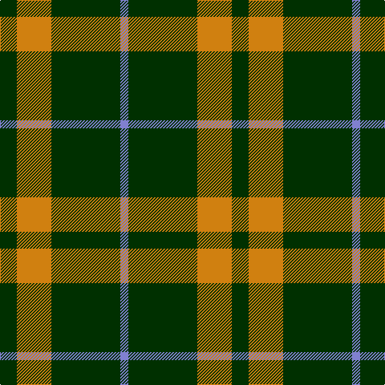

In pattern [BGYG](/stripes/bgyg/).

This was sourced from weddslist.  It is a [4 stripe tartan](/stripes/stripes4/).

Original link http://www.weddslist.com/cgi-bin/tartans/pg.pl?source=sts

## Thread count
DG/21 O43 DG86 B/10

## Palette
Each colour and the base-6 reference it is a variant of.

| Colour | Shade | Base |
|---|---|---|
| B | <code style="background-color:#8080D0;">#8080D0</code> `oklch(63.4% 0.119 282.5)` <small>#8080D0</small> | B <code style="background-color:#2A418A;">#2A418A</code> |
| DG | <code style="background-color:#003000;">#003000</code> `oklch(26.8% 0.091 142.5)` <small>#003000</small> | G <code style="background-color:#006100;">#006100</code> |
| O | <code style="background-color:#D08010;">#D08010</code> `oklch(67.0% 0.145 66.1)` <small>#D08010</small> | Y <code style="background-color:#F2BF00;">#F2BF00</code> |

# Sample pattern

## Nearest tartans

The nearest existing variants by ΔTartan distance.

1. [Special Saffron (Fashion)](/setts/s4/dg21lo44dg86t10/) — ΔT 0.54
1. [Special Saffron Tartan Tartan Number: 201. Earliest known date: pre 2003 Y = Saffron See products available Copyright © Blair Urquhart, Comrie, 2015](/setts/s4/dg21ly43dg86t10/) — ΔT 0.88
1. [Special Saffron](/setts/s6/dg86lo44dg21lo44dg86t10/) — ΔT 1.09
1. [Cowie, Justine (Personal)](/setts/s3/g9k18r2~x4/) — ΔT 1.15
1. [Juchter (Personal)](/setts/s3/dg20w5r3~x2/) — ΔT 1.33
1. [Bumbee #1 (Fashion)](/setts/s4/g10k2dp5g1~x8/) — ΔT 1.36
1. [Scotch Tape 2 (Corporate)](/setts/s4/k3g15k20ly3~x2/) — ΔT 1.43
1. [Wilson's No.192](/setts/s4/dp4g10r1ly1~x2/) — ΔT 1.44
1. [Wilson's No.189](/setts/s4/dp4g10r1w1~x2/) — ΔT 1.44
1. [Wilson's, No 211](/setts/s4/g8p4g1p2~x4/) — ΔT 1.55

## Neighbour map

Every grey dot is one of 14299 variants placed by the first two principal components of the ΔTartan feature space (44% of its variance). Red is this tartan; blue dots are its nearest — click one to open its page.

<svg viewBox="0 0 640 380" role="img" style="max-width:100%;height:auto;border:1px solid #e0e0e0;border-radius:4px;display:block" xmlns="http://www.w3.org/2000/svg"><image href="/nn/cloud.v1.png" width="640" height="380"/><a href="/setts/s4/dg21lo44dg86t10/"><circle cx="372.7" cy="262.0" r="4" fill="#3465a4"><title>Special Saffron (Fashion)</title></circle></a><a href="/setts/s4/dg21ly43dg86t10/"><circle cx="357.6" cy="254.7" r="4" fill="#3465a4"><title>Special Saffron Tartan Tartan Number: 201. Earliest known date: pre 2003 Y = Saffron See products available Copyright © Blair Urquhart, Comrie, 2015</title></circle></a><a href="/setts/s6/dg86lo44dg21lo44dg86t10/"><circle cx="355.1" cy="256.4" r="4" fill="#3465a4"><title>Special Saffron</title></circle></a><a href="/setts/s3/g9k18r2~x4/"><circle cx="343.3" cy="277.5" r="4" fill="#3465a4"><title>Cowie, Justine (Personal)</title></circle></a><a href="/setts/s3/dg20w5r3~x2/"><circle cx="390.2" cy="268.2" r="4" fill="#3465a4"><title>Juchter (Personal)</title></circle></a><a href="/setts/s4/g10k2dp5g1~x8/"><circle cx="355.8" cy="263.8" r="4" fill="#3465a4"><title>Bumbee #1 (Fashion)</title></circle></a><a href="/setts/s4/k3g15k20ly3~x2/"><circle cx="311.9" cy="278.6" r="4" fill="#3465a4"><title>Scotch Tape 2 (Corporate)</title></circle></a><a href="/setts/s4/dp4g10r1ly1~x2/"><circle cx="357.4" cy="230.6" r="4" fill="#3465a4"><title>Wilson's No.192</title></circle></a><a href="/setts/s4/dp4g10r1w1~x2/"><circle cx="343.3" cy="223.6" r="4" fill="#3465a4"><title>Wilson's No.189</title></circle></a><a href="/setts/s4/g8p4g1p2~x4/"><circle cx="375.3" cy="281.6" r="4" fill="#3465a4"><title>Wilson's, No 211</title></circle></a><circle cx="379.1" cy="263.5" r="5" fill="#c00000"/></svg>

ID: /setts/s4/dg21lo43dg86b10/
