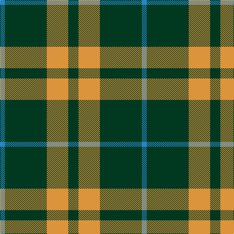

**Bands:** [BGYG](/stripes/bgyg/) · **Stripes:** [T DG LO DG](/stripes/stripes4/) T DG LO DG

This was sourced from tartans-authority.  It is a [4 band tartan](/bands/bands4/).

Original link http://www.tartansauthority.com/tartan-ferret/display/201/

## Thread count
B/10 DG86 O44 DG/21

## Palette
Each colour and its ΔE from the base-6 reference it is a variant of.

| Colour | Shade | Base | ΔE (OKLab) |
|---|---|---|---|
| B | <code style="background-color:#2888C4;">#2888C4</code> `#2888C4` | B <code style="background-color:#2A418A;">#2A418A</code> | 0.21 |
| DG | <code style="background-color:#003820;">#003820</code> `#003820` | G <code style="background-color:#006100;">#006100</code> | 0.15 |
| O | <code style="background-color:#DC943C;">#DC943C</code> `#DC943C` | Y <code style="background-color:#F2BF00;">#F2BF00</code> | 0.12 |

# Sample pattern

## Nearest tartans

The nearest existing variants by ΔTartan distance.

1. [Special, Saffron](/setts/s4/dg21lo43dg86b10/) — ΔT 0.54
1. [Special Saffron Tartan Tartan Number: 201. Earliest known date: pre 2003 Y = Saffron See products available Copyright © Blair Urquhart, Comrie, 2015](/setts/s4/dg21ly43dg86t10/) — ΔT 0.71
1. [Special Saffron](/setts/s6/dg86lo44dg21lo44dg86t10/) — ΔT 0.99
1. [Juchter (Personal)](/setts/s3/dg20w5r3~x2/) — ΔT 1.12
1. [Cowie, Justine (Personal)](/setts/s3/g9k18r2~x4/) — ΔT 1.21
1. [Wilson's, No 211](/setts/s4/g8p4g1p2~x4/) — ΔT 1.23
1. [Bumbee #1 (Fashion)](/setts/s4/g10k2dp5g1~x8/) — ΔT 1.27
1. [Wilson's No.189](/setts/s4/dp4g10r1w1~x2/) — ΔT 1.29
1. [Wilson's No.192](/setts/s4/dp4g10r1ly1~x2/) — ΔT 1.39
1. [Juchter (Personal)](/setts/s4/dg20w5r3w5~x2/) — ΔT 1.44

## Neighbour map

Every grey dot is one of 14313 variants placed by the first two principal components of the ΔTartan feature space (44% of its variance). Red is this tartan; blue dots are its nearest — click one to open its page.

<svg viewBox="0 0 640 380" role="img" style="max-width:100%;height:auto;border:1px solid #e0e0e0;border-radius:4px;display:block" xmlns="http://www.w3.org/2000/svg"><image href="/nn/cloud.v1.png" width="640" height="380"/><a href="/setts/s4/dg21lo43dg86b10/"><circle cx="379.2" cy="263.9" r="4" fill="#3465a4"><title>Special, Saffron</title></circle></a><a href="/setts/s4/dg21ly43dg86t10/"><circle cx="357.7" cy="255.2" r="4" fill="#3465a4"><title>Special Saffron Tartan Tartan Number: 201. Earliest known date: pre 2003 Y = Saffron See products available Copyright © Blair Urquhart, Comrie, 2015</title></circle></a><a href="/setts/s6/dg86lo44dg21lo44dg86t10/"><circle cx="355.2" cy="256.8" r="4" fill="#3465a4"><title>Special Saffron</title></circle></a><a href="/setts/s3/dg20w5r3~x2/"><circle cx="390.3" cy="268.7" r="4" fill="#3465a4"><title>Juchter (Personal)</title></circle></a><a href="/setts/s3/g9k18r2~x4/"><circle cx="343.2" cy="277.9" r="4" fill="#3465a4"><title>Cowie, Justine (Personal)</title></circle></a><a href="/setts/s4/g8p4g1p2~x4/"><circle cx="375.5" cy="281.9" r="4" fill="#3465a4"><title>Wilson's, No 211</title></circle></a><a href="/setts/s4/g10k2dp5g1~x8/"><circle cx="355.7" cy="264.1" r="4" fill="#3465a4"><title>Bumbee #1 (Fashion)</title></circle></a><a href="/setts/s4/dp4g10r1w1~x2/"><circle cx="343.4" cy="223.9" r="4" fill="#3465a4"><title>Wilson's No.189</title></circle></a><a href="/setts/s4/dp4g10r1ly1~x2/"><circle cx="357.5" cy="230.9" r="4" fill="#3465a4"><title>Wilson's No.192</title></circle></a><a href="/setts/s4/dg20w5r3w5~x2/"><circle cx="306.6" cy="242.9" r="4" fill="#3465a4"><title>Juchter (Personal)</title></circle></a><circle cx="372.8" cy="262.4" r="5" fill="#c00000"/></svg>

ID: /setts/s4/dg21lo44dg86t10/
