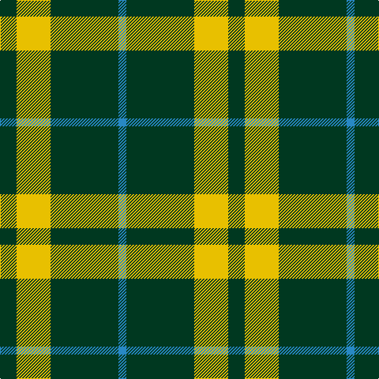

In pattern [BGYG](/stripes/bgyg/).

This was sourced from house-of-tartan.  It is a [4 stripe tartan](/stripes/stripes4/).

Original link http://www.house-of-tartan.scotland.net/house/TartanViewjs.asp?colr=Def&tnam=201

## Thread count
DG/21 Y43 DG86 B/10

## Palette
Each colour and its ΔE from the base-6 reference it is a variant of.

| Colour | Shade | Base | ΔE (OKLab) |
|---|---|---|---|
| B | <code style="background-color:#2888C4;">#2888C4</code> `#2888C4` | B <code style="background-color:#2A418A;">#2A418A</code> | 0.21 |
| DG | <code style="background-color:#003820;">#003820</code> `#003820` | G <code style="background-color:#006100;">#006100</code> | 0.15 |
| Y | <code style="background-color:#E8C000;">#E8C000</code> `#E8C000` | Y <code style="background-color:#F2BF00;">#F2BF00</code> | 0.02 |

# Sample pattern

## Nearest tartans

The nearest existing variants by ΔTartan distance.

1. [Special Saffron (Fashion)](/setts/s4/dg21lo44dg86t10/) — ΔT 0.71
1. [Special, Saffron](/setts/s4/dg21lo43dg86b10/) — ΔT 0.88
1. [Juchter (Personal)](/setts/s3/dg20w5r3~x2/) — ΔT 1.18
1. [Special Saffron](/setts/s6/dg86lo44dg21lo44dg86t10/) — ΔT 1.18
1. [Loch Rannoch](/setts/s5/g19w5g2k5w2~x2/) — ΔT 1.33
1. [Juchter (Personal)](/setts/s4/dg20w5r3~x2/) — ΔT 1.35
1. [Heritage #2](/setts/s7/dg20w2dg9w2ly5w7dg10~x2/) — ΔT 1.38
1. [Cowie, Justine (Personal)](/setts/s3/g9k18r2~x4/) — ΔT 1.42
1. [Wilson's No.189](/setts/s4/dp4g10r1w1~x2/) — ΔT 1.49
1. [Granger](/setts/s6/dg40k4dg12k21dg17w4~x2/) — ΔT 1.53

## Neighbour map

Every grey dot is one of 14299 variants placed by the first two principal components of the ΔTartan feature space (44% of its variance). Red is this tartan; blue dots are its nearest — click one to open its page.

<svg viewBox="0 0 640 380" role="img" style="max-width:100%;height:auto;border:1px solid #e0e0e0;border-radius:4px;display:block" xmlns="http://www.w3.org/2000/svg"><image href="/nn/cloud.v1.png" width="640" height="380"/><a href="/setts/s4/dg21lo44dg86t10/"><circle cx="372.7" cy="262.0" r="4" fill="#3465a4"><title>Special Saffron (Fashion)</title></circle></a><a href="/setts/s4/dg21lo43dg86b10/"><circle cx="379.1" cy="263.5" r="4" fill="#3465a4"><title>Special, Saffron</title></circle></a><a href="/setts/s3/dg20w5r3~x2/"><circle cx="390.2" cy="268.2" r="4" fill="#3465a4"><title>Juchter (Personal)</title></circle></a><a href="/setts/s6/dg86lo44dg21lo44dg86t10/"><circle cx="355.1" cy="256.4" r="4" fill="#3465a4"><title>Special Saffron</title></circle></a><a href="/setts/s5/g19w5g2k5w2~x2/"><circle cx="333.1" cy="216.4" r="4" fill="#3465a4"><title>Loch Rannoch</title></circle></a><a href="/setts/s4/dg20w5r3~x2/"><circle cx="306.5" cy="242.5" r="4" fill="#3465a4"><title>Juchter (Personal)</title></circle></a><a href="/setts/s7/dg20w2dg9w2ly5w7dg10~x2/"><circle cx="372.6" cy="225.6" r="4" fill="#3465a4"><title>Heritage #2</title></circle></a><a href="/setts/s3/g9k18r2~x4/"><circle cx="343.3" cy="277.5" r="4" fill="#3465a4"><title>Cowie, Justine (Personal)</title></circle></a><a href="/setts/s4/dp4g10r1w1~x2/"><circle cx="343.3" cy="223.6" r="4" fill="#3465a4"><title>Wilson's No.189</title></circle></a><a href="/setts/s6/dg40k4dg12k21dg17w4~x2/"><circle cx="391.4" cy="245.5" r="4" fill="#3465a4"><title>Granger</title></circle></a><circle cx="357.6" cy="254.7" r="5" fill="#c00000"/></svg>

ID: /setts/s4/dg21ly43dg86t10/
