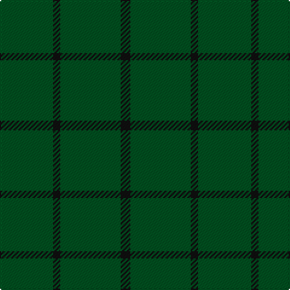

**Bands:** [GKGK](/stripes/gkgk/) · **Stripes:** [DG K DG K](/stripes/stripes4/) DG K DG K

This was sourced from register-of-tartans.  It is a [4 band tartan](/bands/bands4/).

Original link https://www.tartanregister.gov.uk/tartanDetails.aspx?ref=529

## Register references

External register numbers recorded for this tartan.

- Scottish Register of Tartans: [529](https://www.tartanregister.gov.uk/tartanDetails.aspx?ref=529)
- Scottish Tartans World Register: 783

## Variants

Other setts woven to the same stripe pattern.

- [Graham](/setts/s4/dg12k4dg1k4~x2/)

## Thread count
G/44 K6 G50 K/8

## Palette
Each colour and its ΔE from the base-6 reference it is a variant of.

| Colour | Shade | Base | ΔE (OKLab) |
|---|---|---|---|
| G | <code style="background-color:#005020;">#005020</code> `#005020` | G <code style="background-color:#006100;">#006100</code> | 0.07 |
| K | <code style="background-color:#101010;">#101010</code> `#101010` | K <code style="background-color:#000000;">#000000</code> | 0.17 |

# Sample pattern

## Nearest tartans

The nearest existing variants by ΔTartan distance.

1. [Pearson Family Tartan Tartan Number: 1734. Earliest known date: 1951 Nothing See products available Copyright © Blair Urquhart, Comrie, 2015](/setts/s5/lo3g14dy1g14lo3~x4/) — ΔT 2.25
1. [MacNab, Ancient](/setts/s5/dg62r7k4r4dg62~x2/) — ΔT 2.53
1. [Kenmore Hunting](/setts/s7/lo2g2g19g2g2g19r2~x2/) — ΔT 2.57
1. [Bannockbane Hunting Trade Tartan Tartan Number: 909. Earliest known date: c.1984 Nothing See products available Copyright © Blair Urquhart, Comrie, 2015](/setts/s8/g2dy2g15dy1w1g15dy2g2~x2/) — ΔT 2.70
1. [Castle Fraser Check](/setts/s3/dg20r1dg4~x3/) — ΔT 2.87
1. [Pearson](/setts/s5/o3g14o1g14o3~x4/) — ΔT 2.97
1. [Ben Dubh (Fashion)](/setts/s3/k4dt1k3~x10/) — ΔT 2.97
1. [Bannockbane Hunting](/setts/s8/dg2dy2dg15dy1w1dg15dy2dg2~x2/) — ΔT 3.01
1. [Bannockbane, hunting](/setts/s8/g2o2g15o1w1g15o2g2~x2/) — ΔT 3.10
1. [Kenmore Hunting (Fashion)](/setts/s7/k2g2g19g2g2g19r2~x2/) — ΔT 3.19

## Neighbour map

Every grey dot is one of 14313 variants placed by the first two principal components of the ΔTartan feature space (44% of its variance). Red is this tartan; blue dots are its nearest — click one to open its page.

<svg viewBox="0 0 640 380" role="img" style="max-width:100%;height:auto;border:1px solid #e0e0e0;border-radius:4px;display:block" xmlns="http://www.w3.org/2000/svg"><image href="/nn/cloud.v1.png" width="640" height="380"/><a href="/setts/s5/lo3g14dy1g14lo3~x4/"><circle cx="609.5" cy="298.4" r="4" fill="#3465a4"><title>Pearson Family Tartan Tartan Number: 1734. Earliest known date: 1951 Nothing See products available Copyright © Blair Urquhart, Comrie, 2015</title></circle></a><a href="/setts/s5/dg62r7k4r4dg62~x2/"><circle cx="626.0" cy="264.8" r="4" fill="#3465a4"><title>MacNab, Ancient</title></circle></a><a href="/setts/s7/lo2g2g19g2g2g19r2~x2/"><circle cx="626.0" cy="276.6" r="4" fill="#3465a4"><title>Kenmore Hunting</title></circle></a><a href="/setts/s8/g2dy2g15dy1w1g15dy2g2~x2/"><circle cx="626.0" cy="258.9" r="4" fill="#3465a4"><title>Bannockbane Hunting Trade Tartan Tartan Number: 909. Earliest known date: c.1984 Nothing See products available Copyright © Blair Urquhart, Comrie, 2015</title></circle></a><a href="/setts/s3/dg20r1dg4~x3/"><circle cx="626.0" cy="327.0" r="4" fill="#3465a4"><title>Castle Fraser Check</title></circle></a><a href="/setts/s5/o3g14o1g14o3~x4/"><circle cx="626.0" cy="316.8" r="4" fill="#3465a4"><title>Pearson</title></circle></a><a href="/setts/s3/k4dt1k3~x10/"><circle cx="626.0" cy="366.0" r="4" fill="#3465a4"><title>Ben Dubh (Fashion)</title></circle></a><a href="/setts/s8/dg2dy2dg15dy1w1dg15dy2dg2~x2/"><circle cx="626.0" cy="242.0" r="4" fill="#3465a4"><title>Bannockbane Hunting</title></circle></a><a href="/setts/s8/g2o2g15o1w1g15o2g2~x2/"><circle cx="626.0" cy="249.4" r="4" fill="#3465a4"><title>Bannockbane, hunting</title></circle></a><a href="/setts/s7/k2g2g19g2g2g19r2~x2/"><circle cx="626.0" cy="257.1" r="4" fill="#3465a4"><title>Kenmore Hunting (Fashion)</title></circle></a><circle cx="626.0" cy="363.0" r="5" fill="#c00000"/></svg>

ID: /setts/s4/dg22k3dg25k4~x2/
