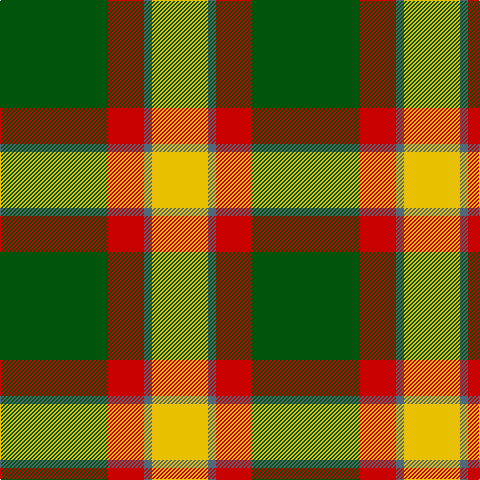

In pattern [GRBY](/stripes/grby/).

This was sourced from register-of-tartans.  It is a [4 stripe tartan](/stripes/stripes4/).

Original link https://www.tartanregister.gov.uk/tartanDetails.aspx?ref=1112

## Also known as

This cloth is also recorded under:

- Englehart, City of

## Attestations

This cloth appears in 2 source records; the oldest owns this page.

- 01/01/1958 — Englehart, City of (register-of-tartans, [record](https://www.tartanregister.gov.uk/tartanDetails.aspx?ref=1112))
- 1958 — City of Englehart (District) (tartans-authority, [record](http://www.tartansauthority.com/tartan-ferret/display/849/))

## Register references

External register numbers recorded for this tartan.

- Scottish Register of Tartans: [1112](https://www.tartanregister.gov.uk/tartanDetails.aspx?ref=1112)
- Scottish Tartans Authority (ITI): 849
- Scottish Tartans World Register: 849

## Thread count
G/108 R36 N8 Y/56

## Palette
Each colour and its ΔE from the base-6 reference it is a variant of.

| Colour | Shade | Base | ΔE (OKLab) |
|---|---|---|---|
| G | <code style="background-color:#00540C;">#00540C</code> `#00540C` | G <code style="background-color:#006100;">#006100</code> | 0.04 |
| N | <code style="background-color:#506878;">#506878</code> `#506878` | B <code style="background-color:#2A418A;">#2A418A</code> | 0.14 |
| R | <code style="background-color:#C80000;">#C80000</code> `#C80000` | R <code style="background-color:#CC0000;">#CC0000</code> | 0.01 |
| Y | <code style="background-color:#E8C000;">#E8C000</code> `#E8C000` | Y <code style="background-color:#F2BF00;">#F2BF00</code> | 0.02 |

# Sample pattern

## Nearest tartans

The nearest existing variants by ΔTartan distance.

1. [Wilson's, No 195](/setts/s4/lo5g7k1t1~x4/) — ΔT 1.10
1. [MacGregor of Balquidder - 1831 (Clan](/setts/s6/g9r2g9r14k1w2~x4/) — ΔT 1.33
1. [Loch Lomond](/setts/s4/g22w14r7ly1~x2/) — ΔT 1.41
1. [Loch Lomond #3](/setts/s4/g22w14r7ly2~x2/) — ΔT 1.46
1. [Unidentfied (Ligioner Highland Games](/setts/s6/do4g25lo10g3lo18r4~x2/) — ΔT 1.47
1. [MacDuck #2](/setts/s6/k4r5k2lo21g8k2~x2/) — ΔT 1.49
1. [Wilson's, No 193](/setts/s5/g6k1r1t2r2~x4/) — ΔT 1.60
1. [MacDuck (Corporate)](/setts/s6/k4r5k2ly21g8k2~x2/) — ΔT 1.61
1. [MacGregor of Balquidder (Logan)](/setts/s6/g9r2g9r14k1w2~x2/) — ΔT 1.62
1. [Forget Family (Yonne)](/setts/s6/dg8lo1dg8lo12r1lo1~x4/) — ΔT 1.62

## Neighbour map

Every grey dot is one of 14299 variants placed by the first two principal components of the ΔTartan feature space (44% of its variance). Red is this tartan; blue dots are its nearest — click one to open its page.

<svg viewBox="0 0 640 380" role="img" style="max-width:100%;height:auto;border:1px solid #e0e0e0;border-radius:4px;display:block" xmlns="http://www.w3.org/2000/svg"><image href="/nn/cloud.v1.png" width="640" height="380"/><a href="/setts/s4/lo5g7k1t1~x4/"><circle cx="236.9" cy="234.8" r="4" fill="#3465a4"><title>Wilson's, No 195</title></circle></a><a href="/setts/s6/g9r2g9r14k1w2~x4/"><circle cx="289.3" cy="194.3" r="4" fill="#3465a4"><title>MacGregor of Balquidder - 1831 (Clan</title></circle></a><a href="/setts/s4/g22w14r7ly1~x2/"><circle cx="268.0" cy="193.9" r="4" fill="#3465a4"><title>Loch Lomond</title></circle></a><a href="/setts/s4/g22w14r7ly2~x2/"><circle cx="214.9" cy="213.1" r="4" fill="#3465a4"><title>Loch Lomond #3</title></circle></a><a href="/setts/s6/do4g25lo10g3lo18r4~x2/"><circle cx="222.4" cy="205.2" r="4" fill="#3465a4"><title>Unidentfied (Ligioner Highland Games</title></circle></a><a href="/setts/s6/k4r5k2lo21g8k2~x2/"><circle cx="247.2" cy="181.5" r="4" fill="#3465a4"><title>MacDuck #2</title></circle></a><a href="/setts/s5/g6k1r1t2r2~x4/"><circle cx="225.1" cy="236.6" r="4" fill="#3465a4"><title>Wilson's, No 193</title></circle></a><a href="/setts/s6/k4r5k2ly21g8k2~x2/"><circle cx="227.9" cy="171.9" r="4" fill="#3465a4"><title>MacDuck (Corporate)</title></circle></a><a href="/setts/s6/g9r2g9r14k1w2~x2/"><circle cx="298.1" cy="198.9" r="4" fill="#3465a4"><title>MacGregor of Balquidder (Logan)</title></circle></a><a href="/setts/s6/dg8lo1dg8lo12r1lo1~x4/"><circle cx="321.5" cy="211.4" r="4" fill="#3465a4"><title>Forget Family (Yonne)</title></circle></a><circle cx="265.6" cy="218.1" r="5" fill="#c00000"/></svg>

ID: /setts/s4/dg27r9n2ly14~x4/
