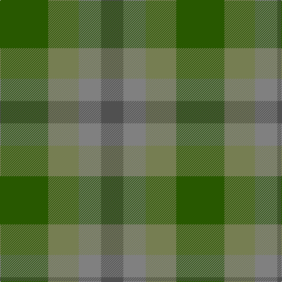

This page is one **sett** — a single exact thread-count. It belongs to the [tartan](/tartans/dg41y26yi19n19/)
(the same proportion at any scale), whose colour order is pattern [BGGG](/stripes/bggg/).

Sourced from register-of-tartans.  It is a [4 stripe tartan](/stripes/stripes4/).

Original link https://www.tartanregister.gov.uk/tartanDetails.aspx?ref=11572

## Register references

External register numbers recorded for this tartan.

- Scottish Register of Tartans: [11572](https://www.tartanregister.gov.uk/tartanDetails.aspx?ref=11572)

## Thread count
G/82 Ga52 N38 Na/38

## Palette

Palette: <strong>Tartan Register</strong>
<table><thead><tr><th>Colour</th><th>Threads</th><th>Shade</th><th>Base</th><th>OKLCh</th></tr></thead><tbody><tr><td>G/</td><td style="text-align:right;font-variant-numeric:tabular-nums">82</td><td><code style="background-color:#285800;">#285800</code> <small style="color:#888">#285800</small></td><td>G <code style="background-color:#006100;">#006100</code></td><td><small style="color:#888">oklch(41.0% 0.122 135.8)</small></td></tr><tr><td>Ga</td><td style="text-align:right;font-variant-numeric:tabular-nums">52</td><td><code style="background-color:#767E52;">#767E52</code> <small style="color:#888">#767E52</small></td><td>G <code style="background-color:#006100;">#006100</code></td><td><small style="color:#888">oklch(57.5% 0.064 116.8)</small></td></tr><tr><td>N</td><td style="text-align:right;font-variant-numeric:tabular-nums">38</td><td><code style="background-color:#808080;">#808080</code> <small style="color:#888">#808080</small></td><td>G <code style="background-color:#006100;">#006100</code></td><td><small style="color:#888">oklch(60.0% 0.000 89.9)</small></td></tr><tr><td>Na/</td><td style="text-align:right;font-variant-numeric:tabular-nums">38</td><td><code style="background-color:#505050;">#505050</code> <small style="color:#888">#505050</small></td><td>B <code style="background-color:#2A418A;">#2A418A</code></td><td><small style="color:#888">oklch(43.1% 0.000 89.9)</small></td></tr></tbody></table>

# Sample pattern

## Nearest tartans

The nearest existing variants by ΔTartan distance, with this tartan at the top so the swatches line up against it.

ΔTartan

Tartan

Sett

—

<a href="/ttd/edit/#slug=dg41y26yi19n19~x2">Green Alaskan</a> <a class="nn-out" href="/setts/s4/dg41y26yi19n19~x2/" title="open its dictionary page">↗</a>

2.58

<a href="/ttd/edit/#slug=dy1db3dy1dg3dy4r1~x2">Fraser Hunting #2</a> <a class="nn-out" href="/setts/s6/dy1db3dy1dg3dy4r1~x2/" title="open its dictionary page">↗</a>

2.63

<a href="/ttd/edit/#slug=g7y6n7y1n2~x6">Bright of Garth (Personal)</a> <a class="nn-out" href="/setts/s5/g7y6n7y1n2~x6/" title="open its dictionary page">↗</a>

2.67

<a href="/ttd/edit/#slug=r4dg1yi6y3r2~x8">Belladrum Estate</a> <a class="nn-out" href="/setts/s5/r4dg1yi6y3r2~x8/" title="open its dictionary page">↗</a>

2.72

<a href="/ttd/edit/#slug=ly2o2n2y2o6y3o3n3y2o2ly2~x2">Callanish (District)</a> <a class="nn-out" href="/setts/s11/ly2o2n2y2o6y3o3n3y2o2ly2~x2/" title="open its dictionary page">↗</a>

2.97

<a href="/ttd/edit/#slug=dy9g9ly2g9dy9b9dy3~x2">MacKay - 1800 (Reay Coat) (Artefact)</a> <a class="nn-out" href="/setts/s7/dy9g9ly2g9dy9b9dy3~x2/" title="open its dictionary page">↗</a>

2.98

<a href="/ttd/edit/#slug=k18dg18dy21r4~x2">Tennant</a> <a class="nn-out" href="/setts/s4/k18dg18dy21r4~x2/" title="open its dictionary page">↗</a>

2.99

<a href="/ttd/edit/#slug=g7dy6dt7dy1dt2~x6">Bright of Garth (Personal)</a> <a class="nn-out" href="/setts/s5/g7dy6dt7dy1dt2~x6/" title="open its dictionary page">↗</a>

3.08

<a href="/ttd/edit/#slug=y7n6lt1lo6n1lo6n6lt1y6~x8">Outlander #2</a> <a class="nn-out" href="/setts/s9/y7n6lt1lo6n1lo6n6lt1y6~x8/" title="open its dictionary page">↗</a>

3.09

<a href="/ttd/edit/#slug=r1o4g3o1db3o1~x2">Fraser Hunting</a> <a class="nn-out" href="/setts/s6/r1o4g3o1db3o1~x2/" title="open its dictionary page">↗</a>

3.09

<a href="/ttd/edit/#slug=o7n6lb1lo6n1lo6n6lb1o6~x8">Outlander #2</a> <a class="nn-out" href="/setts/s9/o7n6lb1lo6n1lo6n6lb1o6~x8/" title="open its dictionary page">↗</a>

## Neighbour map

Every grey dot is one of 14359 variants placed by the first two principal components of the ΔTartan feature space (44% of its variance). Red is this tartan; blue dots are its nearest — click one to open its page.

<svg viewBox="0 0 640 380" role="img" style="max-width:100%;height:auto;border:1px solid #e0e0e0;border-radius:4px;display:block" xmlns="http://www.w3.org/2000/svg"><image href="/nn/cloud.v1.png" width="640" height="380"/><a href="/setts/s6/dy1db3dy1dg3dy4r1~x2/"><circle cx="271.2" cy="324.7" r="4" fill="#3465a4"><title>Fraser Hunting #2</title></circle></a><a href="/setts/s5/g7y6n7y1n2~x6/"><circle cx="302.2" cy="335.8" r="4" fill="#3465a4"><title>Bright of Garth (Personal)</title></circle></a><a href="/setts/s5/r4dg1yi6y3r2~x8/"><circle cx="273.9" cy="316.0" r="4" fill="#3465a4"><title>Belladrum Estate</title></circle></a><a href="/setts/s11/ly2o2n2y2o6y3o3n3y2o2ly2~x2/"><circle cx="216.6" cy="314.8" r="4" fill="#3465a4"><title>Callanish (District)</title></circle></a><a href="/setts/s7/dy9g9ly2g9dy9b9dy3~x2/"><circle cx="211.2" cy="314.4" r="4" fill="#3465a4"><title>MacKay - 1800 (Reay Coat) (Artefact)</title></circle></a><a href="/setts/s4/k18dg18dy21r4~x2/"><circle cx="210.7" cy="345.6" r="4" fill="#3465a4"><title>Tennant</title></circle></a><a href="/setts/s5/g7dy6dt7dy1dt2~x6/"><circle cx="292.6" cy="333.1" r="4" fill="#3465a4"><title>Bright of Garth (Personal)</title></circle></a><a href="/setts/s9/y7n6lt1lo6n1lo6n6lt1y6~x8/"><circle cx="264.9" cy="300.5" r="4" fill="#3465a4"><title>Outlander #2</title></circle></a><a href="/setts/s6/r1o4g3o1db3o1~x2/"><circle cx="242.5" cy="304.0" r="4" fill="#3465a4"><title>Fraser Hunting</title></circle></a><a href="/setts/s9/o7n6lb1lo6n1lo6n6lb1o6~x8/"><circle cx="264.4" cy="299.3" r="4" fill="#3465a4"><title>Outlander #2</title></circle></a><circle cx="211.0" cy="366.0" r="5" fill="#c00000"/></svg>

ID: /setts/s4/dg41y26yi19n19~x2/
