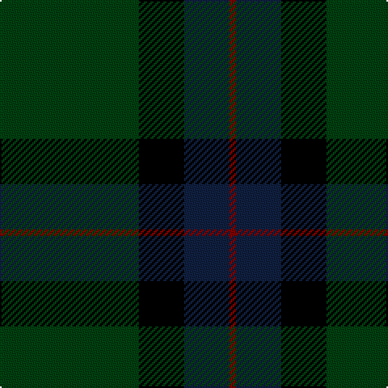

In pattern [GKBR](/stripes/gkbr/).

This was sourced from weddslist.  It is a [4 stripe tartan](/stripes/stripes4/).

Original link http://www.weddslist.com/cgi-bin/tartans/pg.pl?source=sts

## Thread count
DG/86 K28 DB28 DR/4

## Palette
Each colour and the base-6 reference it is a variant of.

| Colour | Shade | Base |
|---|---|---|
| DB | <code style="background-color:#102040;">#102040</code> `oklch(24.9% 0.065 262.6)` <small>#102040</small> | B <code style="background-color:#2A418A;">#2A418A</code> |
| DG | <code style="background-color:#004010;">#004010</code> `oklch(32.3% 0.098 146.3)` <small>#004010</small> | G <code style="background-color:#006100;">#006100</code> |
| DR | <code style="background-color:#800000;">#800000</code> `oklch(37.7% 0.155 29.2)` <small>#800000</small> | R <code style="background-color:#CC0000;">#CC0000</code> |
| K | <code style="background-color:#000000;">#000000</code> `oklch(0.0% 0.000 0.0)` <small>#000000</small> | K <code style="background-color:#000000;">#000000</code> |

# Sample pattern

## Nearest tartans

The nearest existing variants by ΔTartan distance, with this tartan at the top so the swatches line up against it.

ΔTartan

Tartan

Sett

—

<a href="/ttd/edit/#slug=dg43k14dt14r2~x2">St. Andrews International Golf Club</a> <a class="nn-out" href="/setts/s4/dg43k14dt14r2~x2/" title="open its dictionary page">↗</a>

1.43

<a href="/ttd/edit/#slug=r1dg16k8dg4k4ly1~x2">Forbes #6</a> <a class="nn-out" href="/setts/s6/r1dg16k8dg4k4ly1~x2/" title="open its dictionary page">↗</a>

1.68

<a href="/ttd/edit/#slug=dg2k12dg1k12dg12r2~x2">Gunn (Logan)</a> <a class="nn-out" href="/setts/s6/dg2k12dg1k12dg12r2~x2/" title="open its dictionary page">↗</a>

1.72

<a href="/ttd/edit/#slug=dg1db16dg16r1~x2">Barclay Hunting</a> <a class="nn-out" href="/setts/s4/dg1db16dg16r1~x2/" title="open its dictionary page">↗</a>

1.77

<a href="/ttd/edit/#slug=k8lo1k8dg13r2~x4">Tolmie</a> <a class="nn-out" href="/setts/s5/k8lo1k8dg13r2~x4/" title="open its dictionary page">↗</a>

1.79

<a href="/ttd/edit/#slug=k6db4dg44k41w4~x2">Douglas (Clan)</a> <a class="nn-out" href="/setts/s5/k6db4dg44k41w4~x2/" title="open its dictionary page">↗</a>

1.81

<a href="/ttd/edit/#slug=dg26k3dg12k10dp15w2~x2">Lossiemouth/Hersbruck</a> <a class="nn-out" href="/setts/s6/dg26k3dg12k10dp15w2~x2/" title="open its dictionary page">↗</a>

1.82

<a href="/ttd/edit/#slug=db4k4db24dg32lr1dg2~x2">Oliphant</a> <a class="nn-out" href="/setts/s6/db4k4db24dg32lr1dg2~x2/" title="open its dictionary page">↗</a>

1.82

<a href="/ttd/edit/#slug=k8r2k13lo2dg48b6~x2">Green Swamp Youth Campers</a> <a class="nn-out" href="/setts/s6/k8r2k13lo2dg48b6~x2/" title="open its dictionary page">↗</a>

1.84

<a href="/ttd/edit/#slug=g3r1k14g14lo1~x4">Wcwm 1255</a> <a class="nn-out" href="/setts/s5/g3r1k14g14lo1~x4/" title="open its dictionary page">↗</a>

1.84

<a href="/ttd/edit/#slug=k5g40db20ly3~x2">Robert Byers Family - Dooballagh, Ireland</a> <a class="nn-out" href="/setts/s4/k5g40db20ly3~x2/" title="open its dictionary page">↗</a>

## Neighbour map

Every grey dot is one of 14299 variants placed by the first two principal components of the ΔTartan feature space (44% of its variance). Red is this tartan; blue dots are its nearest — click one to open its page.

<svg viewBox="0 0 640 380" role="img" style="max-width:100%;height:auto;border:1px solid #e0e0e0;border-radius:4px;display:block" xmlns="http://www.w3.org/2000/svg"><image href="/nn/cloud.v1.png" width="640" height="380"/><a href="/setts/s6/r1dg16k8dg4k4ly1~x2/"><circle cx="388.7" cy="221.9" r="4" fill="#3465a4"><title>Forbes #6</title></circle></a><a href="/setts/s6/dg2k12dg1k12dg12r2~x2/"><circle cx="403.3" cy="269.0" r="4" fill="#3465a4"><title>Gunn (Logan)</title></circle></a><a href="/setts/s4/dg1db16dg16r1~x2/"><circle cx="400.5" cy="269.2" r="4" fill="#3465a4"><title>Barclay Hunting</title></circle></a><a href="/setts/s5/k8lo1k8dg13r2~x4/"><circle cx="307.7" cy="245.6" r="4" fill="#3465a4"><title>Tolmie</title></circle></a><a href="/setts/s5/k6db4dg44k41w4~x2/"><circle cx="317.9" cy="235.7" r="4" fill="#3465a4"><title>Douglas (Clan)</title></circle></a><a href="/setts/s6/dg26k3dg12k10dp15w2~x2/"><circle cx="302.0" cy="228.7" r="4" fill="#3465a4"><title>Lossiemouth/Hersbruck</title></circle></a><a href="/setts/s6/db4k4db24dg32lr1dg2~x2/"><circle cx="389.7" cy="190.9" r="4" fill="#3465a4"><title>Oliphant</title></circle></a><a href="/setts/s6/k8r2k13lo2dg48b6~x2/"><circle cx="408.3" cy="175.3" r="4" fill="#3465a4"><title>Green Swamp Youth Campers</title></circle></a><a href="/setts/s5/g3r1k14g14lo1~x4/"><circle cx="337.7" cy="223.3" r="4" fill="#3465a4"><title>Wcwm 1255</title></circle></a><a href="/setts/s4/k5g40db20ly3~x2/"><circle cx="353.5" cy="237.3" r="4" fill="#3465a4"><title>Robert Byers Family - Dooballagh, Ireland</title></circle></a><circle cx="399.1" cy="246.8" r="5" fill="#c00000"/></svg>

ID: /setts/s4/dg43k14dt14r2~x2/
