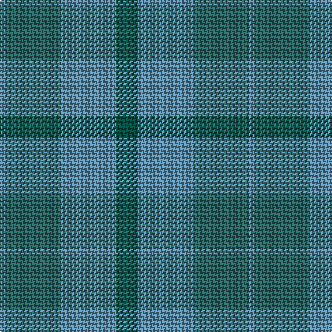

This page is one **sett** — a single exact thread-count. It belongs to the [tartan](/tartans/dg4t10y10t1/)
(the same proportion at any scale), whose colour order is pattern [BGBG](/stripes/bgbg/).

Sourced from tartans-authority.  It is a [4 stripe tartan](/stripes/stripes4/).

Original link http://www.tartansauthority.com/tartan-ferret/display/7432/

2 attestations — the source records this cloth was collapsed from (oldest owns this page)

<ul>
<li>August 2008 — Baker City (District) (tartans-authority, <a href="http://www.tartansauthority.com/tartan-ferret/display/7432/">record</a>)</li>
<li>undated — Baker City (Estimated threadcount) (register-of-tartans, <a href="https://www.tartanregister.gov.uk/tartanDetails.aspx?ref=5501">record</a>)</li>
</ul>

## Register references

External register numbers recorded for this tartan.

- Scottish Register of Tartans: [5501](https://www.tartanregister.gov.uk/tartanDetails.aspx?ref=5501)
- Scottish Tartans Authority (ITI): 7432

## Thread count
Ga/16 B40 G40 B/4

## Palette

Palette: <strong>Tartan Register</strong> <small style="color:#888">(1 of 3 colours)</small>
<table><thead><tr><th>Colour</th><th>Threads</th><th>Shade</th><th>Base</th><th>OKLCh</th></tr></thead><tbody><tr><td>Ga/</td><td style="text-align:right;font-variant-numeric:tabular-nums">16</td><td><code style="background-color:#005044;">#005044</code> <small style="color:#888">#005044</small></td><td>G <code style="background-color:#006100;">#006100</code></td><td><small style="color:#888">oklch(38.6% 0.071 178.2)</small></td></tr><tr><td>B</td><td style="text-align:right;font-variant-numeric:tabular-nums">40</td><td><code style="background-color:#5C8CA8;">#5C8CA8</code> <small style="color:#888">#5C8CA8</small></td><td>B <code style="background-color:#2A418A;">#2A418A</code></td><td><small style="color:#888">oklch(61.7% 0.067 235.0)</small></td></tr><tr><td>G</td><td style="text-align:right;font-variant-numeric:tabular-nums">40</td><td><code style="background-color:#2C6464;">#2C6464</code> <small style="color:#888">#2C6464</small></td><td>G <code style="background-color:#006100;">#006100</code></td><td><small style="color:#888">oklch(46.6% 0.059 195.3)</small></td></tr><tr><td>B/</td><td style="text-align:right;font-variant-numeric:tabular-nums">4</td><td><code style="background-color:#5C8CA8;">#5C8CA8</code> <small style="color:#888">#5C8CA8</small></td><td>B <code style="background-color:#2A418A;">#2A418A</code></td><td><small style="color:#888">oklch(61.7% 0.067 235.0)</small></td></tr></tbody></table>

# Sample pattern

## Nearest tartans

The nearest existing variants by ΔTartan distance, with this tartan at the top so the swatches line up against it.

ΔTartan

Tartan

Sett

—

<a href="/ttd/edit/#slug=dg4t10y10t1~x4">Baker City (District)</a> <a class="nn-out" href="/setts/s4/dg4t10y10t1~x4/" title="open its dictionary page">↗</a>

1.86

<a href="/ttd/edit/#slug=g7y6n7y1n2~x6">Bright of Garth (Personal)</a> <a class="nn-out" href="/setts/s5/g7y6n7y1n2~x6/" title="open its dictionary page">↗</a>

2.12

<a href="/ttd/edit/#slug=dg11n4dg6dy11n1k1dy4~x4">Calais (Fashion)</a> <a class="nn-out" href="/setts/s7/dg11n4dg6dy11n1k1dy4~x4/" title="open its dictionary page">↗</a>

2.12

<a href="/ttd/edit/#slug=g4o25g6t12g12t3~x2">Canadian Fancy</a> <a class="nn-out" href="/setts/s6/g4o25g6t12g12t3~x2/" title="open its dictionary page">↗</a>

2.26

<a href="/ttd/edit/#slug=t22g3t3g3t3g9o28g3o6~x2">Manx Centenary</a> <a class="nn-out" href="/setts/s9/t22g3t3g3t3g9o28g3o6~x2/" title="open its dictionary page">↗</a>

2.33

<a href="/ttd/edit/#slug=y23db11b22r2b22db11y23r2~x2">Skibo</a> <a class="nn-out" href="/setts/s8/y23db11b22r2b22db11y23r2~x2/" title="open its dictionary page">↗</a>

2.36

<a href="/ttd/edit/#slug=n11o1n4o8r1~x8">Cairns, David (Personal)</a> <a class="nn-out" href="/setts/s5/n11o1n4o8r1~x8/" title="open its dictionary page">↗</a>

2.38

<a href="/ttd/edit/#slug=o24n3o3n3o3n20lr22n4~x2">Turnberry (MacArthur)</a> <a class="nn-out" href="/setts/s8/o24n3o3n3o3n20lr22n4~x2/" title="open its dictionary page">↗</a>

2.40

<a href="/ttd/edit/#slug=r2y23db11b22r2~x2">Skibo (Corporate)</a> <a class="nn-out" href="/setts/s5/r2y23db11b22r2~x2/" title="open its dictionary page">↗</a>

2.45

<a href="/ttd/edit/#slug=t4g26g8t8g8g3t2~x2">Valley of the Green</a> <a class="nn-out" href="/setts/s7/t4g26g8t8g8g3t2~x2/" title="open its dictionary page">↗</a>

2.46

<a href="/ttd/edit/#slug=y9g9lo1g9y9g1~x4">Spring Morning</a> <a class="nn-out" href="/setts/s6/y9g9lo1g9y9g1~x4/" title="open its dictionary page">↗</a>

## Neighbour map

Every grey dot is one of 14299 variants placed by the first two principal components of the ΔTartan feature space (44% of its variance). Red is this tartan; blue dots are its nearest — click one to open its page.

<svg viewBox="0 0 640 380" role="img" style="max-width:100%;height:auto;border:1px solid #e0e0e0;border-radius:4px;display:block" xmlns="http://www.w3.org/2000/svg"><image href="/nn/cloud.v1.png" width="640" height="380"/><a href="/setts/s5/g7y6n7y1n2~x6/"><circle cx="301.9" cy="334.8" r="4" fill="#3465a4"><title>Bright of Garth (Personal)</title></circle></a><a href="/setts/s7/dg11n4dg6dy11n1k1dy4~x4/"><circle cx="369.6" cy="292.4" r="4" fill="#3465a4"><title>Calais (Fashion)</title></circle></a><a href="/setts/s6/g4o25g6t12g12t3~x2/"><circle cx="315.3" cy="294.4" r="4" fill="#3465a4"><title>Canadian Fancy</title></circle></a><a href="/setts/s9/t22g3t3g3t3g9o28g3o6~x2/"><circle cx="370.7" cy="267.2" r="4" fill="#3465a4"><title>Manx Centenary</title></circle></a><a href="/setts/s8/y23db11b22r2b22db11y23r2~x2/"><circle cx="289.0" cy="275.1" r="4" fill="#3465a4"><title>Skibo</title></circle></a><a href="/setts/s5/n11o1n4o8r1~x8/"><circle cx="504.7" cy="311.4" r="4" fill="#3465a4"><title>Cairns, David (Personal)</title></circle></a><a href="/setts/s8/o24n3o3n3o3n20lr22n4~x2/"><circle cx="346.4" cy="282.7" r="4" fill="#3465a4"><title>Turnberry (MacArthur)</title></circle></a><a href="/setts/s5/r2y23db11b22r2~x2/"><circle cx="291.0" cy="268.0" r="4" fill="#3465a4"><title>Skibo (Corporate)</title></circle></a><a href="/setts/s7/t4g26g8t8g8g3t2~x2/"><circle cx="355.2" cy="265.9" r="4" fill="#3465a4"><title>Valley of the Green</title></circle></a><a href="/setts/s6/y9g9lo1g9y9g1~x4/"><circle cx="402.3" cy="322.2" r="4" fill="#3465a4"><title>Spring Morning</title></circle></a><circle cx="375.0" cy="339.1" r="5" fill="#c00000"/></svg>

ID: /setts/s4/dg4t10y10t1~x4/
