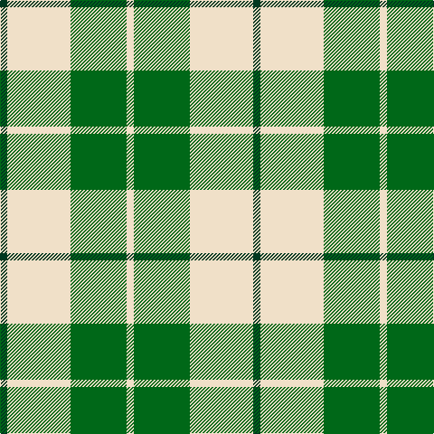

**Bands:** [GWGW](/stripes/gwgw/) · **Stripes:** [DG W G W](/stripes/stripes4/) DG W G W

This was sourced from tartans-authority.  It is a [4 band tartan](/bands/bands4/).

Original link http://www.tartansauthority.com/tartan-ferret/display/7600/

## Attestations

This cloth appears in 2 source records; the oldest owns this page.

- March 2008 — Lewis, Green (Dance) (tartans-authority, [record](http://www.tartansauthority.com/tartan-ferret/display/7600/))
- undated — Lewis Green (register-of-tartans, [record](https://www.tartanregister.gov.uk/tartanDetails.aspx?ref=5624))

## Register references

External register numbers recorded for this tartan.

- Scottish Register of Tartans: [5624](https://www.tartanregister.gov.uk/tartanDetails.aspx?ref=5624)
- Scottish Tartans Authority (ITI): 7600

## Thread count
DG/8 W70 G62 W/8

## Palette
Each colour and its ΔE from the base-6 reference it is a variant of.

| Colour | Shade | Base | ΔE (OKLab) |
|---|---|---|---|
| DG | <code style="background-color:#003820;">#003820</code> `#003820` | G <code style="background-color:#006100;">#006100</code> | 0.15 |
| G | <code style="background-color:#006818;">#006818</code> `#006818` | G <code style="background-color:#006100;">#006100</code> | 0.02 |
| W | <code style="background-color:#F0E0C8;">#F0E0C8</code> `#F0E0C8` | W <code style="background-color:#F7F7F7;">#F7F7F7</code> | 0.07 |

# Sample pattern

## Nearest tartans

The nearest existing variants by ΔTartan distance.

1. [Wallace Green Dress Fashion Tartan Tartan Number: 2212. Earliest known date: pre 2004 A dancers tartan based on the Wallace See products available Copyright © Blair Urquhart, Comrie, 2015](/setts/s6/w12g12w1g12w12lo1~x4/) — ΔT 1.25
1. [Loch Lomond #3](/setts/s4/g22w14r7ly2~x2/) — ΔT 1.51
1. [MacPherson Dress Green (Dance)](/setts/s7/w5r3w26g20w3g8ly3~x2/) — ΔT 1.54
1. [Fraser Yellow #2](/setts/s6/ly1db3ly1dg3ly8w1~x4/) — ΔT 1.64
1. [Barclay Dress](/setts/s4/ly5dt32ly32w5~x2/) — ΔT 1.66
1. [Erskine, Green (Dance)](/setts/s6/g6w2g29w29g2w6~x2/) — ΔT 1.67
1. [WVU Mountaineer Tartan](/setts/s6/db4ly9w4db9ly18w1~x2/) — ΔT 1.73
1. [Erskine Green](/setts/s6/dg6w2dg29w29dg2w6~x2/) — ΔT 1.74
1. [Masai Shuka 04 (Artefact)](/setts/s3/ly20db10k3~x2/) — ΔT 1.74
1. [Fraser, Yellow](/setts/s6/ly1db3ly1g3ly8w1~x4/) — ΔT 1.79

## Neighbour map

Every grey dot is one of 14313 variants placed by the first two principal components of the ΔTartan feature space (44% of its variance). Red is this tartan; blue dots are its nearest — click one to open its page.

<svg viewBox="0 0 640 380" role="img" style="max-width:100%;height:auto;border:1px solid #e0e0e0;border-radius:4px;display:block" xmlns="http://www.w3.org/2000/svg"><image href="/nn/cloud.v1.png" width="640" height="380"/><a href="/setts/s6/w12g12w1g12w12lo1~x4/"><circle cx="273.7" cy="223.8" r="4" fill="#3465a4"><title>Wallace Green Dress Fashion Tartan Tartan Number: 2212. Earliest known date: pre 2004 A dancers tartan based on the Wallace See products available Copyright © Blair Urquhart, Comrie, 2015</title></circle></a><a href="/setts/s4/g22w14r7ly2~x2/"><circle cx="215.1" cy="213.3" r="4" fill="#3465a4"><title>Loch Lomond #3</title></circle></a><a href="/setts/s7/w5r3w26g20w3g8ly3~x2/"><circle cx="246.2" cy="183.2" r="4" fill="#3465a4"><title>MacPherson Dress Green (Dance)</title></circle></a><a href="/setts/s6/ly1db3ly1dg3ly8w1~x4/"><circle cx="272.7" cy="191.9" r="4" fill="#3465a4"><title>Fraser Yellow #2</title></circle></a><a href="/setts/s4/ly5dt32ly32w5~x2/"><circle cx="249.4" cy="241.6" r="4" fill="#3465a4"><title>Barclay Dress</title></circle></a><a href="/setts/s6/g6w2g29w29g2w6~x2/"><circle cx="320.5" cy="195.0" r="4" fill="#3465a4"><title>Erskine, Green (Dance)</title></circle></a><a href="/setts/s6/db4ly9w4db9ly18w1~x2/"><circle cx="301.2" cy="179.6" r="4" fill="#3465a4"><title>WVU Mountaineer Tartan</title></circle></a><a href="/setts/s6/dg6w2dg29w29dg2w6~x2/"><circle cx="327.4" cy="200.0" r="4" fill="#3465a4"><title>Erskine Green</title></circle></a><a href="/setts/s3/ly20db10k3~x2/"><circle cx="288.3" cy="260.4" r="4" fill="#3465a4"><title>Masai Shuka 04 (Artefact)</title></circle></a><a href="/setts/s6/ly1db3ly1g3ly8w1~x4/"><circle cx="279.9" cy="194.0" r="4" fill="#3465a4"><title>Fraser, Yellow</title></circle></a><circle cx="282.2" cy="231.1" r="5" fill="#c00000"/></svg>

ID: /setts/s4/dg4w35g31w4~x2/
