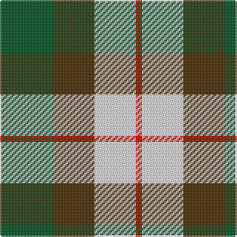

In pattern [GGWR](/stripes/ggwr/).

This was sourced from register-of-tartans.  It is a [4 stripe tartan](/stripes/stripes4/).

Original link https://www.tartanregister.gov.uk/tartanDetails.aspx?ref=2554

## Also known as

This cloth is also recorded under:

- MacKinnon, dress

## Register references

External register numbers recorded for this tartan.

- Scottish Register of Tartans: [2554](https://www.tartanregister.gov.uk/tartanDetails.aspx?ref=2554)
- Scottish Tartans World Register: 921

## Thread count
G/36 T28 LN28 R/4

## Palette
Each colour and the base-6 reference it is a variant of.

| Colour | Shade | Base |
|---|---|---|
| G | <code style="background-color:#005020;">#005020</code> `oklch(37.7% 0.105 149.6)` <small>#005020</small> | G <code style="background-color:#006100;">#006100</code> |
| LN | <code style="background-color:#E0E0E0;">#E0E0E0</code> `oklch(90.7% 0.000 89.9)` <small>#E0E0E0</small> | W <code style="background-color:#F7F7F7;">#F7F7F7</code> |
| R | <code style="background-color:#DC0000;">#DC0000</code> `oklch(56.2% 0.230 29.2)` <small>#DC0000</small> | R <code style="background-color:#CC0000;">#CC0000</code> |
| T | <code style="background-color:#482800;">#482800</code> `oklch(31.1% 0.070 65.5)` <small>#482800</small> | G <code style="background-color:#006100;">#006100</code> |

# Sample pattern

## Nearest tartans

The nearest existing variants by ΔTartan distance.

1. [MacKinnon Dress Trade Tartan Tartan Number: 921. Earliest known date: 1970-80 Canada. See products available Copyright © Blair Urquhart, Comrie, 2015](/setts/s4/g9dr7w7r1~x4/) — ΔT 0.25
1. [MacKinnon Dress Hunting (Fashion)](/setts/s4/dg7dr7w7r1~x6/) — ΔT 0.82
1. [MacKinnon, dress](/setts/s4/g9o7w7r1~x4/) — ΔT 0.89
1. [Thistle and Kudzu Scottish Socie Corporate Tartan Tartan Number: 10655. Earliest known date: 01/09/2010 The Thistle and Kudzu Scottish Society of Athens is an informal group that organizes and supports Scottish activities in Athens, Georgia, USA. Activities include Royal Scottish Country Dance lessons and demonstrations, annual Robert Burns Dinners, a Scottish Festival, and the Thistle & Kudzu Pipes and Drums band and piping lessons. In 2010 a tartan design contest was organized to create a unique tartan that represented the Thistle and Kudzu Scottish Society. Members used an online tartan design programme (http://www.houseoftartan.co.uk/interactive/weaver/index.html) to create and submit various tartan designs that were then voted on by the Scottish dance class. The design that received the most votes was selected as the official tartan of the group. The overall design was submitted by Stephanie Bohan and the thread count established for weaving by Dorothy Harnish. Colours: dark green represents the kudzu vine which grows abundantly throughout Georgia and is well known in that state; light green, purple and white represent the thistle plant and flower in bloom. See products available Copyright © Blair Urquhart, Comrie, 2015](/setts/s4/p6lg15g15k2~x2/) — ΔT 1.17
1. [Delroeux, John Michael (Personal)](/setts/s4/db3dg6ly1r3~x10/) — ΔT 1.22
1. [Harbison (2015)](/setts/s4/db21g34r14w6~x2/) — ΔT 1.26
1. [Delroeux (Personal)](/setts/s4/db3g6ly1r3~x10/) — ΔT 1.35
1. [Oban Grey District Tartan Tartan Number: 1237. Earliest known date: pre 2003 Not an official district but a name chosen by the weavers. See products available Copyright © Blair Urquhart, Comrie, 2015](/setts/s5/k4w3k4o9r1~x4/) — ΔT 1.38
1. [Oban Grey](/setts/s5/k4w3k4y9r1~x4/) — ΔT 1.39
1. [Thistle and Kudzu Scottish Society](/setts/s4/p6lg15g15w2~x2/) — ΔT 1.42

## Neighbour map

Every grey dot is one of 14299 variants placed by the first two principal components of the ΔTartan feature space (44% of its variance). Red is this tartan; blue dots are its nearest — click one to open its page.

<svg viewBox="0 0 640 380" role="img" style="max-width:100%;height:auto;border:1px solid #e0e0e0;border-radius:4px;display:block" xmlns="http://www.w3.org/2000/svg"><image href="/nn/cloud.v1.png" width="640" height="380"/><a href="/setts/s4/g9dr7w7r1~x4/"><circle cx="140.4" cy="243.3" r="4" fill="#3465a4"><title>MacKinnon Dress Trade Tartan Tartan Number: 921. Earliest known date: 1970-80 Canada. See products available Copyright © Blair Urquhart, Comrie, 2015</title></circle></a><a href="/setts/s4/dg7dr7w7r1~x6/"><circle cx="107.6" cy="252.5" r="4" fill="#3465a4"><title>MacKinnon Dress Hunting (Fashion)</title></circle></a><a href="/setts/s4/g9o7w7r1~x4/"><circle cx="149.5" cy="246.7" r="4" fill="#3465a4"><title>MacKinnon, dress</title></circle></a><a href="/setts/s4/p6lg15g15k2~x2/"><circle cx="158.1" cy="245.3" r="4" fill="#3465a4"><title>Thistle and Kudzu Scottish Socie Corporate Tartan Tartan Number: 10655. Earliest known date: 01/09/2010 The Thistle and Kudzu Scottish Society of Athens is an informal group that organizes and supports Scottish activities in Athens, Georgia, USA. Activities include Royal Scottish Country Dance lessons and demonstrations, annual Robert Burns Dinners, a Scottish Festival, and the Thistle &amp; Kudzu Pipes and Drums band and piping lessons. In 2010 a tartan design contest was organized to create a unique tartan that represented the Thistle and Kudzu Scottish Society. Members used an online tartan design programme (http://www.houseoftartan.co.uk/interactive/weaver/index.html) to create and submit various tartan designs that were then voted on by the Scottish dance class. The design that received the most votes was selected as the official tartan of the group. The overall design was submitted by Stephanie Bohan and the thread count established for weaving by Dorothy Harnish. Colours: dark green represents the kudzu vine which grows abundantly throughout Georgia and is well known in that state; light green, purple and white represent the thistle plant and flower in bloom. See products available Copyright © Blair Urquhart, Comrie, 2015</title></circle></a><a href="/setts/s4/db3dg6ly1r3~x10/"><circle cx="171.0" cy="256.6" r="4" fill="#3465a4"><title>Delroeux, John Michael (Personal)</title></circle></a><a href="/setts/s4/db21g34r14w6~x2/"><circle cx="178.6" cy="268.0" r="4" fill="#3465a4"><title>Harbison (2015)</title></circle></a><a href="/setts/s4/db3g6ly1r3~x10/"><circle cx="194.8" cy="269.2" r="4" fill="#3465a4"><title>Delroeux (Personal)</title></circle></a><a href="/setts/s5/k4w3k4o9r1~x4/"><circle cx="185.8" cy="222.5" r="4" fill="#3465a4"><title>Oban Grey District Tartan Tartan Number: 1237. Earliest known date: pre 2003 Not an official district but a name chosen by the weavers. See products available Copyright © Blair Urquhart, Comrie, 2015</title></circle></a><a href="/setts/s5/k4w3k4y9r1~x4/"><circle cx="187.5" cy="223.6" r="4" fill="#3465a4"><title>Oban Grey</title></circle></a><a href="/setts/s4/p6lg15g15w2~x2/"><circle cx="162.8" cy="245.3" r="4" fill="#3465a4"><title>Thistle and Kudzu Scottish Society</title></circle></a><circle cx="143.5" cy="246.9" r="5" fill="#c00000"/></svg>

ID: /setts/s4/dg9dy7w7r1~x4/
