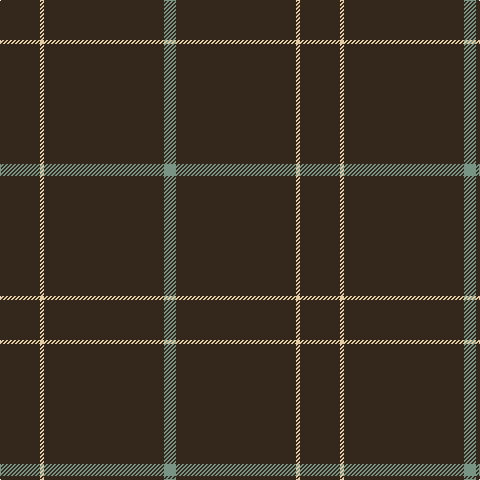

This page is one **sett** — a single exact thread-count. It belongs to the [tartan](/tartans/do10ly1do30y3/)
(the same proportion at any scale), whose colour order is pattern [BYBG](/stripes/bybg/).

Sourced from house-of-tartan.  It is a [4 stripe tartan](/stripes/stripes4/).

Original link http://www.house-of-tartan.scotland.net/house/TartanViewjs.asp?colr=Def&tnam=7094

## Thread count
K/40 LR4 K120 LG/12

## Palette

Palette: <strong>Tartan Register</strong> <small style="color:#888">(1 of 3 colours)</small>
<table><thead><tr><th>Colour</th><th>Threads</th><th>Shade</th><th>Base</th><th>OKLCh</th></tr></thead><tbody><tr><td>K/</td><td style="text-align:right;font-variant-numeric:tabular-nums">40</td><td><code style="background-color:#34281C;">#34281C</code> <small style="color:#888">#34281C</small></td><td>B <code style="background-color:#2A418A;">#2A418A</code></td><td><small style="color:#888">oklch(28.7% 0.027 66.4)</small></td></tr><tr><td>LR</td><td style="text-align:right;font-variant-numeric:tabular-nums">4</td><td><code style="background-color:#E4CCA4;">#E4CCA4</code> <small style="color:#888">#E4CCA4</small></td><td>Y <code style="background-color:#F2BF00;">#F2BF00</code></td><td><small style="color:#888">oklch(85.5% 0.059 80.4)</small></td></tr><tr><td>K</td><td style="text-align:right;font-variant-numeric:tabular-nums">120</td><td><code style="background-color:#34281C;">#34281C</code> <small style="color:#888">#34281C</small></td><td>B <code style="background-color:#2A418A;">#2A418A</code></td><td><small style="color:#888">oklch(28.7% 0.027 66.4)</small></td></tr><tr><td>LG/</td><td style="text-align:right;font-variant-numeric:tabular-nums">12</td><td><code style="background-color:#789484;">#789484</code> <small style="color:#888">#789484</small></td><td>G <code style="background-color:#006100;">#006100</code></td><td><small style="color:#888">oklch(64.0% 0.040 160.0)</small></td></tr></tbody></table>

# Sample pattern

## Nearest tartans

The nearest existing variants by ΔTartan distance, with this tartan at the top so the swatches line up against it.

ΔTartan

Tartan

Sett

—

<a href="/ttd/edit/#slug=do10ly1do30y3~x4">Pasteur Fancy Tartan Tartan Number: 7094. Earliest known date: 1836 The pattern is taken from a shawl or cloak which appears in a portrait of Louie Pasteur's mother. The portrait was drawn in pastels when Pasteur was just 13 years old. The information came Marie-Claude Fortier researching the life of Pasteur. See products available Copyright © Blair Urquhart, Comrie, 2015</a> <a class="nn-out" href="/setts/s4/do10ly1do30y3~x4/" title="open its dictionary page">↗</a>

0.97

<a href="/ttd/edit/#slug=dy10ly1dy30y3~x4">Pasteur</a> <a class="nn-out" href="/setts/s4/dy10ly1dy30y3~x4/" title="open its dictionary page">↗</a>

1.62

<a href="/ttd/edit/#slug=k72w3k11db9">Dunnotar (School)</a> <a class="nn-out" href="/setts/s4/k72w3k11db9/" title="open its dictionary page">↗</a>

1.69

<a href="/ttd/edit/#slug=k72r3k11t9k11r3k37">Chafyn House (School)</a> <a class="nn-out" href="/setts/s7/k72r3k11t9k11r3k37/" title="open its dictionary page">↗</a>

1.76

<a href="/ttd/edit/#slug=k60t3k9g7">Wallington (Corporate?)</a> <a class="nn-out" href="/setts/s4/k60t3k9g7/" title="open its dictionary page">↗</a>

1.81

<a href="/ttd/edit/#slug=r2k50n2r1~x2">Galloway (Name)</a> <a class="nn-out" href="/setts/s4/r2k50n2r1~x2/" title="open its dictionary page">↗</a>

1.87

<a href="/ttd/edit/#slug=dg30r2dg8r1dg5w2">Dewi Sant</a> <a class="nn-out" href="/setts/s6/dg30r2dg8r1dg5w2/" title="open its dictionary page">↗</a>

2.10

<a href="/ttd/edit/#slug=k31r2k10db1k1w1~x4">NewGeneration Alchemy (NGA) Inc</a> <a class="nn-out" href="/setts/s6/k31r2k10db1k1w1~x4/" title="open its dictionary page">↗</a>

2.22

<a href="/ttd/edit/#slug=dg60r2dg8r1dg5w2">St. David's Welsh District Tartan Tartan Number: 5746. Earliest known date: 2002 Representing the colours of Wales, this national tartan is recognised in Wales as The Brithwe Dewi Sant, or The Saint Davids Tartan, exclusively woven in Wales by The Cambrian Woollen Mill, in Llanwrtyd Wells, Powys. Launched at Cardiff Castle in honour of the Welsh Patron Saint, and worn by Welsh folk around the world for special occasions including St Davids Day, March 1st. A differing warp and weft create a vertical stripe in these Welsh Tartans. See products available Copyright © Blair Urquhart, Comrie, 2015</a> <a class="nn-out" href="/setts/s6/dg60r2dg8r1dg5w2/" title="open its dictionary page">↗</a>

2.29

<a href="/ttd/edit/#slug=dg62r7k4r4dg62~x2">MacNab, Ancient</a> <a class="nn-out" href="/setts/s5/dg62r7k4r4dg62~x2/" title="open its dictionary page">↗</a>

2.33

<a href="/ttd/edit/#slug=k8ly3k120ly3k40t2k4~x2">Lochaber (Hesketh)</a> <a class="nn-out" href="/setts/s7/k8ly3k120ly3k40t2k4~x2/" title="open its dictionary page">↗</a>

## Neighbour map

Every grey dot is one of 14359 variants placed by the first two principal components of the ΔTartan feature space (44% of its variance). Red is this tartan; blue dots are its nearest — click one to open its page.

<svg viewBox="0 0 640 380" role="img" style="max-width:100%;height:auto;border:1px solid #e0e0e0;border-radius:4px;display:block" xmlns="http://www.w3.org/2000/svg"><image href="/nn/cloud.v1.png" width="640" height="380"/><a href="/setts/s4/dy10ly1dy30y3~x4/"><circle cx="626.0" cy="239.1" r="4" fill="#3465a4"><title>Pasteur</title></circle></a><a href="/setts/s4/k72w3k11db9/"><circle cx="626.0" cy="233.5" r="4" fill="#3465a4"><title>Dunnotar (School)</title></circle></a><a href="/setts/s7/k72r3k11t9k11r3k37/"><circle cx="626.0" cy="214.2" r="4" fill="#3465a4"><title>Chafyn House (School)</title></circle></a><a href="/setts/s4/k60t3k9g7/"><circle cx="626.0" cy="231.8" r="4" fill="#3465a4"><title>Wallington (Corporate?)</title></circle></a><a href="/setts/s4/r2k50n2r1~x2/"><circle cx="626.0" cy="204.2" r="4" fill="#3465a4"><title>Galloway (Name)</title></circle></a><a href="/setts/s6/dg30r2dg8r1dg5w2/"><circle cx="626.0" cy="202.3" r="4" fill="#3465a4"><title>Dewi Sant</title></circle></a><a href="/setts/s6/k31r2k10db1k1w1~x4/"><circle cx="626.0" cy="172.5" r="4" fill="#3465a4"><title>NewGeneration Alchemy (NGA) Inc</title></circle></a><a href="/setts/s6/dg60r2dg8r1dg5w2/"><circle cx="626.0" cy="171.1" r="4" fill="#3465a4"><title>St. David's Welsh District Tartan Tartan Number: 5746. Earliest known date: 2002 Representing the colours of Wales, this national tartan is recognised in Wales as The Brithwe Dewi Sant, or The Saint Davids Tartan, exclusively woven in Wales by The Cambrian Woollen Mill, in Llanwrtyd Wells, Powys. Launched at Cardiff Castle in honour of the Welsh Patron Saint, and worn by Welsh folk around the world for special occasions including St Davids Day, March 1st. A differing warp and weft create a vertical stripe in these Welsh Tartans. See products available Copyright © Blair Urquhart, Comrie, 2015</title></circle></a><a href="/setts/s5/dg62r7k4r4dg62~x2/"><circle cx="626.0" cy="264.6" r="4" fill="#3465a4"><title>MacNab, Ancient</title></circle></a><a href="/setts/s7/k8ly3k120ly3k40t2k4~x2/"><circle cx="626.0" cy="169.5" r="4" fill="#3465a4"><title>Lochaber (Hesketh)</title></circle></a><circle cx="626.0" cy="232.2" r="5" fill="#c00000"/></svg>

ID: /setts/s4/do10ly1do30y3~x4/
