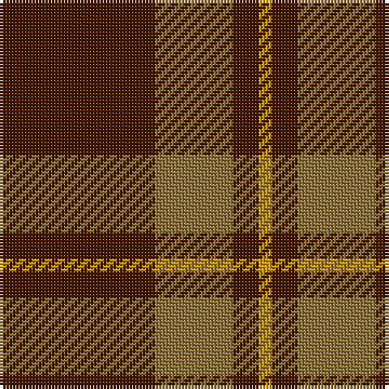

This page is one **sett** — a single exact thread-count. It belongs to the [tartan](/tartans/do12y6do2lo1/)
(the same proportion at any scale), whose colour order is pattern [BGBY](/stripes/bgby/).

Sourced from register-of-tartans.  It is a [4 stripe tartan](/stripes/stripes4/).

Original link https://www.tartanregister.gov.uk/tartanDetails.aspx?ref=2145

2 attestations — the source records this cloth was collapsed from (oldest owns this page)

<ul>
<li>01/01/2002 — Loch Garth (register-of-tartans, <a href="https://www.tartanregister.gov.uk/tartanDetails.aspx?ref=2145">record</a>)</li>
<li>pre 2002 — Loch Garth (Fashion) (tartans-authority, <a href="http://www.tartansauthority.com/tartan-ferret/display/1750/">record</a>)</li>
</ul>

## Register references

External register numbers recorded for this tartan.

- Scottish Register of Tartans: [2145](https://www.tartanregister.gov.uk/tartanDetails.aspx?ref=2145)
- Scottish Tartans Authority (ITI): 1750
- Scottish Tartans World Register: 1750

## Thread count
DR/48 LT24 DR8 DY/4

## Palette

Palette: <strong>Tartan Register</strong> <small style="color:#888">(2 of 3 colours)</small>
<table><thead><tr><th>Colour</th><th>Threads</th><th>Shade</th><th>Base</th><th>OKLCh</th></tr></thead><tbody><tr><td>DR/</td><td style="text-align:right;font-variant-numeric:tabular-nums">48</td><td><code style="background-color:#441800;">#441800</code> <small style="color:#888">#441800</small></td><td>B <code style="background-color:#2A418A;">#2A418A</code></td><td><small style="color:#888">oklch(27.3% 0.076 46.3)</small></td></tr><tr><td>LT</td><td style="text-align:right;font-variant-numeric:tabular-nums">24</td><td><code style="background-color:#8C7038;">#8C7038</code> <small style="color:#888">#8C7038</small></td><td>G <code style="background-color:#006100;">#006100</code></td><td><small style="color:#888">oklch(56.0% 0.082 83.0)</small></td></tr><tr><td>DR</td><td style="text-align:right;font-variant-numeric:tabular-nums">8</td><td><code style="background-color:#441800;">#441800</code> <small style="color:#888">#441800</small></td><td>B <code style="background-color:#2A418A;">#2A418A</code></td><td><small style="color:#888">oklch(27.3% 0.076 46.3)</small></td></tr><tr><td>DY/</td><td style="text-align:right;font-variant-numeric:tabular-nums">4</td><td><code style="background-color:#D09800;">#D09800</code> <small style="color:#888">#D09800</small></td><td>Y <code style="background-color:#F2BF00;">#F2BF00</code></td><td><small style="color:#888">oklch(71.4% 0.147 82.1)</small></td></tr></tbody></table>

# Sample pattern

## Nearest tartans

The nearest existing variants by ΔTartan distance, with this tartan at the top so the swatches line up against it.

ΔTartan

Tartan

Sett

—

<a href="/ttd/edit/#slug=do12y6do2lo1~x4">Loch Garth</a> <a class="nn-out" href="/setts/s4/do12y6do2lo1~x4/" title="open its dictionary page">↗</a>

1.38

<a href="/ttd/edit/#slug=dy12lo6dy2ly1~x4">Loch Garth Tartan Tartan Number: 1750. Earliest known date: pre 2003 Nothing See products available Copyright © Blair Urquhart, Comrie, 2015</a> <a class="nn-out" href="/setts/s4/dy12lo6dy2ly1~x4/" title="open its dictionary page">↗</a>

1.43

<a href="/ttd/edit/#slug=dg16r5dg2r18k2">MacDonald of Sleat</a> <a class="nn-out" href="/setts/s5/dg16r5dg2r18k2/" title="open its dictionary page">↗</a>

1.49

<a href="/ttd/edit/#slug=dg37o9dg3r9o3~x2">Glen Trool</a> <a class="nn-out" href="/setts/s5/dg37o9dg3r9o3~x2/" title="open its dictionary page">↗</a>

1.51

<a href="/setts/s4/r10dg4lo1~x8/">Lugo (2013)</a>

1.52

<a href="/ttd/edit/#slug=r8g2r2k1r1g2~x10">Waverley Care Aids Trust (Corporate)</a> <a class="nn-out" href="/setts/s6/r8g2r2k1r1g2~x10/" title="open its dictionary page">↗</a>

1.53

<a href="/ttd/edit/#slug=r14k3dg3w1~x2">Bacon, Red (Fashion)</a> <a class="nn-out" href="/setts/s4/r14k3dg3w1~x2/" title="open its dictionary page">↗</a>

1.63

<a href="/ttd/edit/#slug=r9k1r5g6r4k2~x4">MacAn of Lurgyvallan (Hose)</a> <a class="nn-out" href="/setts/s6/r9k1r5g6r4k2~x4/" title="open its dictionary page">↗</a>

1.64

<a href="/ttd/edit/#slug=g16r1g2r11~x8">Middleton</a> <a class="nn-out" href="/setts/s4/g16r1g2r11~x8/" title="open its dictionary page">↗</a>

1.67

<a href="/ttd/edit/#slug=r6w2r30g12r3g12r3~x2">Crawford</a> <a class="nn-out" href="/setts/s7/r6w2r30g12r3g12r3~x2/" title="open its dictionary page">↗</a>

1.71

<a href="/ttd/edit/#slug=dg7r3dg1r9k1~x2">MacDonald of Sleat</a> <a class="nn-out" href="/setts/s5/dg7r3dg1r9k1~x2/" title="open its dictionary page">↗</a>

## Neighbour map

Every grey dot is one of 14359 variants placed by the first two principal components of the ΔTartan feature space (44% of its variance). Red is this tartan; blue dots are its nearest — click one to open its page.

<svg viewBox="0 0 640 380" role="img" style="max-width:100%;height:auto;border:1px solid #e0e0e0;border-radius:4px;display:block" xmlns="http://www.w3.org/2000/svg"><image href="/nn/cloud.v1.png" width="640" height="380"/><a href="/setts/s4/dy12lo6dy2ly1~x4/"><circle cx="463.3" cy="263.6" r="4" fill="#3465a4"><title>Loch Garth Tartan Tartan Number: 1750. Earliest known date: pre 2003 Nothing See products available Copyright © Blair Urquhart, Comrie, 2015</title></circle></a><a href="/setts/s5/dg16r5dg2r18k2/"><circle cx="362.4" cy="250.5" r="4" fill="#3465a4"><title>MacDonald of Sleat</title></circle></a><a href="/setts/s5/dg37o9dg3r9o3~x2/"><circle cx="441.0" cy="239.0" r="4" fill="#3465a4"><title>Glen Trool</title></circle></a><a href="/setts/s4/r10dg4lo1~x8/"><circle cx="348.8" cy="264.4" r="4" fill="#3465a4"><title>Lugo (2013)</title></circle></a><a href="/setts/s6/r8g2r2k1r1g2~x10/"><circle cx="470.6" cy="254.5" r="4" fill="#3465a4"><title>Waverley Care Aids Trust (Corporate)</title></circle></a><a href="/setts/s4/r14k3dg3w1~x2/"><circle cx="429.3" cy="213.3" r="4" fill="#3465a4"><title>Bacon, Red (Fashion)</title></circle></a><a href="/setts/s6/r9k1r5g6r4k2~x4/"><circle cx="421.0" cy="278.0" r="4" fill="#3465a4"><title>MacAn of Lurgyvallan (Hose)</title></circle></a><a href="/setts/s4/g16r1g2r11~x8/"><circle cx="442.1" cy="255.6" r="4" fill="#3465a4"><title>Middleton</title></circle></a><a href="/setts/s7/r6w2r30g12r3g12r3~x2/"><circle cx="409.9" cy="198.7" r="4" fill="#3465a4"><title>Crawford</title></circle></a><a href="/setts/s5/dg7r3dg1r9k1~x2/"><circle cx="353.6" cy="238.0" r="4" fill="#3465a4"><title>MacDonald of Sleat</title></circle></a><circle cx="448.4" cy="256.4" r="5" fill="#c00000"/></svg>

ID: /setts/s4/do12y6do2lo1~x4/
