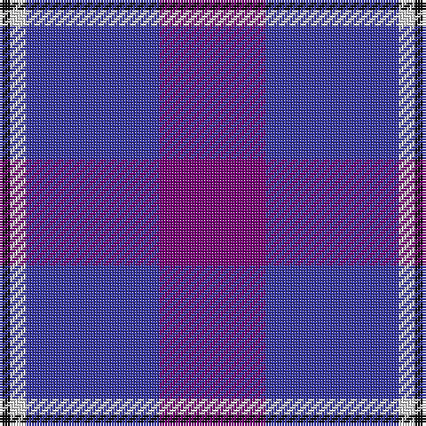

In pattern [BBWK](/stripes/bbwk/).

This was sourced from tartans-authority.  It is a [4 stripe tartan](/stripes/stripes4/).

Original link http://www.tartansauthority.com/tartan-ferret/display/7386/

## Thread count
P/40 B50 LN6 K/4

## Palette
Each colour and the base-6 reference it is a variant of.

| Colour | Shade | Base |
|---|---|---|
| B | <code style="background-color:#3838A4;">#3838A4</code> `oklch(41.3% 0.169 276.1)` <small>#3838A4</small> | B <code style="background-color:#2A418A;">#2A418A</code> |
| K | <code style="background-color:#101010;">#101010</code> `oklch(17.3% 0.000 89.9)` <small>#101010</small> | K <code style="background-color:#000000;">#000000</code> |
| LN | <code style="background-color:#E0E0E0;">#E0E0E0</code> `oklch(90.7% 0.000 89.9)` <small>#E0E0E0</small> | W <code style="background-color:#F7F7F7;">#F7F7F7</code> |
| P | <code style="background-color:#780078;">#780078</code> `oklch(40.2% 0.185 328.4)` <small>#780078</small> | B <code style="background-color:#2A418A;">#2A418A</code> |

# Sample pattern

## Nearest tartans

The nearest existing variants by ΔTartan distance, with this tartan at the top so the swatches line up against it.

ΔTartan

Tartan

Sett

—

<a href="/ttd/edit/#slug=dp20db25w3k2~x2">Murdoch, Ellis (Personal)</a> <a class="nn-out" href="/setts/s4/dp20db25w3k2~x2/" title="open its dictionary page">↗</a>

0.87

<a href="/ttd/edit/#slug=p20db25w3k2~x2">Murdoch, Ellis (Personal)</a> <a class="nn-out" href="/setts/s4/p20db25w3k2~x2/" title="open its dictionary page">↗</a>

1.36

<a href="/ttd/edit/#slug=dp9db6w1dg4dp2~x4">Cathro</a> <a class="nn-out" href="/setts/s5/dp9db6w1dg4dp2~x4/" title="open its dictionary page">↗</a>

1.89

<a href="/ttd/edit/#slug=dp10ly3dp8db42g5o5~x2">Cheadle (Personal)</a> <a class="nn-out" href="/setts/s6/dp10ly3dp8db42g5o5~x2/" title="open its dictionary page">↗</a>

1.99

<a href="/ttd/edit/#slug=p9b6w1g4p2~x8">Cathro (Name)</a> <a class="nn-out" href="/setts/s5/p9b6w1g4p2~x8/" title="open its dictionary page">↗</a>

2.03

<a href="/ttd/edit/#slug=r21db43dt86lb10">Fong (Personal)</a> <a class="nn-out" href="/setts/s4/r21db43dt86lb10/" title="open its dictionary page">↗</a>

2.04

<a href="/ttd/edit/#slug=db4g5dp3g5db46dp42w4dp4">Clans of Caledonia</a> <a class="nn-out" href="/setts/s8/db4g5dp3g5db46dp42w4dp4/" title="open its dictionary page">↗</a>

2.04

<a href="/ttd/edit/#slug=db23dp2g11dp24lb3~x2">Scottish Open Squash (Corporate)</a> <a class="nn-out" href="/setts/s5/db23dp2g11dp24lb3~x2/" title="open its dictionary page">↗</a>

2.05

<a href="/ttd/edit/#slug=b18k2b4k6dp12lo1~x2">Joker, The</a> <a class="nn-out" href="/setts/s6/b18k2b4k6dp12lo1~x2/" title="open its dictionary page">↗</a>

2.06

<a href="/ttd/edit/#slug=dp15k5dp15k21w2~x2">Highland Spirit (Fashion)</a> <a class="nn-out" href="/setts/s5/dp15k5dp15k21w2~x2/" title="open its dictionary page">↗</a>

2.15

<a href="/ttd/edit/#slug=dp2lp1dp10db1y10k1y2~x4">Lennox Primary School</a> <a class="nn-out" href="/setts/s7/dp2lp1dp10db1y10k1y2~x4/" title="open its dictionary page">↗</a>

## Neighbour map

Every grey dot is one of 14299 variants placed by the first two principal components of the ΔTartan feature space (44% of its variance). Red is this tartan; blue dots are its nearest — click one to open its page.

<svg viewBox="0 0 640 380" role="img" style="max-width:100%;height:auto;border:1px solid #e0e0e0;border-radius:4px;display:block" xmlns="http://www.w3.org/2000/svg"><image href="/nn/cloud.v1.png" width="640" height="380"/><a href="/setts/s4/p20db25w3k2~x2/"><circle cx="326.5" cy="238.2" r="4" fill="#3465a4"><title>Murdoch, Ellis (Personal)</title></circle></a><a href="/setts/s5/dp9db6w1dg4dp2~x4/"><circle cx="288.1" cy="263.5" r="4" fill="#3465a4"><title>Cathro</title></circle></a><a href="/setts/s6/dp10ly3dp8db42g5o5~x2/"><circle cx="356.7" cy="185.8" r="4" fill="#3465a4"><title>Cheadle (Personal)</title></circle></a><a href="/setts/s5/p9b6w1g4p2~x8/"><circle cx="270.6" cy="250.8" r="4" fill="#3465a4"><title>Cathro (Name)</title></circle></a><a href="/setts/s4/r21db43dt86lb10/"><circle cx="292.0" cy="257.5" r="4" fill="#3465a4"><title>Fong (Personal)</title></circle></a><a href="/setts/s8/db4g5dp3g5db46dp42w4dp4/"><circle cx="346.1" cy="182.8" r="4" fill="#3465a4"><title>Clans of Caledonia</title></circle></a><a href="/setts/s5/db23dp2g11dp24lb3~x2/"><circle cx="258.7" cy="239.4" r="4" fill="#3465a4"><title>Scottish Open Squash (Corporate)</title></circle></a><a href="/setts/s6/b18k2b4k6dp12lo1~x2/"><circle cx="306.7" cy="199.2" r="4" fill="#3465a4"><title>Joker, The</title></circle></a><a href="/setts/s5/dp15k5dp15k21w2~x2/"><circle cx="336.7" cy="267.1" r="4" fill="#3465a4"><title>Highland Spirit (Fashion)</title></circle></a><a href="/setts/s7/dp2lp1dp10db1y10k1y2~x4/"><circle cx="278.5" cy="182.0" r="4" fill="#3465a4"><title>Lennox Primary School</title></circle></a><circle cx="342.1" cy="242.3" r="5" fill="#c00000"/></svg>

ID: /setts/s4/dp20db25w3k2~x2/
