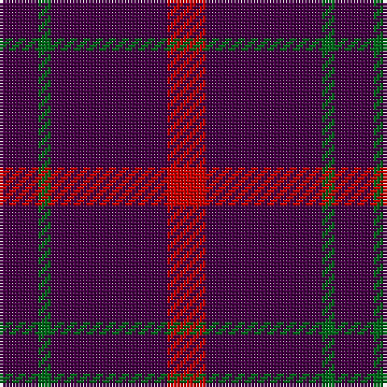

In pattern [BGBR](/stripes/bgbr/).

This was sourced from tartans-authority.  It is a [4 stripe tartan](/stripes/stripes4/).

Original link http://www.tartansauthority.com/tartan-ferret/display/130/

## Thread count
DP/12 G4 DP36 R/12

## Palette
Each colour and its ΔE from the base-6 reference it is a variant of.

| Colour | Shade | Base | ΔE (OKLab) |
|---|---|---|---|
| DP | <code style="background-color:#440044;">#440044</code> `#440044` | B <code style="background-color:#2A418A;">#2A418A</code> | 0.18 |
| G | <code style="background-color:#006818;">#006818</code> `#006818` | G <code style="background-color:#006100;">#006100</code> | 0.02 |
| R | <code style="background-color:#C80000;">#C80000</code> `#C80000` | R <code style="background-color:#CC0000;">#CC0000</code> | 0.01 |

# Sample pattern

## Nearest tartans

The nearest existing variants by ΔTartan distance.

1. [Highland Spring (1988)](/setts/s6/dp3g1dp9r3~x4/) — ΔT 1.26
1. [Highland Spring](/setts/s4/r5p19g3p5~x2/) — ΔT 1.48
1. [Highland Spring Corporate Tartan Tartan Number: 130. Earliest known date: 1987 Highland Spring manufacture bottled drinking water at Blackford in Perthshire, Scotland. See products available Copyright © Blair Urquhart, Comrie, 2015](/setts/s4/dp5g2dp19r5~x2/) — ΔT 1.73
1. [Lynch Variant](/setts/s6/r12dp3r7dp52dg4dp4~x2/) — ΔT 2.09
1. [Mother's Pride](/setts/s4/r10db10lo1~x4/) — ΔT 2.21
1. [Masai Shuka 22 (Artefact)](/setts/s4/db20w1r12db12~x4/) — ΔT 2.23
1. [Unidentified Plaid #10](/setts/s7/db27r5db27r3db3r30db23~x2/) — ΔT 2.25
1. [Leonard Hunting (Name)](/setts/s4/k30dp5k10dp9~x4/) — ΔT 2.33
1. [Romsdal Tresfjord](/setts/s5/k2r4k7r1k2~x2/) — ΔT 2.33
1. [Leonard Hunting](/setts/s6/k10dp5k30dp5k10dp9~x4/) — ΔT 2.40

## Neighbour map

Every grey dot is one of 14299 variants placed by the first two principal components of the ΔTartan feature space (44% of its variance). Red is this tartan; blue dots are its nearest — click one to open its page.

<svg viewBox="0 0 640 380" role="img" style="max-width:100%;height:auto;border:1px solid #e0e0e0;border-radius:4px;display:block" xmlns="http://www.w3.org/2000/svg"><image href="/nn/cloud.v1.png" width="640" height="380"/><a href="/setts/s6/dp3g1dp9r3~x4/"><circle cx="551.8" cy="265.0" r="4" fill="#3465a4"><title>Highland Spring (1988)</title></circle></a><a href="/setts/s4/r5p19g3p5~x2/"><circle cx="501.5" cy="278.9" r="4" fill="#3465a4"><title>Highland Spring</title></circle></a><a href="/setts/s4/dp5g2dp19r5~x2/"><circle cx="561.7" cy="271.6" r="4" fill="#3465a4"><title>Highland Spring Corporate Tartan Tartan Number: 130. Earliest known date: 1987 Highland Spring manufacture bottled drinking water at Blackford in Perthshire, Scotland. See products available Copyright © Blair Urquhart, Comrie, 2015</title></circle></a><a href="/setts/s6/r12dp3r7dp52dg4dp4~x2/"><circle cx="530.0" cy="190.3" r="4" fill="#3465a4"><title>Lynch Variant</title></circle></a><a href="/setts/s4/r10db10lo1~x4/"><circle cx="393.5" cy="296.6" r="4" fill="#3465a4"><title>Mother's Pride</title></circle></a><a href="/setts/s4/db20w1r12db12~x4/"><circle cx="460.5" cy="252.0" r="4" fill="#3465a4"><title>Masai Shuka 22 (Artefact)</title></circle></a><a href="/setts/s7/db27r5db27r3db3r30db23~x2/"><circle cx="437.3" cy="257.1" r="4" fill="#3465a4"><title>Unidentified Plaid #10</title></circle></a><a href="/setts/s4/k30dp5k10dp9~x4/"><circle cx="530.7" cy="339.8" r="4" fill="#3465a4"><title>Leonard Hunting (Name)</title></circle></a><a href="/setts/s5/k2r4k7r1k2~x2/"><circle cx="481.0" cy="318.6" r="4" fill="#3465a4"><title>Romsdal Tresfjord</title></circle></a><a href="/setts/s6/k10dp5k30dp5k10dp9~x4/"><circle cx="511.7" cy="318.8" r="4" fill="#3465a4"><title>Leonard Hunting</title></circle></a><circle cx="502.2" cy="275.3" r="5" fill="#c00000"/></svg>

ID: /setts/s4/dp3g1dp9r3~x4/
