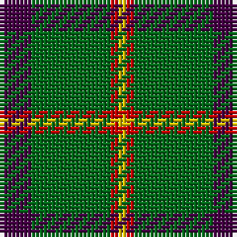

**Bands:** [BGRY](/stripes/bgry/) · **Stripes:** [DP G R LY](/stripes/stripes4/) DP G R LY

This was sourced from register-of-tartans.  It is a [4 band tartan](/bands/bands4/).

Original link https://www.tartanregister.gov.uk/tartanDetails.aspx?ref=4724

## Register references

External register numbers recorded for this tartan.

- Scottish Register of Tartans: [4724](https://www.tartanregister.gov.uk/tartanDetails.aspx?ref=4724)
- Scottish Tartans Authority (ITI): 1934
- Scottish Tartans World Register: 1934

## Thread count
DP/8 G20 R2 Y/2

## Palette
Each colour and its ΔE from the base-6 reference it is a variant of.

| Colour | Shade | Base | ΔE (OKLab) |
|---|---|---|---|
| DG | <code style="background-color:#003820;">#003820</code> `#003820` | G <code style="background-color:#006100;">#006100</code> | 0.15 |
| DP | <code style="background-color:#440044;">#440044</code> `#440044` | B <code style="background-color:#2A418A;">#2A418A</code> | 0.18 |
| G | <code style="background-color:#006818;">#006818</code> `#006818` | G <code style="background-color:#006100;">#006100</code> | 0.02 |
| P | <code style="background-color:#780078;">#780078</code> `#780078` | B <code style="background-color:#2A418A;">#2A418A</code> | 0.17 |
| R | <code style="background-color:#C80000;">#C80000</code> `#C80000` | R <code style="background-color:#CC0000;">#CC0000</code> | 0.01 |
| Ra | <code style="background-color:#C80000;">#C80000</code> `#C80000` | R <code style="background-color:#CC0000;">#CC0000</code> | 0.01 |
| Y | <code style="background-color:#E8C000;">#E8C000</code> `#E8C000` | Y <code style="background-color:#F2BF00;">#F2BF00</code> | 0.02 |
| Ya | <code style="background-color:#D8B000;">#D8B000</code> `#D8B000` | Y <code style="background-color:#F2BF00;">#F2BF00</code> | 0.06 |

# Sample pattern

## Nearest tartans

The nearest existing variants by ΔTartan distance.

1. [Wilson's No.189](/setts/s4/dp4g10r1w1~x2/) — ΔT 0.52
1. [Wilson's, No 192](/setts/s4/p4g10r1ly1~x2/) — ΔT 0.73
1. [Bacon, Green (Fashion)](/setts/s4/g14k3r3lr2~x2/) — ΔT 0.79
1. [Wilson's, No 189](/setts/s4/p4g10w1r1~x2/) — ΔT 0.81
1. [Wilson's No.174](/setts/s4/ly1g10db4t1~x2/) — ΔT 1.06
1. [Wilson's No.140](/setts/s4/k2ly1g7t1~x2/) — ΔT 1.12
1. [Robert Byers Family - Dooballagh, Ireland](/setts/s4/k5g40db20ly3~x2/) — ΔT 1.14
1. [St Johns County Sheriff Office (Cor)](/setts/s5/r17db7lo8g58k6~x2/) — ΔT 1.22
1. [Sugell (Name?)](/setts/s4/g72r25ly8w5/) — ΔT 1.23
1. [Arkansas](/setts/s7/g3w1g12r6g3k3g2~x4/) — ΔT 1.38

## Neighbour map

Every grey dot is one of 14313 variants placed by the first two principal components of the ΔTartan feature space (44% of its variance). Red is this tartan; blue dots are its nearest — click one to open its page.

<svg viewBox="0 0 640 380" role="img" style="max-width:100%;height:auto;border:1px solid #e0e0e0;border-radius:4px;display:block" xmlns="http://www.w3.org/2000/svg"><image href="/nn/cloud.v1.png" width="640" height="380"/><a href="/setts/s4/dp4g10r1w1~x2/"><circle cx="343.4" cy="223.9" r="4" fill="#3465a4"><title>Wilson's No.189</title></circle></a><a href="/setts/s4/p4g10r1ly1~x2/"><circle cx="348.3" cy="222.3" r="4" fill="#3465a4"><title>Wilson's, No 192</title></circle></a><a href="/setts/s4/g14k3r3lr2~x2/"><circle cx="347.6" cy="250.7" r="4" fill="#3465a4"><title>Bacon, Green (Fashion)</title></circle></a><a href="/setts/s4/p4g10w1r1~x2/"><circle cx="343.5" cy="220.3" r="4" fill="#3465a4"><title>Wilson's, No 189</title></circle></a><a href="/setts/s4/ly1g10db4t1~x2/"><circle cx="362.7" cy="242.0" r="4" fill="#3465a4"><title>Wilson's No.174</title></circle></a><a href="/setts/s4/k2ly1g7t1~x2/"><circle cx="337.5" cy="248.0" r="4" fill="#3465a4"><title>Wilson's No.140</title></circle></a><a href="/setts/s4/k5g40db20ly3~x2/"><circle cx="353.6" cy="237.5" r="4" fill="#3465a4"><title>Robert Byers Family - Dooballagh, Ireland</title></circle></a><a href="/setts/s5/r17db7lo8g58k6~x2/"><circle cx="325.8" cy="200.3" r="4" fill="#3465a4"><title>St Johns County Sheriff Office (Cor)</title></circle></a><a href="/setts/s4/g72r25ly8w5/"><circle cx="392.6" cy="208.3" r="4" fill="#3465a4"><title>Sugell (Name?)</title></circle></a><a href="/setts/s7/g3w1g12r6g3k3g2~x4/"><circle cx="367.4" cy="208.8" r="4" fill="#3465a4"><title>Arkansas</title></circle></a><circle cx="357.5" cy="230.9" r="5" fill="#c00000"/></svg>

ID: /setts/s4/dp4g10r1ly1~x2/
