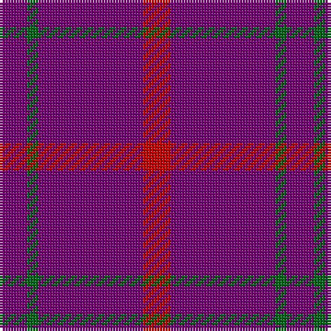

**Bands:** [BGBR](/stripes/bgbr/) · **Stripes:** [DP G DP R](/stripes/stripes4/) DP G DP R

This was sourced from house-of-tartan.  It is a [4 band tartan](/bands/bands4/).

Original link http://www.house-of-tartan.scotland.net/house/TartanViewjs.asp?colr=Def&tnam=130

## Variants

Other setts woven to the same stripe pattern.

- [Highland Spring (1988) (Corporate)](/setts/s4/dp3g1dp9r3~x4/)

## Thread count
P/10 G4 P38 R/10

## Palette
Each colour and its ΔE from the base-6 reference it is a variant of.

| Colour | Shade | Base | ΔE (OKLab) |
|---|---|---|---|
| G | <code style="background-color:#006818;">#006818</code> `#006818` | G <code style="background-color:#006100;">#006100</code> | 0.02 |
| P | <code style="background-color:#780078;">#780078</code> `#780078` | B <code style="background-color:#2A418A;">#2A418A</code> | 0.17 |
| R | <code style="background-color:#C80000;">#C80000</code> `#C80000` | R <code style="background-color:#CC0000;">#CC0000</code> | 0.01 |

# Sample pattern

## Nearest tartans

The nearest existing variants by ΔTartan distance.

1. [Highland Spring](/setts/s4/p5g3p19r5~x2/) — ΔT 1.00
1. [Highland Spring (1988) (Corporate)](/setts/s4/dp3g1dp9r3~x4/) — ΔT 1.73
1. [Scottish Netball Association](/setts/s5/g2p20db9p20r2~x2/) — ΔT 1.81
1. [Highland Spring (1988)](/setts/s6/dp3g1dp9r3dp9g1~x4/) — ΔT 1.89
1. [Scottish Netball (1987) (Corporate)](/setts/s5/g2dp20db9dp20r2~x2/) — ΔT 2.15
1. [Lynch Variant](/setts/s6/r12dp3r7dp52dg4dp4~x2/) — ΔT 2.34
1. [Brooks Brothers Tattersall Red](/setts/s5/db1r9db2r9lo1~x4/) — ΔT 2.46
1. [Inverness Augustus](/setts/s7/m18dg1k5dg1k1dg1m9~x2/) — ΔT 2.74
1. [Masai Shuka 21 (Artefact)](/setts/s4/r40db2r6db15~x2/) — ΔT 2.85
1. [Glen Shee Trade Tartan Tartan Number: 1662. Earliest known date: pre 2003 May have been obtained from a hand made design procured in the Highlands for The Highland Society of London. See products available Copyright © Blair Urquhart, Comrie, 2015](/setts/s5/m37dy9m3g9dy3~x2/) — ΔT 2.86

## Neighbour map

Every grey dot is one of 14313 variants placed by the first two principal components of the ΔTartan feature space (44% of its variance). Red is this tartan; blue dots are its nearest — click one to open its page.

<svg viewBox="0 0 640 380" role="img" style="max-width:100%;height:auto;border:1px solid #e0e0e0;border-radius:4px;display:block" xmlns="http://www.w3.org/2000/svg"><image href="/nn/cloud.v1.png" width="640" height="380"/><a href="/setts/s4/p5g3p19r5~x2/"><circle cx="501.8" cy="279.2" r="4" fill="#3465a4"><title>Highland Spring</title></circle></a><a href="/setts/s4/dp3g1dp9r3~x4/"><circle cx="502.4" cy="275.6" r="4" fill="#3465a4"><title>Highland Spring (1988) (Corporate)</title></circle></a><a href="/setts/s5/g2p20db9p20r2~x2/"><circle cx="543.8" cy="273.0" r="4" fill="#3465a4"><title>Scottish Netball Association</title></circle></a><a href="/setts/s6/dp3g1dp9r3dp9g1~x4/"><circle cx="552.0" cy="265.4" r="4" fill="#3465a4"><title>Highland Spring (1988)</title></circle></a><a href="/setts/s5/g2dp20db9dp20r2~x2/"><circle cx="556.1" cy="281.2" r="4" fill="#3465a4"><title>Scottish Netball (1987) (Corporate)</title></circle></a><a href="/setts/s6/r12dp3r7dp52dg4dp4~x2/"><circle cx="530.4" cy="190.5" r="4" fill="#3465a4"><title>Lynch Variant</title></circle></a><a href="/setts/s5/db1r9db2r9lo1~x4/"><circle cx="607.2" cy="274.0" r="4" fill="#3465a4"><title>Brooks Brothers Tattersall Red</title></circle></a><a href="/setts/s7/m18dg1k5dg1k1dg1m9~x2/"><circle cx="588.5" cy="221.7" r="4" fill="#3465a4"><title>Inverness Augustus</title></circle></a><a href="/setts/s4/r40db2r6db15~x2/"><circle cx="548.2" cy="225.8" r="4" fill="#3465a4"><title>Masai Shuka 21 (Artefact)</title></circle></a><a href="/setts/s5/m37dy9m3g9dy3~x2/"><circle cx="495.3" cy="241.5" r="4" fill="#3465a4"><title>Glen Shee Trade Tartan Tartan Number: 1662. Earliest known date: pre 2003 May have been obtained from a hand made design procured in the Highlands for The Highland Society of London. See products available Copyright © Blair Urquhart, Comrie, 2015</title></circle></a><circle cx="562.0" cy="271.8" r="5" fill="#c00000"/></svg>

ID: /setts/s4/dp5g2dp19r5~x2/
