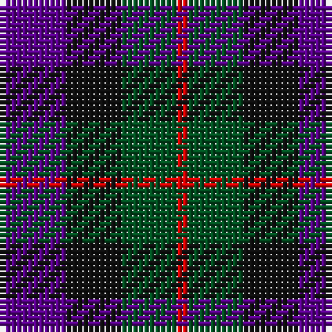

In pattern [BKGR](/stripes/bkgr/).

This was sourced from register-of-tartans.  It is a [4 stripe tartan](/stripes/stripes4/).

Original link https://www.tartanregister.gov.uk/tartanDetails.aspx?ref=4330

## Also known as

This cloth is also recorded under:

- Unnamed, No 60

## Register references

External register numbers recorded for this tartan.

- Scottish Register of Tartans: [4330](https://www.tartanregister.gov.uk/tartanDetails.aspx?ref=4330)
- Scottish Tartans World Register: 1983

## Thread count
P/12 K10 G10 R/2

## Palette
Each colour and the base-6 reference it is a variant of.

| Colour | Shade | Base |
|---|---|---|
| G | <code style="background-color:#005020;">#005020</code> `oklch(37.7% 0.105 149.6)` <small>#005020</small> | G <code style="background-color:#006100;">#006100</code> |
| K | <code style="background-color:#101010;">#101010</code> `oklch(17.3% 0.000 89.9)` <small>#101010</small> | K <code style="background-color:#000000;">#000000</code> |
| P | <code style="background-color:#5A008C;">#5A008C</code> `oklch(37.0% 0.191 306.3)` <small>#5A008C</small> | B <code style="background-color:#2A418A;">#2A418A</code> |
| R | <code style="background-color:#DC0000;">#DC0000</code> `oklch(56.2% 0.230 29.2)` <small>#DC0000</small> | R <code style="background-color:#CC0000;">#CC0000</code> |

# Sample pattern

## Nearest tartans

The nearest existing variants by ΔTartan distance, with this tartan at the top so the swatches line up against it.

ΔTartan

Tartan

Sett

—

<a href="/ttd/edit/#slug=dp6k5dg5r1~x2">Unidentified No 60</a> <a class="nn-out" href="/setts/s4/dp6k5dg5r1~x2/" title="open its dictionary page">↗</a>

0.94

<a href="/ttd/edit/#slug=dp8k11g9r2~x2">Norwich Collection No. 60</a> <a class="nn-out" href="/setts/s4/dp8k11g9r2~x2/" title="open its dictionary page">↗</a>

1.02

<a href="/ttd/edit/#slug=dp8k11dg9w2~x2">Wilson's No 220</a> <a class="nn-out" href="/setts/s4/dp8k11dg9w2~x2/" title="open its dictionary page">↗</a>

1.06

<a href="/ttd/edit/#slug=g9k11dp8t2~x2">Wilson's No.228</a> <a class="nn-out" href="/setts/s4/g9k11dp8t2~x2/" title="open its dictionary page">↗</a>

1.11

<a href="/ttd/edit/#slug=db4k5dg4r1~x4">Unidentified pattern #3</a> <a class="nn-out" href="/setts/s4/db4k5dg4r1~x4/" title="open its dictionary page">↗</a>

1.25

<a href="/ttd/edit/#slug=r8dg20k20db20k3r8~x2">Atholl Highlanders (Military)</a> <a class="nn-out" href="/setts/s6/r8dg20k20db20k3r8~x2/" title="open its dictionary page">↗</a>

1.27

<a href="/ttd/edit/#slug=dp3k3dp3dg6r2~x2">Austin (Wilson's No 137)</a> <a class="nn-out" href="/setts/s5/dp3k3dp3dg6r2~x2/" title="open its dictionary page">↗</a>

1.34

<a href="/ttd/edit/#slug=dp8k11dg9k11dp8t2~x2">Wilson's No.228 #2</a> <a class="nn-out" href="/setts/s6/dp8k11dg9k11dp8t2~x2/" title="open its dictionary page">↗</a>

1.40

<a href="/ttd/edit/#slug=dp5k5g5w1~x4">Wilson's No.220</a> <a class="nn-out" href="/setts/s4/dp5k5g5w1~x4/" title="open its dictionary page">↗</a>

1.49

<a href="/ttd/edit/#slug=k1g3k3db3r1~x4">Durham District Tartan Tartan Number: 1089. Earliest known date: 1819 It was Wilson's practice to give the names of towns to many of his new designs. Maybe because the order came from there or because it was the name of the purchaser. There was a family of Durhams associated with the Royal Court in Edinburgh prior to the Union of the Crowns. Wilson was also a collector of tartans, receiving samples from his agents in the Highlands and from purchase orders from around the world. See 'Denholme' and 'Urquhart'. See products available Copyright © Blair Urquhart, Comrie, 2015</a> <a class="nn-out" href="/setts/s5/k1g3k3db3r1~x4/" title="open its dictionary page">↗</a>

1.55

<a href="/ttd/edit/#slug=k2dg10y2k9dp8dg2~x2">Lennie</a> <a class="nn-out" href="/setts/s6/k2dg10y2k9dp8dg2~x2/" title="open its dictionary page">↗</a>

## Neighbour map

Every grey dot is one of 14299 variants placed by the first two principal components of the ΔTartan feature space (44% of its variance). Red is this tartan; blue dots are its nearest — click one to open its page.

<svg viewBox="0 0 640 380" role="img" style="max-width:100%;height:auto;border:1px solid #e0e0e0;border-radius:4px;display:block" xmlns="http://www.w3.org/2000/svg"><image href="/nn/cloud.v1.png" width="640" height="380"/><a href="/setts/s4/dp8k11g9r2~x2/"><circle cx="157.4" cy="296.1" r="4" fill="#3465a4"><title>Norwich Collection No. 60</title></circle></a><a href="/setts/s4/dp8k11dg9w2~x2/"><circle cx="142.2" cy="293.9" r="4" fill="#3465a4"><title>Wilson's No 220</title></circle></a><a href="/setts/s4/g9k11dp8t2~x2/"><circle cx="167.6" cy="308.9" r="4" fill="#3465a4"><title>Wilson's No.228</title></circle></a><a href="/setts/s4/db4k5dg4r1~x4/"><circle cx="169.3" cy="322.2" r="4" fill="#3465a4"><title>Unidentified pattern #3</title></circle></a><a href="/setts/s6/r8dg20k20db20k3r8~x2/"><circle cx="124.3" cy="262.1" r="4" fill="#3465a4"><title>Atholl Highlanders (Military)</title></circle></a><a href="/setts/s5/dp3k3dp3dg6r2~x2/"><circle cx="122.6" cy="315.6" r="4" fill="#3465a4"><title>Austin (Wilson's No 137)</title></circle></a><a href="/setts/s6/dp8k11dg9k11dp8t2~x2/"><circle cx="194.2" cy="298.3" r="4" fill="#3465a4"><title>Wilson's No.228 #2</title></circle></a><a href="/setts/s4/dp5k5g5w1~x4/"><circle cx="112.5" cy="291.2" r="4" fill="#3465a4"><title>Wilson's No.220</title></circle></a><a href="/setts/s5/k1g3k3db3r1~x4/"><circle cx="130.2" cy="317.5" r="4" fill="#3465a4"><title>Durham District Tartan Tartan Number: 1089. Earliest known date: 1819 It was Wilson's practice to give the names of towns to many of his new designs. Maybe because the order came from there or because it was the name of the purchaser. There was a family of Durhams associated with the Royal Court in Edinburgh prior to the Union of the Crowns. Wilson was also a collector of tartans, receiving samples from his agents in the Highlands and from purchase orders from around the world. See 'Denholme' and 'Urquhart'. See products available Copyright © Blair Urquhart, Comrie, 2015</title></circle></a><a href="/setts/s6/k2dg10y2k9dp8dg2~x2/"><circle cx="200.9" cy="281.0" r="4" fill="#3465a4"><title>Lennie</title></circle></a><circle cx="170.6" cy="301.2" r="5" fill="#c00000"/></svg>

ID: /setts/s4/dp6k5dg5r1~x2/
