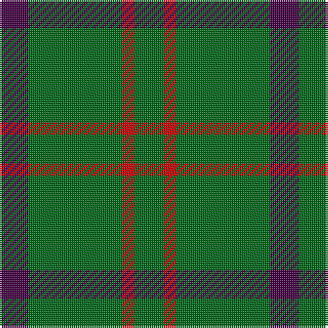

This page is one **sett** — a single exact thread-count. It belongs to the [tartan](/tartans/dp7g23r3g7/)
(the same proportion at any scale), whose colour order is pattern [BGRG](/stripes/bgrg/).

Sourced from tartans-authority.  It is a [4 stripe tartan](/stripes/stripes4/).

Original link http://www.tartansauthority.com/tartan-ferret/display/2322/

## Register references

External register numbers recorded for this tartan.

- Scottish Tartans Authority (ITI): 2322

## Thread count
DP/14 G46 R6 G/14

## Palette

Palette: <strong>Tartan Register</strong>
<table><thead><tr><th>Colour</th><th>Threads</th><th>Shade</th><th>Base</th><th>OKLCh</th></tr></thead><tbody><tr><td>DP/</td><td style="text-align:right;font-variant-numeric:tabular-nums">14</td><td><code style="background-color:#440044;">#440044</code> <small style="color:#888">#440044</small></td><td>B <code style="background-color:#2A418A;">#2A418A</code></td><td><small style="color:#888">oklch(27.1% 0.125 328.4)</small></td></tr><tr><td>G</td><td style="text-align:right;font-variant-numeric:tabular-nums">46</td><td><code style="background-color:#006818;">#006818</code> <small style="color:#888">#006818</small></td><td>G <code style="background-color:#006100;">#006100</code></td><td><small style="color:#888">oklch(45.0% 0.142 145.0)</small></td></tr><tr><td>R</td><td style="text-align:right;font-variant-numeric:tabular-nums">6</td><td><code style="background-color:#C80000;">#C80000</code> <small style="color:#888">#C80000</small></td><td>R <code style="background-color:#CC0000;">#CC0000</code></td><td><small style="color:#888">oklch(52.3% 0.215 29.2)</small></td></tr><tr><td>G/</td><td style="text-align:right;font-variant-numeric:tabular-nums">14</td><td><code style="background-color:#006818;">#006818</code> <small style="color:#888">#006818</small></td><td>G <code style="background-color:#006100;">#006100</code></td><td><small style="color:#888">oklch(45.0% 0.142 145.0)</small></td></tr></tbody></table>

# Sample pattern

## Nearest tartans

The nearest existing variants by ΔTartan distance, with this tartan at the top so the swatches line up against it.

ΔTartan

Tartan

Sett

—

<a href="/ttd/edit/#slug=dp7g23r3g7~x2">Highland Spring (1997) (Corporate)</a> <a class="nn-out" href="/setts/s4/dp7g23r3g7~x2/" title="open its dictionary page">↗</a>

1.01

<a href="/ttd/edit/#slug=g7r3g23m7~x2">Highland Spring (Green)</a> <a class="nn-out" href="/setts/s4/g7r3g23m7~x2/" title="open its dictionary page">↗</a>

1.16

<a href="/ttd/edit/#slug=g9n1g2k4g2~x4">Peterhead (Personal)</a> <a class="nn-out" href="/setts/s5/g9n1g2k4g2~x4/" title="open its dictionary page">↗</a>

1.22

<a href="/ttd/edit/#slug=g23r3g7r3g23dp7~x2">Highland Spring (1997)</a> <a class="nn-out" href="/setts/s6/g23r3g7r3g23dp7~x2/" title="open its dictionary page">↗</a>

1.33

<a href="/ttd/edit/#slug=dg12db3ly1~x4">Unidentified pattern #2</a> <a class="nn-out" href="/setts/s3/dg12db3ly1~x4/" title="open its dictionary page">↗</a>

1.35

<a href="/ttd/edit/#slug=g16k11g16r2~x4">Kincaid of Kincaid</a> <a class="nn-out" href="/setts/s4/g16k11g16r2~x4/" title="open its dictionary page">↗</a>

1.38

<a href="/ttd/edit/#slug=g9o20g40w5~x2">O'Neill (Australia) (Name)</a> <a class="nn-out" href="/setts/s4/g9o20g40w5~x2/" title="open its dictionary page">↗</a>

1.50

<a href="/ttd/edit/#slug=g9o20g46lg5~x2">O'Neill, Red (Corporate?)</a> <a class="nn-out" href="/setts/s4/g9o20g46lg5~x2/" title="open its dictionary page">↗</a>

1.64

<a href="/ttd/edit/#slug=g81r10ly20~x2">McMoosie</a> <a class="nn-out" href="/setts/s3/g81r10ly20~x2/" title="open its dictionary page">↗</a>

1.64

<a href="/ttd/edit/#slug=g18ly2g18k4g2k15~x2">MacArthur (Highland Society)</a> <a class="nn-out" href="/setts/s6/g18ly2g18k4g2k15~x2/" title="open its dictionary page">↗</a>

1.66

<a href="/setts/s8/k8g3k4g20r3~x2/">MacArthur-Fox (Personal)</a>

## Neighbour map

Every grey dot is one of 14359 variants placed by the first two principal components of the ΔTartan feature space (44% of its variance). Red is this tartan; blue dots are its nearest — click one to open its page.

<svg viewBox="0 0 640 380" role="img" style="max-width:100%;height:auto;border:1px solid #e0e0e0;border-radius:4px;display:block" xmlns="http://www.w3.org/2000/svg"><image href="/nn/cloud.v1.png" width="640" height="380"/><a href="/setts/s4/g7r3g23m7~x2/"><circle cx="473.4" cy="289.2" r="4" fill="#3465a4"><title>Highland Spring (Green)</title></circle></a><a href="/setts/s5/g9n1g2k4g2~x4/"><circle cx="461.1" cy="275.2" r="4" fill="#3465a4"><title>Peterhead (Personal)</title></circle></a><a href="/setts/s6/g23r3g7r3g23dp7~x2/"><circle cx="515.0" cy="278.6" r="4" fill="#3465a4"><title>Highland Spring (1997)</title></circle></a><a href="/setts/s3/dg12db3ly1~x4/"><circle cx="515.7" cy="287.1" r="4" fill="#3465a4"><title>Unidentified pattern #2</title></circle></a><a href="/setts/s4/g16k11g16r2~x4/"><circle cx="424.2" cy="322.6" r="4" fill="#3465a4"><title>Kincaid of Kincaid</title></circle></a><a href="/setts/s4/g9o20g40w5~x2/"><circle cx="412.6" cy="287.7" r="4" fill="#3465a4"><title>O'Neill (Australia) (Name)</title></circle></a><a href="/setts/s4/g9o20g46lg5~x2/"><circle cx="463.1" cy="289.1" r="4" fill="#3465a4"><title>O'Neill, Red (Corporate?)</title></circle></a><a href="/setts/s3/g81r10ly20~x2/"><circle cx="440.5" cy="274.5" r="4" fill="#3465a4"><title>McMoosie</title></circle></a><a href="/setts/s6/g18ly2g18k4g2k15~x2/"><circle cx="386.0" cy="265.9" r="4" fill="#3465a4"><title>MacArthur (Highland Society)</title></circle></a><a href="/setts/s8/k8g3k4g20r3~x2/"><circle cx="435.6" cy="263.8" r="4" fill="#3465a4"><title>MacArthur-Fox (Personal)</title></circle></a><circle cx="471.0" cy="290.0" r="5" fill="#c00000"/></svg>

ID: /setts/s4/dp7g23r3g7~x2/
