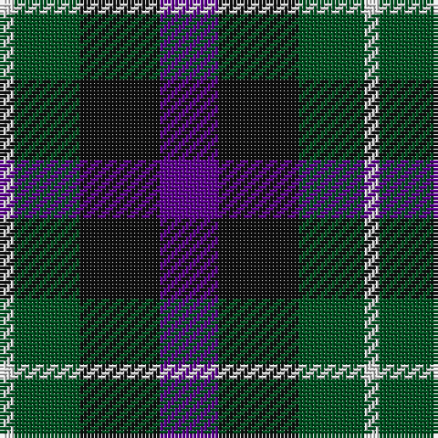

This page is one **sett** — a single exact thread-count. It belongs to the [tartan](/tartans/p8k11g9ln2/)
(the same proportion at any scale), whose colour order is pattern [BKGW](/stripes/bkgw/).

Sourced from register-of-tartans.  It is a [4 stripe tartan](/stripes/stripes4/).

Original link https://www.tartanregister.gov.uk/tartanDetails.aspx?ref=4640

## Also known as

This cloth is also recorded under:

- Wilson's, No 220

## Register references

External register numbers recorded for this tartan.

- Scottish Register of Tartans: [4640](https://www.tartanregister.gov.uk/tartanDetails.aspx?ref=4640)
- Scottish Tartans World Register: 1942

## Thread count
P/16 K22 G18 LN/4

## Palette
Each colour and the base-6 reference it is a variant of.

| Colour | Shade | Base |
|---|---|---|
| G | <code style="background-color:#005020;">#005020</code> `oklch(37.7% 0.105 149.6)` <small>#005020</small> | G <code style="background-color:#006100;">#006100</code> |
| K | <code style="background-color:#101010;">#101010</code> `oklch(17.3% 0.000 89.9)` <small>#101010</small> | K <code style="background-color:#000000;">#000000</code> |
| LN | <code style="background-color:#E0E0E0;">#E0E0E0</code> `oklch(90.7% 0.000 89.9)` <small>#E0E0E0</small> | W <code style="background-color:#F7F7F7;">#F7F7F7</code> |
| P | <code style="background-color:#5A008C;">#5A008C</code> `oklch(37.0% 0.191 306.3)` <small>#5A008C</small> | B <code style="background-color:#2A418A;">#2A418A</code> |

# Sample pattern

## Nearest tartans

The nearest existing variants by ΔTartan distance, with this tartan at the top so the swatches line up against it.

ΔTartan

Tartan

Sett

—

<a href="/ttd/edit/#slug=dp8k11dg9w2~x2">Wilson's No 220</a> <a class="nn-out" href="/setts/s4/dp8k11dg9w2~x2/" title="open its dictionary page">↗</a>

0.77

<a href="/ttd/edit/#slug=dp5k5g5w1~x4">Wilson's No.220</a> <a class="nn-out" href="/setts/s4/dp5k5g5w1~x4/" title="open its dictionary page">↗</a>

0.85

<a href="/ttd/edit/#slug=dp8k11g9r2~x2">Norwich Collection No. 60</a> <a class="nn-out" href="/setts/s4/dp8k11g9r2~x2/" title="open its dictionary page">↗</a>

1.02

<a href="/ttd/edit/#slug=dp6k5dg5r1~x2">Unidentified No 60</a> <a class="nn-out" href="/setts/s4/dp6k5dg5r1~x2/" title="open its dictionary page">↗</a>

1.11

<a href="/ttd/edit/#slug=g9k11dp8t2~x2">Wilson's No.228</a> <a class="nn-out" href="/setts/s4/g9k11dp8t2~x2/" title="open its dictionary page">↗</a>

1.18

<a href="/ttd/edit/#slug=p6k5g5r1~x2">Unnamed, No 60</a> <a class="nn-out" href="/setts/s4/p6k5g5r1~x2/" title="open its dictionary page">↗</a>

1.20

<a href="/ttd/edit/#slug=k5g20k18db20r5~x2">Denholm (Fashion)</a> <a class="nn-out" href="/setts/s5/k5g20k18db20r5~x2/" title="open its dictionary page">↗</a>

1.20

<a href="/ttd/edit/#slug=dp3k3dp3dg6ly2~x2">Austin (Wilson's No 173)</a> <a class="nn-out" href="/setts/s5/dp3k3dp3dg6ly2~x2/" title="open its dictionary page">↗</a>

1.26

<a href="/ttd/edit/#slug=db4k5g4r1~x4">Unidentified, pattern</a> <a class="nn-out" href="/setts/s4/db4k5g4r1~x4/" title="open its dictionary page">↗</a>

1.28

<a href="/ttd/edit/#slug=p8k11g9r2~x2">Wilson's, No 159</a> <a class="nn-out" href="/setts/s4/p8k11g9r2~x2/" title="open its dictionary page">↗</a>

1.33

<a href="/ttd/edit/#slug=p8k11g9w2~x2">Wilson's, No 220</a> <a class="nn-out" href="/setts/s4/p8k11g9w2~x2/" title="open its dictionary page">↗</a>

## Neighbour map

Every grey dot is one of 14299 variants placed by the first two principal components of the ΔTartan feature space (44% of its variance). Red is this tartan; blue dots are its nearest — click one to open its page.

<svg viewBox="0 0 640 380" role="img" style="max-width:100%;height:auto;border:1px solid #e0e0e0;border-radius:4px;display:block" xmlns="http://www.w3.org/2000/svg"><image href="/nn/cloud.v1.png" width="640" height="380"/><a href="/setts/s4/dp5k5g5w1~x4/"><circle cx="112.5" cy="291.2" r="4" fill="#3465a4"><title>Wilson's No.220</title></circle></a><a href="/setts/s4/dp8k11g9r2~x2/"><circle cx="157.4" cy="296.1" r="4" fill="#3465a4"><title>Norwich Collection No. 60</title></circle></a><a href="/setts/s4/dp6k5dg5r1~x2/"><circle cx="170.6" cy="301.2" r="4" fill="#3465a4"><title>Unidentified No 60</title></circle></a><a href="/setts/s4/g9k11dp8t2~x2/"><circle cx="167.6" cy="308.9" r="4" fill="#3465a4"><title>Wilson's No.228</title></circle></a><a href="/setts/s4/p6k5g5r1~x2/"><circle cx="121.7" cy="273.4" r="4" fill="#3465a4"><title>Unnamed, No 60</title></circle></a><a href="/setts/s5/k5g20k18db20r5~x2/"><circle cx="110.5" cy="284.5" r="4" fill="#3465a4"><title>Denholm (Fashion)</title></circle></a><a href="/setts/s5/dp3k3dp3dg6ly2~x2/"><circle cx="93.6" cy="304.0" r="4" fill="#3465a4"><title>Austin (Wilson's No 173)</title></circle></a><a href="/setts/s4/db4k5g4r1~x4/"><circle cx="108.8" cy="293.2" r="4" fill="#3465a4"><title>Unidentified, pattern</title></circle></a><a href="/setts/s4/p8k11g9r2~x2/"><circle cx="119.3" cy="279.1" r="4" fill="#3465a4"><title>Wilson's, No 159</title></circle></a><a href="/setts/s4/p8k11g9w2~x2/"><circle cx="109.8" cy="275.9" r="4" fill="#3465a4"><title>Wilson's, No 220</title></circle></a><circle cx="142.2" cy="293.9" r="5" fill="#c00000"/></svg>

ID: /setts/s4/dp8k11dg9w2~x2/
