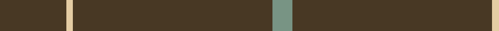
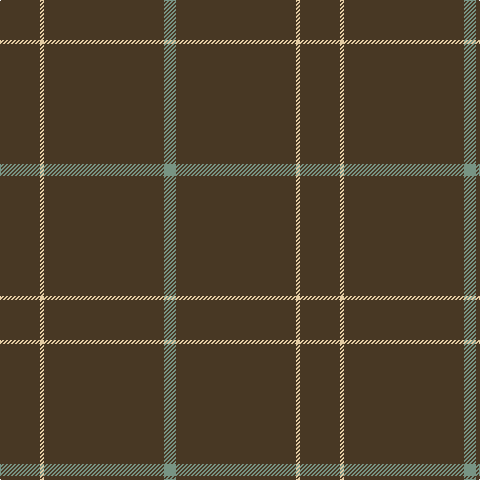

In pattern [GGYG](/stripes/ggyg/).

This was sourced from register-of-tartans.  It is a [4 stripe tartan](/stripes/stripes4/).

Original link https://www.tartanregister.gov.uk/tartanDetails.aspx?ref=3299

## Register references

External register numbers recorded for this tartan.

- Scottish Register of Tartans: [3299](https://www.tartanregister.gov.uk/tartanDetails.aspx?ref=3299)
- Scottish Tartans Authority (ITI): 7094

## Thread count
T/40 LR4 T120 LG/12

## Palette
Each colour and its ΔE from the base-6 reference it is a variant of.

| Colour | Shade | Base | ΔE (OKLab) |
|---|---|---|---|
| LG | <code style="background-color:#789484;">#789484</code> `#789484` | G <code style="background-color:#006100;">#006100</code> | 0.24 |
| LR | <code style="background-color:#E4CCA4;">#E4CCA4</code> `#E4CCA4` | Y <code style="background-color:#F2BF00;">#F2BF00</code> | 0.11 |
| T | <code style="background-color:#483824;">#483824</code> `#483824` | G <code style="background-color:#006100;">#006100</code> | 0.16 |

# Sample pattern

## Nearest tartans

The nearest existing variants by ΔTartan distance.

1. [Pasteur Fancy Tartan Tartan Number: 7094. Earliest known date: 1836 The pattern is taken from a shawl or cloak which appears in a portrait of Louie Pasteur's mother. The portrait was drawn in pastels when Pasteur was just 13 years old. The information came Marie-Claude Fortier researching the life of Pasteur. See products available Copyright © Blair Urquhart, Comrie, 2015](/setts/s4/do10ly1do30y3~x4/) — ΔT 0.98
1. [MacNab, Ancient](/setts/s5/dg62r7k4r4dg62~x2/) — ΔT 2.00
1. [Galloway (Name)](/setts/s4/r2k50n2r1~x2/) — ΔT 2.12
1. [Kincardine Tweed](/setts/s4/o30r1o15db4~x2/) — ΔT 2.15
1. [Dewi Sant](/setts/s6/dg30r2dg8r1dg5w2/) — ΔT 2.18
1. [Chafyn House (School)](/setts/s7/k72r3k11t9k11r3k37/) — ΔT 2.37
1. [Dunnotar (School)](/setts/s4/k72w3k11db9/) — ΔT 2.39
1. [Rabbie's Dram (Fashion)](/setts/s4/lo60do3lo4r3~x2/) — ΔT 2.46
1. [Dunbar of Pitgaveny](/setts/s3/r1y19w1~x2/) — ΔT 2.47
1. [Dunbar of Pitgaveny (Clan)](/setts/s3/m1o19w1~x2/) — ΔT 2.50

## Neighbour map

Every grey dot is one of 14299 variants placed by the first two principal components of the ΔTartan feature space (44% of its variance). Red is this tartan; blue dots are its nearest — click one to open its page.

<svg viewBox="0 0 640 380" role="img" style="max-width:100%;height:auto;border:1px solid #e0e0e0;border-radius:4px;display:block" xmlns="http://www.w3.org/2000/svg"><image href="/nn/cloud.v1.png" width="640" height="380"/><a href="/setts/s4/do10ly1do30y3~x4/"><circle cx="626.0" cy="231.9" r="4" fill="#3465a4"><title>Pasteur Fancy Tartan Tartan Number: 7094. Earliest known date: 1836 The pattern is taken from a shawl or cloak which appears in a portrait of Louie Pasteur's mother. The portrait was drawn in pastels when Pasteur was just 13 years old. The information came Marie-Claude Fortier researching the life of Pasteur. See products available Copyright © Blair Urquhart, Comrie, 2015</title></circle></a><a href="/setts/s5/dg62r7k4r4dg62~x2/"><circle cx="626.0" cy="264.4" r="4" fill="#3465a4"><title>MacNab, Ancient</title></circle></a><a href="/setts/s4/r2k50n2r1~x2/"><circle cx="626.0" cy="204.2" r="4" fill="#3465a4"><title>Galloway (Name)</title></circle></a><a href="/setts/s4/o30r1o15db4~x2/"><circle cx="626.0" cy="223.2" r="4" fill="#3465a4"><title>Kincardine Tweed</title></circle></a><a href="/setts/s6/dg30r2dg8r1dg5w2/"><circle cx="626.0" cy="202.2" r="4" fill="#3465a4"><title>Dewi Sant</title></circle></a><a href="/setts/s7/k72r3k11t9k11r3k37/"><circle cx="626.0" cy="213.8" r="4" fill="#3465a4"><title>Chafyn House (School)</title></circle></a><a href="/setts/s4/k72w3k11db9/"><circle cx="626.0" cy="233.0" r="4" fill="#3465a4"><title>Dunnotar (School)</title></circle></a><a href="/setts/s4/lo60do3lo4r3~x2/"><circle cx="626.0" cy="227.0" r="4" fill="#3465a4"><title>Rabbie's Dram (Fashion)</title></circle></a><a href="/setts/s3/r1y19w1~x2/"><circle cx="626.0" cy="258.2" r="4" fill="#3465a4"><title>Dunbar of Pitgaveny</title></circle></a><a href="/setts/s3/m1o19w1~x2/"><circle cx="626.0" cy="247.0" r="4" fill="#3465a4"><title>Dunbar of Pitgaveny (Clan)</title></circle></a><circle cx="626.0" cy="239.0" r="5" fill="#c00000"/></svg>

ID: /setts/s4/dy10ly1dy30y3~x4/
