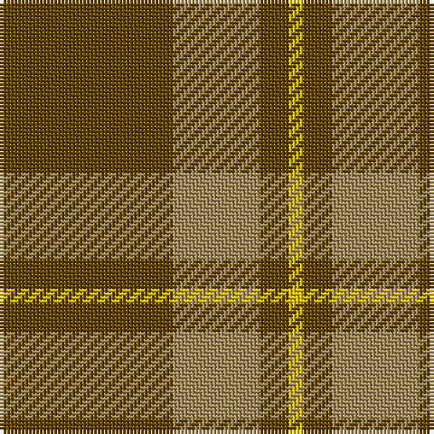

In pattern [GYGY](/stripes/gygy/).

This was sourced from house-of-tartan.  It is a [4 stripe tartan](/stripes/stripes4/).

Original link http://www.house-of-tartan.scotland.net/house/TartanViewjs.asp?colr=Def&tnam=1750

## Thread count
T/48 LT24 T8 Y/4

## Palette
Each colour and the base-6 reference it is a variant of.

| Colour | Shade | Base |
|---|---|---|
| LT | <code style="background-color:#A08858;">#A08858</code> `oklch(63.7% 0.071 84.0)` <small>#A08858</small> | Y <code style="background-color:#F2BF00;">#F2BF00</code> |
| T | <code style="background-color:#604000;">#604000</code> `oklch(39.8% 0.083 76.8)` <small>#604000</small> | G <code style="background-color:#006100;">#006100</code> |
| Y | <code style="background-color:#E8C000;">#E8C000</code> `oklch(81.9% 0.168 93.7)` <small>#E8C000</small> | Y <code style="background-color:#F2BF00;">#F2BF00</code> |

# Sample pattern

## Nearest tartans

The nearest existing variants by ΔTartan distance, with this tartan at the top so the swatches line up against it.

ΔTartan

Tartan

Sett

—

<a href="/ttd/edit/#slug=dy12lo6dy2ly1~x4">Loch Garth Tartan Tartan Number: 1750. Earliest known date: pre 2003 Nothing See products available Copyright © Blair Urquhart, Comrie, 2015</a> <a class="nn-out" href="/setts/s4/dy12lo6dy2ly1~x4/" title="open its dictionary page">↗</a>

1.38

<a href="/ttd/edit/#slug=do12y6do2lo1~x4">Loch Garth</a> <a class="nn-out" href="/setts/s4/do12y6do2lo1~x4/" title="open its dictionary page">↗</a>

1.43

<a href="/ttd/edit/#slug=g16r1g2r11~x8">Middleton</a> <a class="nn-out" href="/setts/s4/g16r1g2r11~x8/" title="open its dictionary page">↗</a>

1.46

<a href="/ttd/edit/#slug=lb9y52dy15ly4~x2">McGuigan, Julia (Personal)</a> <a class="nn-out" href="/setts/s4/lb9y52dy15ly4~x2/" title="open its dictionary page">↗</a>

1.65

<a href="/ttd/edit/#slug=g9o20g46lg5~x2">O'Neill, Red (Corporate?)</a> <a class="nn-out" href="/setts/s4/g9o20g46lg5~x2/" title="open its dictionary page">↗</a>

1.66

<a href="/ttd/edit/#slug=dg42o10dg3r10o3~x2">Glen Trool (Fashion)</a> <a class="nn-out" href="/setts/s5/dg42o10dg3r10o3~x2/" title="open its dictionary page">↗</a>

1.70

<a href="/ttd/edit/#slug=dg16ly3dg14r16dg2r2dg3~x2">Scott Autumn (Fashion)</a> <a class="nn-out" href="/setts/s7/dg16ly3dg14r16dg2r2dg3~x2/" title="open its dictionary page">↗</a>

1.70

<a href="/ttd/edit/#slug=g9o20g40w5~x2">O'Neill (Australia) (Name)</a> <a class="nn-out" href="/setts/s4/g9o20g40w5~x2/" title="open its dictionary page">↗</a>

1.72

<a href="/ttd/edit/#slug=r6dg2db2dg17r2~x4">Loton (Personal)</a> <a class="nn-out" href="/setts/s5/r6dg2db2dg17r2~x4/" title="open its dictionary page">↗</a>

1.74

<a href="/ttd/edit/#slug=r2g2r1g12r3k1~x4">Connell (Personal?)</a> <a class="nn-out" href="/setts/s6/r2g2r1g12r3k1~x4/" title="open its dictionary page">↗</a>

1.76

<a href="/ttd/edit/#slug=r1dy7o25dy7r1~x2">Unnamed Brown (Teddy Bear)</a> <a class="nn-out" href="/setts/s5/r1dy7o25dy7r1~x2/" title="open its dictionary page">↗</a>

## Neighbour map

Every grey dot is one of 14299 variants placed by the first two principal components of the ΔTartan feature space (44% of its variance). Red is this tartan; blue dots are its nearest — click one to open its page.

<svg viewBox="0 0 640 380" role="img" style="max-width:100%;height:auto;border:1px solid #e0e0e0;border-radius:4px;display:block" xmlns="http://www.w3.org/2000/svg"><image href="/nn/cloud.v1.png" width="640" height="380"/><a href="/setts/s4/do12y6do2lo1~x4/"><circle cx="449.3" cy="255.6" r="4" fill="#3465a4"><title>Loch Garth</title></circle></a><a href="/setts/s4/g16r1g2r11~x8/"><circle cx="443.1" cy="254.9" r="4" fill="#3465a4"><title>Middleton</title></circle></a><a href="/setts/s4/lb9y52dy15ly4~x2/"><circle cx="422.3" cy="235.4" r="4" fill="#3465a4"><title>McGuigan, Julia (Personal)</title></circle></a><a href="/setts/s4/g9o20g46lg5~x2/"><circle cx="463.7" cy="288.5" r="4" fill="#3465a4"><title>O'Neill, Red (Corporate?)</title></circle></a><a href="/setts/s5/dg42o10dg3r10o3~x2/"><circle cx="467.3" cy="240.5" r="4" fill="#3465a4"><title>Glen Trool (Fashion)</title></circle></a><a href="/setts/s7/dg16ly3dg14r16dg2r2dg3~x2/"><circle cx="406.4" cy="262.3" r="4" fill="#3465a4"><title>Scott Autumn (Fashion)</title></circle></a><a href="/setts/s4/g9o20g40w5~x2/"><circle cx="413.2" cy="286.9" r="4" fill="#3465a4"><title>O'Neill (Australia) (Name)</title></circle></a><a href="/setts/s5/r6dg2db2dg17r2~x4/"><circle cx="453.1" cy="267.3" r="4" fill="#3465a4"><title>Loton (Personal)</title></circle></a><a href="/setts/s6/r2g2r1g12r3k1~x4/"><circle cx="445.8" cy="217.8" r="4" fill="#3465a4"><title>Connell (Personal?)</title></circle></a><a href="/setts/s5/r1dy7o25dy7r1~x2/"><circle cx="475.2" cy="200.4" r="4" fill="#3465a4"><title>Unnamed Brown (Teddy Bear)</title></circle></a><circle cx="464.2" cy="263.0" r="5" fill="#c00000"/></svg>

ID: /setts/s4/dy12lo6dy2ly1~x4/
