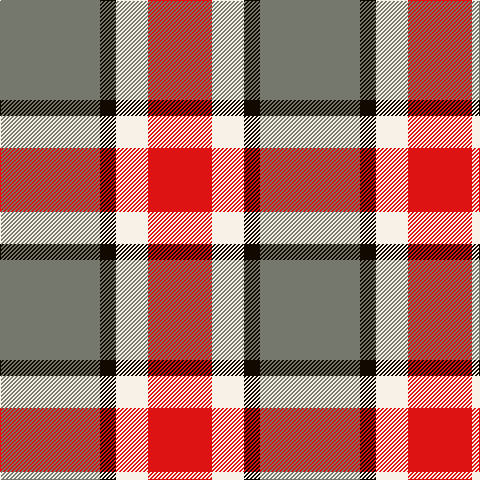

In pattern [GKWR](/patterns/gkwr/).

This was sourced from register-of-tartans.  It is a [4 stripes tartan](/stripes/stripes4/).

Original link https://www.tartanregister.gov.uk/tartanDetails.aspx?ref=10702

## Thread count
N/100 K16 W32 R/64

## Palette
Each colour and its ΔE from the base-6 reference it is a variant of.

| Colour | Shade | Base | ΔE (OKLab) |
|---|---|---|---|
| K | <code style="background-color:#120A01;">#120A01</code> `#120A01` | K <code style="background-color:#000000;">#000000</code> | 0.15 |
| N | <code style="background-color:#75786C;">#75786C</code> `#75786C` | G <code style="background-color:#006400;">#006400</code> | 0.19 |
| R | <code style="background-color:#DD1212;">#DD1212</code> `#DD1212` | R <code style="background-color:#C80000;">#C80000</code> | 0.05 |
| W | <code style="background-color:#F7F1E8;">#F7F1E8</code> `#F7F1E8` | W <code style="background-color:#F4F4F0;">#F4F4F0</code> | 0.01 |

# Sample pattern

ID: /setts/s4/g100k16w32r64-g75786c-k120a01-rdd1212-wf7f1e8/
vert(1) contrast(100);">#DD1212</code> `#DD1212` | R <code style="background-color:#C80000;">#C80000</code> | 0.05 |
| W | <code style="background-color:#F7F1E8;">#F7F1E8</code> `#F7F1E8` | W <code style="background-color:#F4F4F0;">#F4F4F0</code> | 0.01 |

# Sample pattern

ID: /setts/s4/g100k16w32r64-g75786c-k120a01-rdd1212-wf7f1e8/
