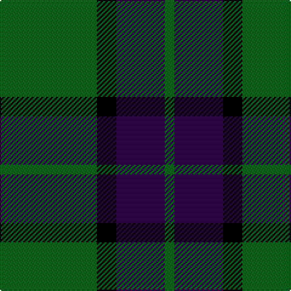

This page is one **sett** — a single exact thread-count. It belongs to the [tartan](/tartans/g10k2dp5g1/)
(the same proportion at any scale), whose colour order is pattern [GBKG](/stripes/gbkg/).

Sourced from tartans-authority.  It is a [4 stripe tartan](/stripes/stripes4/).

Original link http://www.tartansauthority.com/tartan-ferret/display/3764/

## Thread count
G/80 K16 DP40 G/8

## Palette
Each colour and the base-6 reference it is a variant of.

| Colour | Shade | Base |
|---|---|---|
| DP | <code style="background-color:#300048;">#300048</code> `oklch(23.9% 0.121 309.9)` <small>#300048</small> | B <code style="background-color:#2A418A;">#2A418A</code> |
| G | <code style="background-color:#006818;">#006818</code> `oklch(45.0% 0.142 145.0)` <small>#006818</small> | G <code style="background-color:#006100;">#006100</code> |
| K | <code style="background-color:#000000;">#000000</code> `oklch(0.0% 0.000 0.0)` <small>#000000</small> | K <code style="background-color:#000000;">#000000</code> |

# Sample pattern

## Nearest tartans

The nearest existing variants by ΔTartan distance, with this tartan at the top so the swatches line up against it.

ΔTartan

Tartan

Sett

—

<a href="/ttd/edit/#slug=g10k2dp5g1~x8">Bumbee #1 (Fashion)</a> <a class="nn-out" href="/setts/s4/g10k2dp5g1~x8/" title="open its dictionary page">↗</a>

0.90

<a href="/ttd/edit/#slug=k3g15k20ly3~x2">Scotch Tape 2 (Corporate)</a> <a class="nn-out" href="/setts/s4/k3g15k20ly3~x2/" title="open its dictionary page">↗</a>

1.14

<a href="/ttd/edit/#slug=k2g11k26b11k2~x2">Campbell of Loch Awe</a> <a class="nn-out" href="/setts/s5/k2g11k26b11k2~x2/" title="open its dictionary page">↗</a>

1.16

<a href="/ttd/edit/#slug=g9k18r2~x4">Cowie, Justine (Personal)</a> <a class="nn-out" href="/setts/s3/g9k18r2~x4/" title="open its dictionary page">↗</a>

1.27

<a href="/ttd/edit/#slug=dg21lo44dg86t10">Special Saffron (Fashion)</a> <a class="nn-out" href="/setts/s4/dg21lo44dg86t10/" title="open its dictionary page">↗</a>

1.32

<a href="/ttd/edit/#slug=k5g40db20ly3~x2">Robert Byers Family - Dooballagh, Ireland</a> <a class="nn-out" href="/setts/s4/k5g40db20ly3~x2/" title="open its dictionary page">↗</a>

1.36

<a href="/ttd/edit/#slug=dg21lo43dg86b10">Special, Saffron</a> <a class="nn-out" href="/setts/s4/dg21lo43dg86b10/" title="open its dictionary page">↗</a>

1.40

<a href="/ttd/edit/#slug=w1dg10dp4lt1~x2">Wilson's No.205</a> <a class="nn-out" href="/setts/s4/w1dg10dp4lt1~x2/" title="open its dictionary page">↗</a>

1.40

<a href="/ttd/edit/#slug=k9g3k3g12ly2~x4">MacArthur</a> <a class="nn-out" href="/setts/s5/k9g3k3g12ly2~x4/" title="open its dictionary page">↗</a>

1.40

<a href="/ttd/edit/#slug=g7k1g7t1k6t1~x4">Innes, Georgina (Portrait)</a> <a class="nn-out" href="/setts/s6/g7k1g7t1k6t1~x4/" title="open its dictionary page">↗</a>

1.41

<a href="/ttd/edit/#slug=k30lb7g36k5~x2">Innes Hunting</a> <a class="nn-out" href="/setts/s4/k30lb7g36k5~x2/" title="open its dictionary page">↗</a>

## Neighbour map

Every grey dot is one of 14299 variants placed by the first two principal components of the ΔTartan feature space (44% of its variance). Red is this tartan; blue dots are its nearest — click one to open its page.

<svg viewBox="0 0 640 380" role="img" style="max-width:100%;height:auto;border:1px solid #e0e0e0;border-radius:4px;display:block" xmlns="http://www.w3.org/2000/svg"><image href="/nn/cloud.v1.png" width="640" height="380"/><a href="/setts/s4/k3g15k20ly3~x2/"><circle cx="311.9" cy="278.6" r="4" fill="#3465a4"><title>Scotch Tape 2 (Corporate)</title></circle></a><a href="/setts/s5/k2g11k26b11k2~x2/"><circle cx="350.4" cy="244.0" r="4" fill="#3465a4"><title>Campbell of Loch Awe</title></circle></a><a href="/setts/s3/g9k18r2~x4/"><circle cx="343.3" cy="277.5" r="4" fill="#3465a4"><title>Cowie, Justine (Personal)</title></circle></a><a href="/setts/s4/dg21lo44dg86t10/"><circle cx="372.7" cy="262.0" r="4" fill="#3465a4"><title>Special Saffron (Fashion)</title></circle></a><a href="/setts/s4/k5g40db20ly3~x2/"><circle cx="353.5" cy="237.3" r="4" fill="#3465a4"><title>Robert Byers Family - Dooballagh, Ireland</title></circle></a><a href="/setts/s4/dg21lo43dg86b10/"><circle cx="379.1" cy="263.5" r="4" fill="#3465a4"><title>Special, Saffron</title></circle></a><a href="/setts/s4/w1dg10dp4lt1~x2/"><circle cx="334.6" cy="224.9" r="4" fill="#3465a4"><title>Wilson's No.205</title></circle></a><a href="/setts/s5/k9g3k3g12ly2~x4/"><circle cx="282.5" cy="278.4" r="4" fill="#3465a4"><title>MacArthur</title></circle></a><a href="/setts/s6/g7k1g7t1k6t1~x4/"><circle cx="310.9" cy="255.7" r="4" fill="#3465a4"><title>Innes, Georgina (Portrait)</title></circle></a><a href="/setts/s4/k30lb7g36k5~x2/"><circle cx="264.6" cy="276.9" r="4" fill="#3465a4"><title>Innes Hunting</title></circle></a><circle cx="355.8" cy="263.8" r="5" fill="#c00000"/></svg>

ID: /setts/s4/g10k2dp5g1~x8/
