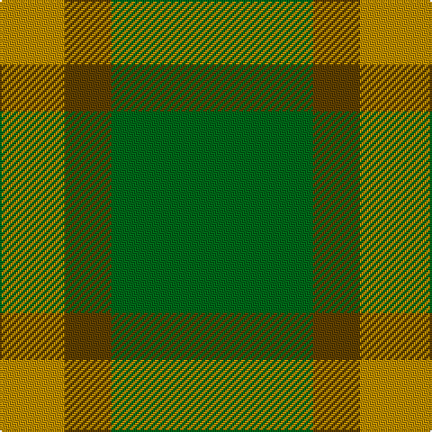

In pattern [GGYY](/patterns/ggyy/).

This was sourced from tartans-authority.  It is a [4 stripes tartan](/stripes/stripes4/).

Original link http://www.tartansauthority.com/tartan-ferret/display/10487/

## Thread count
DY/10 DY26 T26 G/112

## Palette
Each colour and its ΔE from the base-6 reference it is a variant of.

| Colour | Shade | Base | ΔE (OKLab) |
|---|---|---|---|
| DY | <code style="background-color:#BC8C00;">#BC8C00</code> `#BC8C00` | Y <code style="background-color:#F2BF00;">#F2BF00</code> | 0.16 |
| G | <code style="background-color:#006818;">#006818</code> `#006818` | G <code style="background-color:#006100;">#006100</code> | 0.02 |
| T | <code style="background-color:#604000;">#604000</code> `#604000` | G <code style="background-color:#006100;">#006100</code> | 0.14 |

# Sample pattern

## Nearest tartans

The nearest existing variants by ΔTartan distance.

1. [O'Neill, Red (Corporate?)](/setts/s4/g18r40g92y10-g006818-rb84c00-y48a4c0/) — ΔT 1.19
1. [Glen Boig](/setts/s5/g74r18g6b18r6-b401000-g006020-r806050/) — ΔT 1.23
1. [Ledford Family Tartan Tartan Number: 835. Earliest known date: 1987 A quantity of this cloth was woven in 1998 for a Ledford family in the USA. See products available Copyright © Blair Urquhart, Comrie, 2015](/setts/s3/g36r16y4-g006818-r888888-ye8c000/) — ΔT 1.60
1. [Confederate Artillery (Military)](/setts/s6/g4r28g16r6g24ra4-g006818-ra0783c-ra8c0000/) — ΔT 1.68
1. [O'Neill, Red](/setts/s6/g92r40g18r40g92y10-g006818-rb84c00-y48a4c0/) — ΔT 1.69
1. [Ledford (Name)](/setts/s3/g144r64y16-g008c44-r888888-yf0c800/) — ΔT 1.71
1. [O'Neill (Australia) (Name)](/setts/s4/g18r40g80w10-g006818-r98481c-we0e0e0/) — ΔT 1.73
1. [Ledford](/setts/s3/g72ga32y8-g005020-ga808080-yc89600/) — ΔT 1.78
1. [O'Neill (Australia)](/setts/s6/r40g80w10g80r40g18-g006818-r98481c-we0e0e0/) — ΔT 1.78
1. [Campbell Simpson (Dalgliesh)](/setts/s6/g44k6g6ga32g12k8-g408060-ga006818-k101010/) — ΔT 1.79

## Neighbour map

Every grey dot is one of 15726 variants placed by the first two principal components of the ΔTartan feature space (44% of its variance). Red is this tartan; blue dots are its nearest — click one to open its page.

<svg viewBox="0 0 640 380" role="img" style="max-width:100%;height:auto;border:1px solid #e0e0e0;border-radius:4px;display:block" xmlns="http://www.w3.org/2000/svg"><image href="/nn/cloud.v1.png" width="640" height="380"/><a href="/setts/s4/g18r40g92y10-g006818-rb84c00-y48a4c0/"><circle cx="464.4" cy="283.7" r="4" fill="#3465a4"><title>O'Neill, Red (Corporate?)</title></circle></a><a href="/setts/s5/g74r18g6b18r6-b401000-g006020-r806050/"><circle cx="491.4" cy="262.6" r="4" fill="#3465a4"><title>Glen Boig</title></circle></a><a href="/setts/s3/g36r16y4-g006818-r888888-ye8c000/"><circle cx="416.4" cy="299.3" r="4" fill="#3465a4"><title>Ledford Family Tartan Tartan Number: 835. Earliest known date: 1987 A quantity of this cloth was woven in 1998 for a Ledford family in the USA. See products available Copyright © Blair Urquhart, Comrie, 2015</title></circle></a><a href="/setts/s6/g4r28g16r6g24ra4-g006818-ra0783c-ra8c0000/"><circle cx="384.9" cy="291.0" r="4" fill="#3465a4"><title>Confederate Artillery (Military)</title></circle></a><a href="/setts/s6/g92r40g18r40g92y10-g006818-rb84c00-y48a4c0/"><circle cx="456.3" cy="281.0" r="4" fill="#3465a4"><title>O'Neill, Red</title></circle></a><a href="/setts/s3/g144r64y16-g008c44-r888888-yf0c800/"><circle cx="455.8" cy="317.2" r="4" fill="#3465a4"><title>Ledford (Name)</title></circle></a><a href="/setts/s4/g18r40g80w10-g006818-r98481c-we0e0e0/"><circle cx="414.1" cy="283.8" r="4" fill="#3465a4"><title>O'Neill (Australia) (Name)</title></circle></a><a href="/setts/s3/g72ga32y8-g005020-ga808080-yc89600/"><circle cx="421.9" cy="301.9" r="4" fill="#3465a4"><title>Ledford</title></circle></a><a href="/setts/s6/r40g80w10g80r40g18-g006818-r98481c-we0e0e0/"><circle cx="422.7" cy="290.1" r="4" fill="#3465a4"><title>O'Neill (Australia)</title></circle></a><a href="/setts/s6/g44k6g6ga32g12k8-g408060-ga006818-k101010/"><circle cx="372.1" cy="278.2" r="4" fill="#3465a4"><title>Campbell Simpson (Dalgliesh)</title></circle></a><circle cx="459.0" cy="274.0" r="5" fill="#c00000"/></svg>

ID: /setts/s4/g112ga26y26y10-g006818-ga604000-ybc8c00/
