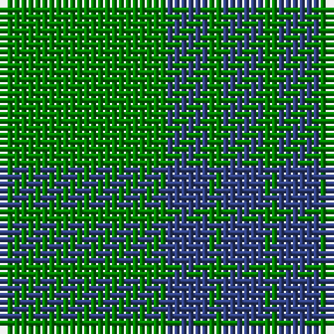

This page is one **sett** — a single exact thread-count. It belongs to the [tartan](/tartans/g12db3g1/)
(the same proportion at any scale), whose colour order is pattern [BGBG](/stripes/bgbg/).

Sourced from weddslist.  It is a [4 stripe tartan](/stripes/stripes4/).

Original link http://www.weddslist.com/cgi-bin/tartans/pg.pl?source=sts

## Thread count
G/24 B6 G2 B/6

## Palette

Palette: <strong>custom</strong>
<table><thead><tr><th>Colour</th><th>Threads</th><th>Shade</th><th>Base</th><th>OKLCh</th></tr></thead><tbody><tr><td>G/</td><td style="text-align:right;font-variant-numeric:tabular-nums">24</td><td><code style="background-color:#008000;">#008000</code> <small style="color:#888">#008000</small></td><td>G <code style="background-color:#006100;">#006100</code></td><td><small style="color:#888">oklch(52.0% 0.177 142.5)</small></td></tr><tr><td>B</td><td style="text-align:right;font-variant-numeric:tabular-nums">6</td><td><code style="background-color:#304080;">#304080</code> <small style="color:#888">#304080</small></td><td>B <code style="background-color:#2A418A;">#2A418A</code></td><td><small style="color:#888">oklch(39.4% 0.109 270.2)</small></td></tr><tr><td>G</td><td style="text-align:right;font-variant-numeric:tabular-nums">2</td><td><code style="background-color:#008000;">#008000</code> <small style="color:#888">#008000</small></td><td>G <code style="background-color:#006100;">#006100</code></td><td><small style="color:#888">oklch(52.0% 0.177 142.5)</small></td></tr><tr><td>B/</td><td style="text-align:right;font-variant-numeric:tabular-nums">6</td><td><code style="background-color:#304080;">#304080</code> <small style="color:#888">#304080</small></td><td>B <code style="background-color:#2A418A;">#2A418A</code></td><td><small style="color:#888">oklch(39.4% 0.109 270.2)</small></td></tr></tbody></table>

# Sample pattern

## Nearest tartans

The nearest existing variants by ΔTartan distance, with this tartan at the top so the swatches line up against it.

ΔTartan

Tartan

Sett

—

<a href="/ttd/edit/#slug=g12db3g1~x2">Montgomerie</a> <a class="nn-out" href="/setts/s4/g12db3g1~x2/" title="open its dictionary page">↗</a>

1.46

<a href="/ttd/edit/#slug=g12db3ly1~x4">Unidentified, pattern</a> <a class="nn-out" href="/setts/s3/g12db3ly1~x4/" title="open its dictionary page">↗</a>

1.49

<a href="/ttd/edit/#slug=dg12db3ly1~x4">Unidentified pattern #2</a> <a class="nn-out" href="/setts/s3/dg12db3ly1~x4/" title="open its dictionary page">↗</a>

1.69

<a href="/ttd/edit/#slug=g9o20g46lg5~x2">O'Neill, Red (Corporate?)</a> <a class="nn-out" href="/setts/s4/g9o20g46lg5~x2/" title="open its dictionary page">↗</a>

1.73

<a href="/ttd/edit/#slug=g9n1g2k4g2~x4">Peterhead (Personal)</a> <a class="nn-out" href="/setts/s5/g9n1g2k4g2~x4/" title="open its dictionary page">↗</a>

1.73

<a href="/ttd/edit/#slug=g9o4ly1~x4">Ledford Family Tartan Tartan Number: 835. Earliest known date: 1987 A quantity of this cloth was woven in 1998 for a Ledford family in the USA. See products available Copyright © Blair Urquhart, Comrie, 2015</a> <a class="nn-out" href="/setts/s3/g9o4ly1~x4/" title="open its dictionary page">↗</a>

1.75

<a href="/ttd/edit/#slug=dp7g23r3g7~x2">Highland Spring (1997) (Corporate)</a> <a class="nn-out" href="/setts/s4/dp7g23r3g7~x2/" title="open its dictionary page">↗</a>

1.76

<a href="/ttd/edit/#slug=g44db9r2db9g2~x2">Tyrconnell (Personal)</a> <a class="nn-out" href="/setts/s5/g44db9r2db9g2~x2/" title="open its dictionary page">↗</a>

1.76

<a href="/ttd/edit/#slug=dg9y4lo1~x8">Ledford</a> <a class="nn-out" href="/setts/s3/dg9y4lo1~x8/" title="open its dictionary page">↗</a>

1.77

<a href="/setts/s4/g6db2g1~x4/">Montgomery</a>

1.77

<a href="/setts/s4/g6db2g1~x8/">Montgomery - 1842 (VS</a>

## Neighbour map

Every grey dot is one of 14299 variants placed by the first two principal components of the ΔTartan feature space (44% of its variance). Red is this tartan; blue dots are its nearest — click one to open its page.

<svg viewBox="0 0 640 380" role="img" style="max-width:100%;height:auto;border:1px solid #e0e0e0;border-radius:4px;display:block" xmlns="http://www.w3.org/2000/svg"><image href="/nn/cloud.v1.png" width="640" height="380"/><a href="/setts/s3/g12db3ly1~x4/"><circle cx="495.9" cy="275.1" r="4" fill="#3465a4"><title>Unidentified, pattern</title></circle></a><a href="/setts/s3/dg12db3ly1~x4/"><circle cx="516.3" cy="286.5" r="4" fill="#3465a4"><title>Unidentified pattern #2</title></circle></a><a href="/setts/s4/g9o20g46lg5~x2/"><circle cx="463.7" cy="288.5" r="4" fill="#3465a4"><title>O'Neill, Red (Corporate?)</title></circle></a><a href="/setts/s5/g9n1g2k4g2~x4/"><circle cx="461.6" cy="274.4" r="4" fill="#3465a4"><title>Peterhead (Personal)</title></circle></a><a href="/setts/s3/g9o4ly1~x4/"><circle cx="415.8" cy="303.5" r="4" fill="#3465a4"><title>Ledford Family Tartan Tartan Number: 835. Earliest known date: 1987 A quantity of this cloth was woven in 1998 for a Ledford family in the USA. See products available Copyright © Blair Urquhart, Comrie, 2015</title></circle></a><a href="/setts/s4/dp7g23r3g7~x2/"><circle cx="471.7" cy="289.2" r="4" fill="#3465a4"><title>Highland Spring (1997) (Corporate)</title></circle></a><a href="/setts/s5/g44db9r2db9g2~x2/"><circle cx="512.9" cy="221.1" r="4" fill="#3465a4"><title>Tyrconnell (Personal)</title></circle></a><a href="/setts/s3/dg9y4lo1~x8/"><circle cx="421.5" cy="306.5" r="4" fill="#3465a4"><title>Ledford</title></circle></a><a href="/setts/s4/g6db2g1~x4/"><circle cx="426.5" cy="330.6" r="4" fill="#3465a4"><title>Montgomery</title></circle></a><a href="/setts/s4/g6db2g1~x8/"><circle cx="426.5" cy="330.6" r="4" fill="#3465a4"><title>Montgomery - 1842 (VS</title></circle></a><circle cx="486.0" cy="285.2" r="5" fill="#c00000"/></svg>

ID: /setts/s4/g12db3g1~x2/
