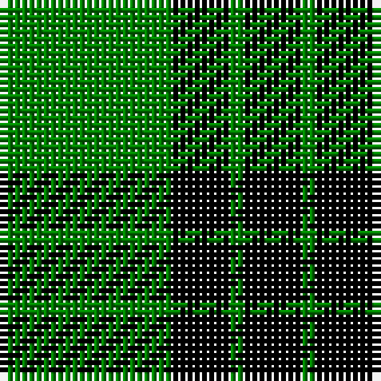

In pattern [GKGK](/stripes/gkgk/).

This was sourced from weddslist.  It is a [4 stripe tartan](/stripes/stripes4/).

Original link http://www.weddslist.com/cgi-bin/tartans/pg.pl?source=sts

## Thread count
G/24 K8 G2 K/8

## Palette
Each colour and the base-6 reference it is a variant of.

| Colour | Shade | Base |
|---|---|---|
| G | <code style="background-color:#008000;">#008000</code> `oklch(52.0% 0.177 142.5)` <small>#008000</small> | G <code style="background-color:#006100;">#006100</code> |
| K | <code style="background-color:#000000;">#000000</code> `oklch(0.0% 0.000 0.0)` <small>#000000</small> | K <code style="background-color:#000000;">#000000</code> |

# Sample pattern

## Nearest tartans

The nearest existing variants by ΔTartan distance.

1. [MacArthur-Fox](/setts/s5/k19g8k10g31r3/) — ΔT 1.35
1. [Fife, Duchess of..](/setts/s6/g30k12g6k6db2k5~x2/) — ΔT 1.39
1. [MacArthur](/setts/s5/k32g6k12g30ly3/) — ΔT 1.58
1. [Innes](/setts/s6/g7k1g7t1k6t1~x2/) — ΔT 1.59
1. [Granger](/setts/s6/dg40k4dg12k21dg17w4~x2/) — ΔT 1.67
1. [Innes, Georgina (Portrait)](/setts/s6/g7k1g7t1k6t1~x4/) — ΔT 1.67
1. [Wallace, hunting](/setts/s4/k4g33k33ly4~x2/) — ΔT 1.71
1. [Duchess of Fife](/setts/s6/g70k26g12k14b3k16~x2/) — ΔT 1.71
1. [Special Saffron Tartan Tartan Number: 201. Earliest known date: pre 2003 Y = Saffron See products available Copyright © Blair Urquhart, Comrie, 2015](/setts/s4/dg21ly43dg86t10/) — ΔT 1.80
1. [Cowie, Justine (Personal)](/setts/s3/g9k18r2~x4/) — ΔT 1.81

## Neighbour map

Every grey dot is one of 14299 variants placed by the first two principal components of the ΔTartan feature space (44% of its variance). Red is this tartan; blue dots are its nearest — click one to open its page.

<svg viewBox="0 0 640 380" role="img" style="max-width:100%;height:auto;border:1px solid #e0e0e0;border-radius:4px;display:block" xmlns="http://www.w3.org/2000/svg"><image href="/nn/cloud.v1.png" width="640" height="380"/><a href="/setts/s5/k19g8k10g31r3/"><circle cx="294.6" cy="248.4" r="4" fill="#3465a4"><title>MacArthur-Fox</title></circle></a><a href="/setts/s6/g30k12g6k6db2k5~x2/"><circle cx="344.2" cy="210.9" r="4" fill="#3465a4"><title>Fife, Duchess of..</title></circle></a><a href="/setts/s5/k32g6k12g30ly3/"><circle cx="292.6" cy="244.9" r="4" fill="#3465a4"><title>MacArthur</title></circle></a><a href="/setts/s6/g7k1g7t1k6t1~x2/"><circle cx="298.4" cy="249.9" r="4" fill="#3465a4"><title>Innes</title></circle></a><a href="/setts/s6/dg40k4dg12k21dg17w4~x2/"><circle cx="391.4" cy="245.5" r="4" fill="#3465a4"><title>Granger</title></circle></a><a href="/setts/s6/g7k1g7t1k6t1~x4/"><circle cx="310.9" cy="255.7" r="4" fill="#3465a4"><title>Innes, Georgina (Portrait)</title></circle></a><a href="/setts/s4/k4g33k33ly4~x2/"><circle cx="273.4" cy="255.7" r="4" fill="#3465a4"><title>Wallace, hunting</title></circle></a><a href="/setts/s6/g70k26g12k14b3k16~x2/"><circle cx="363.6" cy="196.8" r="4" fill="#3465a4"><title>Duchess of Fife</title></circle></a><a href="/setts/s4/dg21ly43dg86t10/"><circle cx="357.6" cy="254.7" r="4" fill="#3465a4"><title>Special Saffron Tartan Tartan Number: 201. Earliest known date: pre 2003 Y = Saffron See products available Copyright © Blair Urquhart, Comrie, 2015</title></circle></a><a href="/setts/s3/g9k18r2~x4/"><circle cx="343.3" cy="277.5" r="4" fill="#3465a4"><title>Cowie, Justine (Personal)</title></circle></a><circle cx="371.9" cy="263.7" r="5" fill="#c00000"/></svg>

ID: /setts/s4/g12k4g1~x2/
