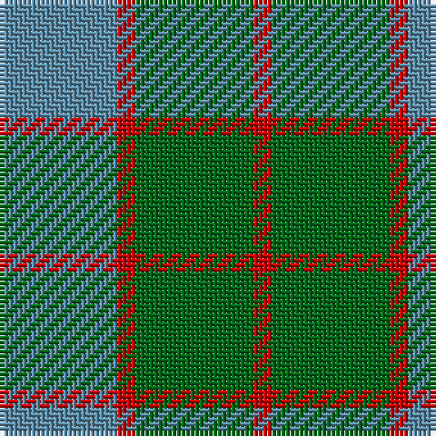

This page is one **sett** — a single exact thread-count. It belongs to the [tartan](/tartans/g13r2t13/)
(the same proportion at any scale), whose colour order is pattern [BRGR](/stripes/brgr/).

Sourced from register-of-tartans.  It is a [4 stripe tartan](/stripes/stripes4/).

Original link https://www.tartanregister.gov.uk/tartanDetails.aspx?ref=4706

## Also known as

This cloth is also recorded under:

- Wilson's No 62,
- Wilson's, No 161

## Register references

External register numbers recorded for this tartan.

- Scottish Register of Tartans: [4706](https://www.tartanregister.gov.uk/tartanDetails.aspx?ref=4706)
- Scottish Tartans Authority (ITI): 505
- Scottish Tartans World Register: 505

## Thread count
B/26 R4 G26 R/4

## Palette

Palette: <strong>Tartan Register</strong>
<table><thead><tr><th>Colour</th><th>Threads</th><th>Shade</th><th>Base</th><th>OKLCh</th></tr></thead><tbody><tr><td>B/</td><td style="text-align:right;font-variant-numeric:tabular-nums">26</td><td><code style="background-color:#5C8CA8;">#5C8CA8</code> <small style="color:#888">#5C8CA8</small></td><td>B <code style="background-color:#2A418A;">#2A418A</code></td><td><small style="color:#888">oklch(61.7% 0.067 235.0)</small></td></tr><tr><td>R</td><td style="text-align:right;font-variant-numeric:tabular-nums">4</td><td><code style="background-color:#C80000;">#C80000</code> <small style="color:#888">#C80000</small></td><td>R <code style="background-color:#CC0000;">#CC0000</code></td><td><small style="color:#888">oklch(52.3% 0.215 29.2)</small></td></tr><tr><td>G</td><td style="text-align:right;font-variant-numeric:tabular-nums">26</td><td><code style="background-color:#006818;">#006818</code> <small style="color:#888">#006818</small></td><td>G <code style="background-color:#006100;">#006100</code></td><td><small style="color:#888">oklch(45.0% 0.142 145.0)</small></td></tr><tr><td>R/</td><td style="text-align:right;font-variant-numeric:tabular-nums">4</td><td><code style="background-color:#C80000;">#C80000</code> <small style="color:#888">#C80000</small></td><td>R <code style="background-color:#CC0000;">#CC0000</code></td><td><small style="color:#888">oklch(52.3% 0.215 29.2)</small></td></tr></tbody></table>

# Sample pattern

## Nearest tartans

The nearest existing variants by ΔTartan distance, with this tartan at the top so the swatches line up against it.

ΔTartan

Tartan

Sett

—

<a href="/ttd/edit/#slug=g13r2t13~x2">Wilson's No.161</a> <a class="nn-out" href="/setts/s4/g13r2t13~x2/" title="open its dictionary page">↗</a>

1.23

<a href="/ttd/edit/#slug=g13r2t13~x2">Wilson's, No 161</a> <a class="nn-out" href="/setts/s3/g13r2t13~x2/" title="open its dictionary page">↗</a>

1.28

<a href="/ttd/edit/#slug=g14r3db9t2~x2">Unidentified 10</a> <a class="nn-out" href="/setts/s4/g14r3db9t2~x2/" title="open its dictionary page">↗</a>

1.29

<a href="/ttd/edit/#slug=db3o10g9r1g3~x4">Bethlehem, City of (District)</a> <a class="nn-out" href="/setts/s5/db3o10g9r1g3~x4/" title="open its dictionary page">↗</a>

1.37

<a href="/ttd/edit/#slug=r1g8o8w1~x2">MacKinnon, hunting</a> <a class="nn-out" href="/setts/s4/r1g8o8w1~x2/" title="open its dictionary page">↗</a>

1.45

<a href="/ttd/edit/#slug=db13r2g13~x2">Wilson's No 62, (Ferguson)</a> <a class="nn-out" href="/setts/s3/db13r2g13~x2/" title="open its dictionary page">↗</a>

1.47

<a href="/ttd/edit/#slug=t3dg1t10dg4dy10t2~x4">Rob Roy (Film) (Corporate)</a> <a class="nn-out" href="/setts/s6/t3dg1t10dg4dy10t2~x4/" title="open its dictionary page">↗</a>

1.52

<a href="/ttd/edit/#slug=db5g6r1~x4">Wilson's No 84, Ferguson</a> <a class="nn-out" href="/setts/s3/db5g6r1~x4/" title="open its dictionary page">↗</a>

1.59

<a href="/ttd/edit/#slug=dg14r3db9t2~x2">Unidentified #4</a> <a class="nn-out" href="/setts/s4/dg14r3db9t2~x2/" title="open its dictionary page">↗</a>

1.60

<a href="/ttd/edit/#slug=t7k7t7g20t2g2~x4">Falconer of Labhdal (Personal)</a> <a class="nn-out" href="/setts/s6/t7k7t7g20t2g2~x4/" title="open its dictionary page">↗</a>

1.61

<a href="/ttd/edit/#slug=db6g5r1~x4">Ferguson</a> <a class="nn-out" href="/setts/s3/db6g5r1~x4/" title="open its dictionary page">↗</a>

## Neighbour map

Every grey dot is one of 14299 variants placed by the first two principal components of the ΔTartan feature space (44% of its variance). Red is this tartan; blue dots are its nearest — click one to open its page.

<svg viewBox="0 0 640 380" role="img" style="max-width:100%;height:auto;border:1px solid #e0e0e0;border-radius:4px;display:block" xmlns="http://www.w3.org/2000/svg"><image href="/nn/cloud.v1.png" width="640" height="380"/><a href="/setts/s3/g13r2t13~x2/"><circle cx="308.4" cy="329.2" r="4" fill="#3465a4"><title>Wilson's, No 161</title></circle></a><a href="/setts/s4/g14r3db9t2~x2/"><circle cx="267.6" cy="271.4" r="4" fill="#3465a4"><title>Unidentified 10</title></circle></a><a href="/setts/s5/db3o10g9r1g3~x4/"><circle cx="279.6" cy="255.3" r="4" fill="#3465a4"><title>Bethlehem, City of (District)</title></circle></a><a href="/setts/s4/r1g8o8w1~x2/"><circle cx="301.8" cy="267.7" r="4" fill="#3465a4"><title>MacKinnon, hunting</title></circle></a><a href="/setts/s3/db13r2g13~x2/"><circle cx="288.7" cy="320.2" r="4" fill="#3465a4"><title>Wilson's No 62, (Ferguson)</title></circle></a><a href="/setts/s6/t3dg1t10dg4dy10t2~x4/"><circle cx="334.4" cy="265.5" r="4" fill="#3465a4"><title>Rob Roy (Film) (Corporate)</title></circle></a><a href="/setts/s3/db5g6r1~x4/"><circle cx="291.6" cy="323.6" r="4" fill="#3465a4"><title>Wilson's No 84, Ferguson</title></circle></a><a href="/setts/s4/dg14r3db9t2~x2/"><circle cx="292.1" cy="284.5" r="4" fill="#3465a4"><title>Unidentified #4</title></circle></a><a href="/setts/s6/t7k7t7g20t2g2~x4/"><circle cx="296.5" cy="248.9" r="4" fill="#3465a4"><title>Falconer of Labhdal (Personal)</title></circle></a><a href="/setts/s3/db6g5r1~x4/"><circle cx="293.4" cy="323.6" r="4" fill="#3465a4"><title>Ferguson</title></circle></a><circle cx="289.8" cy="290.6" r="5" fill="#c00000"/></svg>

ID: /setts/s4/g13r2t13~x2/
