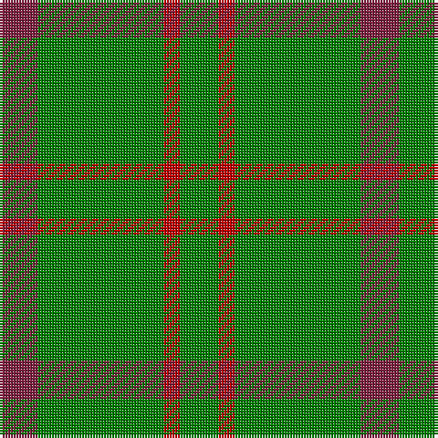

In pattern [GRGR](/patterns/grgr/).

This was sourced from weddslist.  It is a [4 stripes tartan](/stripes/stripes4/).

Original link http://www.weddslist.com/cgi-bin/tartans/pg.pl?source=sts

## Thread count
DR/14 G46 R6 G/14

## Palette
Each colour and its ΔE from the base-6 reference it is a variant of.

| Colour | Shade | Base | ΔE (OKLab) |
|---|---|---|---|
| DR | <code style="background-color:#802040;">#802040</code> `#802040` | R <code style="background-color:#C80000;">#C80000</code> | 0.16 |
| G | <code style="background-color:#008000;">#008000</code> `#008000` | G <code style="background-color:#006400;">#006400</code> | 0.09 |
| R | <code style="background-color:#C00000;">#C00000</code> `#C00000` | R <code style="background-color:#C80000;">#C80000</code> | 0.02 |

# Sample pattern

## Nearest tartans

The nearest existing variants by ΔTartan distance.

1. [Highland Spring (1997) (Corporate)](/setts/s4/b14g46r6g14-b440044-g006818-rc80000/) — ΔT 1.01
1. [O'Neill, Red (Corporate?)](/setts/s4/g18r40g92y10-g006818-rb84c00-y48a4c0/) — ΔT 1.18
1. [O'Neill (Australia) (Name)](/setts/s4/g18r40g80w10-g006818-r98481c-we0e0e0/) — ΔT 1.21
1. [McMoosie](/setts/s3/g162r20y40-g006818-rc80000-ye8c000/) — ΔT 1.27
1. [Highland Spring (1997)](/setts/s6/g46r6g14r6g46b14-b440044-g006818-rc80000/) — ΔT 1.34
1. [Unidentified, pattern](/setts/s3/g48b12y4-b304080-g008000-yf0c000/) — ΔT 1.35
1. [Wilson's, No 212](/setts/s3/g36r8b8-b5480b0-g008000-rc00000/) — ΔT 1.36
1. [O'Neill](/setts/s4/g18y40g80w10-g008000-we0e0e0-yd08010/) — ΔT 1.37
1. [Hibernian S3](/setts/s3/g98w8y22-g006818-wfcfcfc-yd87c00/) — ΔT 1.48
1. [O'Neill, Red](/setts/s6/g92r40g18r40g92y10-g006818-rb84c00-y48a4c0/) — ΔT 1.50

## Neighbour map

Every grey dot is one of 15726 variants placed by the first two principal components of the ΔTartan feature space (44% of its variance). Red is this tartan; blue dots are its nearest — click one to open its page.

<svg viewBox="0 0 640 380" role="img" style="max-width:100%;height:auto;border:1px solid #e0e0e0;border-radius:4px;display:block" xmlns="http://www.w3.org/2000/svg"><image href="/nn/cloud.v1.png" width="640" height="380"/><a href="/setts/s4/b14g46r6g14-b440044-g006818-rc80000/"><circle cx="472.9" cy="286.5" r="4" fill="#3465a4"><title>Highland Spring (1997) (Corporate)</title></circle></a><a href="/setts/s4/g18r40g92y10-g006818-rb84c00-y48a4c0/"><circle cx="464.4" cy="283.7" r="4" fill="#3465a4"><title>O'Neill, Red (Corporate?)</title></circle></a><a href="/setts/s4/g18r40g80w10-g006818-r98481c-we0e0e0/"><circle cx="414.1" cy="283.8" r="4" fill="#3465a4"><title>O'Neill (Australia) (Name)</title></circle></a><a href="/setts/s3/g162r20y40-g006818-rc80000-ye8c000/"><circle cx="443.2" cy="273.6" r="4" fill="#3465a4"><title>McMoosie</title></circle></a><a href="/setts/s6/g46r6g14r6g46b14-b440044-g006818-rc80000/"><circle cx="517.1" cy="274.6" r="4" fill="#3465a4"><title>Highland Spring (1997)</title></circle></a><a href="/setts/s3/g48b12y4-b304080-g008000-yf0c000/"><circle cx="496.4" cy="272.1" r="4" fill="#3465a4"><title>Unidentified, pattern</title></circle></a><a href="/setts/s3/g36r8b8-b5480b0-g008000-rc00000/"><circle cx="416.3" cy="315.5" r="4" fill="#3465a4"><title>Wilson's, No 212</title></circle></a><a href="/setts/s4/g18y40g80w10-g008000-we0e0e0-yd08010/"><circle cx="406.7" cy="278.8" r="4" fill="#3465a4"><title>O'Neill</title></circle></a><a href="/setts/s3/g98w8y22-g006818-wfcfcfc-yd87c00/"><circle cx="493.8" cy="256.4" r="4" fill="#3465a4"><title>Hibernian S3</title></circle></a><a href="/setts/s6/g92r40g18r40g92y10-g006818-rb84c00-y48a4c0/"><circle cx="456.3" cy="281.0" r="4" fill="#3465a4"><title>O'Neill, Red</title></circle></a><circle cx="475.8" cy="285.8" r="5" fill="#c00000"/></svg>

ID: /setts/s4/g14r6g46ra14-g008000-rc00000-ra802040/
