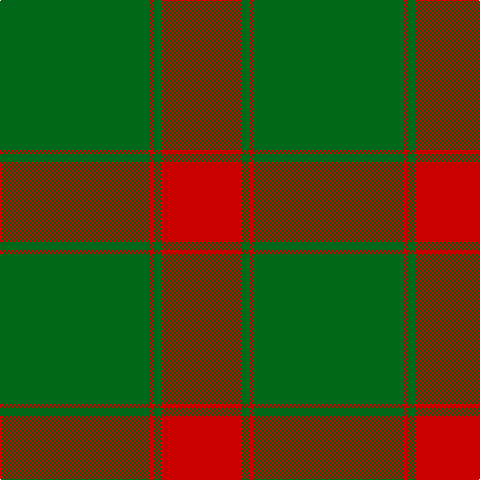

In pattern [GRGR](/patterns/grgr/).

This was sourced from tartans-authority.  It is a [4 stripes tartan](/stripes/stripes4/).

Original link http://www.tartansauthority.com/tartan-ferret/display/8133/

## Thread count
G/150 R4 G8 R/80

## Palette
Each colour and its ΔE from the base-6 reference it is a variant of.

| Colour | Shade | Base | ΔE (OKLab) |
|---|---|---|---|
| G | <code style="background-color:#006818;">#006818</code> `#006818` | G <code style="background-color:#006400;">#006400</code> | 0.02 |
| R | <code style="background-color:#C80000;">#C80000</code> `#C80000` | R <code style="background-color:#C80000;">#C80000</code> | 0.00 |

# Sample pattern

## Nearest tartans

The nearest existing variants by ΔTartan distance.

1. [Middleton](/setts/s4/g128r8g16r88-g006818-rc80000/) — ΔT 1.49
1. [Middleton](/setts/s4/g128r8g16r88-g008000-rc00000/) — ΔT 1.54
1. [Aukland & District Pipe Band (Corp)](/setts/s8/g164r20g6r20g23r14g4r36-g006818-rc8002c/) — ΔT 1.74
1. [Maxwell Hunting Clan Tartan Tartan Number: 865. Earliest known date: 0 Tartans of the Lowland families were not named until the publication the 'Vestiarium Scoticum' in 1842. The authors, the Sobieski Stuart brothers, enjoyed a popular following amongst the Scottish gentry in the early Victorian era, and in the spirit of the times, added mystery, romance and some spurious historical documentation to the subject of tartans. The Maxwells have, nevertheless, a tartan of at least 150 years antiquity, probably designed by persons of great imagination and flair. The Maxwells come from Glasgow and the S.W. of Scotland. See products available Copyright © Blair Urquhart, Comrie, 2015](/setts/s7/g6r32g8k12g56r2g6-g006818-k101010-rc80000/) — ΔT 1.75
1. [Erskine](/setts/s6/g12r2g48r56g2r8-g008000-rc00000/) — ΔT 1.77
1. [Yellow Pencil (Corporate)](/setts/s8/g96y18g12y18g24y8g4y32-g604000-ydc943c/) — ΔT 1.86
1. [Erskine (Green & Red) Clan Tartan Tartan Number: 891. Earliest known date: 1842 The Erskine clan or family originated in Renfrewshire. The first published version of the tartan appeared in the Vestiarium Scoticum, a romantic history of Scottish dress produced in 1842 by the Sobieski brothers. Cunningham tartan, published in the same work, differs only in the addition of a white stripe between the narrow green lines. Cunningham was one of the names adopted by the MacGregors, and this provides a tenuous connection which might explain the origin of the design. See products available Copyright © Blair Urquhart, Comrie, 2015](/setts/s6/g12r2g48r56g2r8-g006818-rc80000/) — ΔT 1.87
1. [Erskine (Vestiarium Scoticum)](/setts/s6/g12r2g48r56g2r8-g00643c-rc80000/) — ΔT 2.01
1. [MacMillan/Isetan (Corporate)](/setts/s6/g136r48g16y36g6y36-g285800-rc80000-ybc8c00/) — ΔT 2.02
1. [Erskine](/setts/s6/g12r2g48r56g2r8-g004c00-rc80000/) — ΔT 2.03

## Neighbour map

Every grey dot is one of 15726 variants placed by the first two principal components of the ΔTartan feature space (44% of its variance). Red is this tartan; blue dots are its nearest — click one to open its page.

<svg viewBox="0 0 640 380" role="img" style="max-width:100%;height:auto;border:1px solid #e0e0e0;border-radius:4px;display:block" xmlns="http://www.w3.org/2000/svg"><image href="/nn/cloud.v1.png" width="640" height="380"/><a href="/setts/s4/g128r8g16r88-g006818-rc80000/"><circle cx="444.6" cy="253.8" r="4" fill="#3465a4"><title>Middleton</title></circle></a><a href="/setts/s4/g128r8g16r88-g008000-rc00000/"><circle cx="436.9" cy="251.2" r="4" fill="#3465a4"><title>Middleton</title></circle></a><a href="/setts/s8/g164r20g6r20g23r14g4r36-g006818-rc8002c/"><circle cx="542.0" cy="161.8" r="4" fill="#3465a4"><title>Aukland &amp; District Pipe Band (Corp)</title></circle></a><a href="/setts/s7/g6r32g8k12g56r2g6-g006818-k101010-rc80000/"><circle cx="428.2" cy="178.7" r="4" fill="#3465a4"><title>Maxwell Hunting Clan Tartan Tartan Number: 865. Earliest known date: 0 Tartans of the Lowland families were not named until the publication the 'Vestiarium Scoticum' in 1842. The authors, the Sobieski Stuart brothers, enjoyed a popular following amongst the Scottish gentry in the early Victorian era, and in the spirit of the times, added mystery, romance and some spurious historical documentation to the subject of tartans. The Maxwells have, nevertheless, a tartan of at least 150 years antiquity, probably designed by persons of great imagination and flair. The Maxwells come from Glasgow and the S.W. of Scotland. See products available Copyright © Blair Urquhart, Comrie, 2015</title></circle></a><a href="/setts/s6/g12r2g48r56g2r8-g008000-rc00000/"><circle cx="431.8" cy="193.9" r="4" fill="#3465a4"><title>Erskine</title></circle></a><a href="/setts/s8/g96y18g12y18g24y8g4y32-g604000-ydc943c/"><circle cx="477.5" cy="188.4" r="4" fill="#3465a4"><title>Yellow Pencil (Corporate)</title></circle></a><a href="/setts/s6/g12r2g48r56g2r8-g006818-rc80000/"><circle cx="438.9" cy="196.0" r="4" fill="#3465a4"><title>Erskine (Green &amp; Red) Clan Tartan Tartan Number: 891. Earliest known date: 1842 The Erskine clan or family originated in Renfrewshire. The first published version of the tartan appeared in the Vestiarium Scoticum, a romantic history of Scottish dress produced in 1842 by the Sobieski brothers. Cunningham tartan, published in the same work, differs only in the addition of a white stripe between the narrow green lines. Cunningham was one of the names adopted by the MacGregors, and this provides a tenuous connection which might explain the origin of the design. See products available Copyright © Blair Urquhart, Comrie, 2015</title></circle></a><a href="/setts/s6/g12r2g48r56g2r8-g00643c-rc80000/"><circle cx="444.9" cy="198.1" r="4" fill="#3465a4"><title>Erskine (Vestiarium Scoticum)</title></circle></a><a href="/setts/s6/g136r48g16y36g6y36-g285800-rc80000-ybc8c00/"><circle cx="392.0" cy="202.9" r="4" fill="#3465a4"><title>MacMillan/Isetan (Corporate)</title></circle></a><a href="/setts/s6/g12r2g48r56g2r8-g004c00-rc80000/"><circle cx="434.7" cy="194.5" r="4" fill="#3465a4"><title>Erskine</title></circle></a><circle cx="514.8" cy="216.0" r="5" fill="#c00000"/></svg>

ID: /setts/s4/g150r4g8r80-g006818-rc80000/
