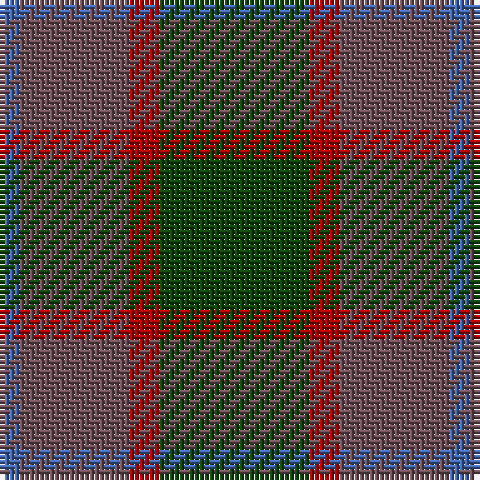

In pattern [BBRG](/patterns/bbrg/).

This was sourced from weddslist.  It is a [4 stripes tartan](/stripes/stripes4/).

Original link http://www.weddslist.com/cgi-bin/tartans/pg.pl?source=tinsel

## Thread count
B/4 N22 DR6 DG/30

## Palette
Each colour and its ΔE from the base-6 reference it is a variant of.

| Colour | Shade | Base | ΔE (OKLab) |
|---|---|---|---|
| B | <code style="background-color:#4367AE;">#4367AE</code> `#4367AE` | B <code style="background-color:#2A418A;">#2A418A</code> | 0.12 |
| DG | <code style="background-color:#11450D;">#11450D</code> `#11450D` | G <code style="background-color:#006100;">#006100</code> | 0.09 |
| DR | <code style="background-color:#AA0000;">#AA0000</code> `#AA0000` | R <code style="background-color:#CC0000;">#CC0000</code> | 0.07 |
| N | <code style="background-color:#6E5058;">#6E5058</code> `#6E5058` | B <code style="background-color:#2A418A;">#2A418A</code> | 0.15 |

# Sample pattern

## Nearest tartans

The nearest existing variants by ΔTartan distance.

1. [MacNab WI2](/setts/s4/g15r3b11ba2~b6e5058-ba4367ae-g11450d-raa0000/) — ΔT 0.00
1. [MacKinnon Hunting #2](/setts/s4/r1g8ga8w1~g005020-ga503c14-rdc0000-we0e0e0~x2/) — ΔT 1.39
1. [Trinity Bicycles](/setts/s5/g4y11g14r30ra4~g6b4226-r8b7355-racd0000-y6ca6cd~x2/) — ΔT 1.49
1. [Dewar (WCWM)](/setts/s6/b1g1b7g5ga7y1~b084848-g604000-ga8c7038-yb8b8b8~x4/) — ΔT 1.52
1. [MacKinnon Hunting](/setts/s7/g1b8g8r1g8b8y1~b521510-g11450d-raa0000-yaaaaaa~x4/) — ΔT 1.55
1. [MacKinnon Hunting](/setts/s7/g1b8g8r1g8b8y1~b521510-g11450d-raa0000-yaaaaaa~x2/) — ΔT 1.55
1. [McMoosie Htg (Fashion)](/setts/s5/g46ga23b23r4y4~b1870a4-g604000-ga00643c-rcc4438-ye8c000~x2/) — ΔT 1.57
1. [Harmony 6](/setts/s5/b2g10ga15b10g2~b840068-g005020-ga503c14~x4/) — ΔT 1.58
1. [Bright of Garth (Personal)](/setts/s5/g7ga6b7ga1b2~b14283c-g006818-ga604000~x6/) — ΔT 1.58
1. [Fraser Hunting #2](/setts/s6/g1b3g1ga3g4r1~b2c4084-g503c14-ga005020-rdc0000~x2/) — ΔT 1.60

## Neighbour map

Every grey dot is one of 15726 variants placed by the first two principal components of the ΔTartan feature space (44% of its variance). Red is this tartan; blue dots are its nearest — click one to open its page.

<svg viewBox="0 0 640 380" role="img" style="max-width:100%;height:auto;border:1px solid #e0e0e0;border-radius:4px;display:block" xmlns="http://www.w3.org/2000/svg"><image href="/nn/cloud.v1.png" width="640" height="380"/><a href="/setts/s4/g15r3b11ba2~b6e5058-ba4367ae-g11450d-raa0000/"><circle cx="334.6" cy="290.1" r="4" fill="#3465a4"><title>MacNab WI2</title></circle></a><a href="/setts/s4/r1g8ga8w1~g005020-ga503c14-rdc0000-we0e0e0~x2/"><circle cx="307.7" cy="271.1" r="4" fill="#3465a4"><title>MacKinnon Hunting #2</title></circle></a><a href="/setts/s5/g4y11g14r30ra4~g6b4226-r8b7355-racd0000-y6ca6cd~x2/"><circle cx="317.1" cy="261.5" r="4" fill="#3465a4"><title>Trinity Bicycles</title></circle></a><a href="/setts/s6/b1g1b7g5ga7y1~b084848-g604000-ga8c7038-yb8b8b8~x4/"><circle cx="254.8" cy="261.8" r="4" fill="#3465a4"><title>Dewar (WCWM)</title></circle></a><a href="/setts/s7/g1b8g8r1g8b8y1~b521510-g11450d-raa0000-yaaaaaa~x4/"><circle cx="361.0" cy="272.0" r="4" fill="#3465a4"><title>MacKinnon Hunting</title></circle></a><a href="/setts/s7/g1b8g8r1g8b8y1~b521510-g11450d-raa0000-yaaaaaa~x2/"><circle cx="361.0" cy="272.0" r="4" fill="#3465a4"><title>MacKinnon Hunting</title></circle></a><a href="/setts/s5/g46ga23b23r4y4~b1870a4-g604000-ga00643c-rcc4438-ye8c000~x2/"><circle cx="282.0" cy="229.9" r="4" fill="#3465a4"><title>McMoosie Htg (Fashion)</title></circle></a><a href="/setts/s5/b2g10ga15b10g2~b840068-g005020-ga503c14~x4/"><circle cx="303.9" cy="299.0" r="4" fill="#3465a4"><title>Harmony 6</title></circle></a><a href="/setts/s5/g7ga6b7ga1b2~b14283c-g006818-ga604000~x6/"><circle cx="290.5" cy="320.1" r="4" fill="#3465a4"><title>Bright of Garth (Personal)</title></circle></a><a href="/setts/s6/g1b3g1ga3g4r1~b2c4084-g503c14-ga005020-rdc0000~x2/"><circle cx="269.8" cy="311.6" r="4" fill="#3465a4"><title>Fraser Hunting #2</title></circle></a><circle cx="334.6" cy="290.1" r="5" fill="#c00000"/></svg>

ID: /setts/s4/g15r3b11ba2~b6e5058-ba4367ae-g11450d-raa0000~x2/
