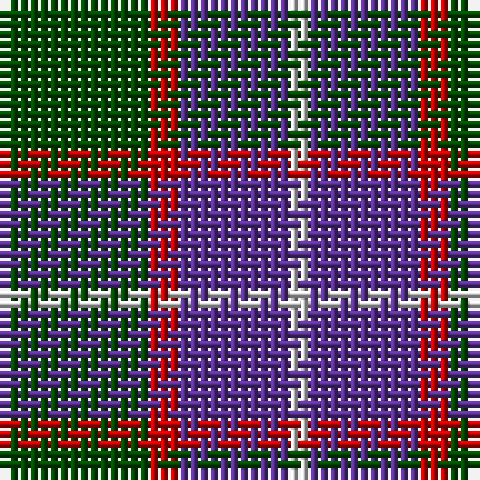

In pattern [GRBW](/patterns/grbw/).

This was sourced from weddslist.  It is a [4 stripes tartan](/stripes/stripes4/).

Original link http://www.weddslist.com/cgi-bin/tartans/pg.pl?source=rb

## Thread count
G/15 R3 P11 N/2

## Palette
Each colour and its ΔE from the base-6 reference it is a variant of.

| Colour | Shade | Base | ΔE (OKLab) |
|---|---|---|---|
| G | <code style="background-color:#004C00;">#004C00</code> `#004C00` | G <code style="background-color:#006100;">#006100</code> | 0.07 |
| N | <code style="background-color:#D0D0D0;">#D0D0D0</code> `#D0D0D0` | W <code style="background-color:#F7F7F7;">#F7F7F7</code> | 0.12 |
| P | <code style="background-color:#5A3094;">#5A3094</code> `#5A3094` | B <code style="background-color:#2A418A;">#2A418A</code> | 0.08 |
| R | <code style="background-color:#C80000;">#C80000</code> `#C80000` | R <code style="background-color:#CC0000;">#CC0000</code> | 0.01 |

# Sample pattern

## Nearest tartans

The nearest existing variants by ΔTartan distance.

1. [MacNab 7](/setts/s4/g30r6b22ba4-b800080-ba5480b0-g008000-rc00000/) — ΔT 0.71
1. [Bethlehem, City of](/setts/s5/b12r40g36ra4g12-b1c0070-g003820-r888888-ra880000/) — ΔT 0.81
1. [All as One (Corporate)](/setts/s5/k22b76r22g22k10-b2888c4-g006818-k101010-rc80000/) — ΔT 1.07
1. [Loganair](/setts/s4/r10ra64k62w10-k101010-r880000-ra888888-we0e0e0/) — ΔT 1.15
1. [Nebar (Corporate)](/setts/s4/r96ra44k24b16-b2c2c80-k101010-r888888-ra901c38/) — ΔT 1.17
1. [New York State Police Pipe Band](/setts/s5/r20b12r72k64y12-b780078-k101010-r888888-ye8c000/) — ΔT 1.17
1. [Thompson, Dress (Clan)](/setts/s4/r12ra64k64w12-k101010-r880000-ra888888-wc0c0c0/) — ΔT 1.18
1. [Mayer, Chris (Personal)](/setts/s4/b10ba60k60r10-b1c0070-ba5c5c5c-k101010-rc80000/) — ΔT 1.19
1. [Wilson's No.062](/setts/s4/g26r4b26r4-b202060-g006818-rc80000/) — ΔT 1.20
1. [Loganair Uniform Skirt Corporate Tartan Tartan Number: 1629. Earliest known date: c.1985 Half actual count for display. Used until 1988 See products available Copyright © Blair Urquhart, Comrie, 2015](/setts/s4/r5ra32k31w5-k101010-rc80000-ra888888-we0e0e0/) — ΔT 1.21

## Neighbour map

Every grey dot is one of 15726 variants placed by the first two principal components of the ΔTartan feature space (44% of its variance). Red is this tartan; blue dots are its nearest — click one to open its page.

<svg viewBox="0 0 640 380" role="img" style="max-width:100%;height:auto;border:1px solid #e0e0e0;border-radius:4px;display:block" xmlns="http://www.w3.org/2000/svg"><image href="/nn/cloud.v1.png" width="640" height="380"/><a href="/setts/s4/g30r6b22ba4-b800080-ba5480b0-g008000-rc00000/"><circle cx="251.6" cy="248.0" r="4" fill="#3465a4"><title>MacNab 7</title></circle></a><a href="/setts/s5/b12r40g36ra4g12-b1c0070-g003820-r888888-ra880000/"><circle cx="254.3" cy="240.1" r="4" fill="#3465a4"><title>Bethlehem, City of</title></circle></a><a href="/setts/s5/k22b76r22g22k10-b2888c4-g006818-k101010-rc80000/"><circle cx="226.4" cy="230.2" r="4" fill="#3465a4"><title>All as One (Corporate)</title></circle></a><a href="/setts/s4/r10ra64k62w10-k101010-r880000-ra888888-we0e0e0/"><circle cx="209.3" cy="242.1" r="4" fill="#3465a4"><title>Loganair</title></circle></a><a href="/setts/s4/r96ra44k24b16-b2c2c80-k101010-r888888-ra901c38/"><circle cx="268.6" cy="257.5" r="4" fill="#3465a4"><title>Nebar (Corporate)</title></circle></a><a href="/setts/s5/r20b12r72k64y12-b780078-k101010-r888888-ye8c000/"><circle cx="234.8" cy="235.0" r="4" fill="#3465a4"><title>New York State Police Pipe Band</title></circle></a><a href="/setts/s4/r12ra64k64w12-k101010-r880000-ra888888-wc0c0c0/"><circle cx="191.9" cy="253.9" r="4" fill="#3465a4"><title>Thompson, Dress (Clan)</title></circle></a><a href="/setts/s4/b10ba60k60r10-b1c0070-ba5c5c5c-k101010-rc80000/"><circle cx="252.3" cy="271.5" r="4" fill="#3465a4"><title>Mayer, Chris (Personal)</title></circle></a><a href="/setts/s4/g26r4b26r4-b202060-g006818-rc80000/"><circle cx="271.8" cy="281.5" r="4" fill="#3465a4"><title>Wilson's No.062</title></circle></a><a href="/setts/s4/r5ra32k31w5-k101010-rc80000-ra888888-we0e0e0/"><circle cx="208.5" cy="240.8" r="4" fill="#3465a4"><title>Loganair Uniform Skirt Corporate Tartan Tartan Number: 1629. Earliest known date: c.1985 Half actual count for display. Used until 1988 See products available Copyright © Blair Urquhart, Comrie, 2015</title></circle></a><circle cx="252.1" cy="253.2" r="5" fill="#c00000"/></svg>

ID: /setts/s4/g15r3b11w2-b5a3094-g004c00-rc80000-wd0d0d0/
