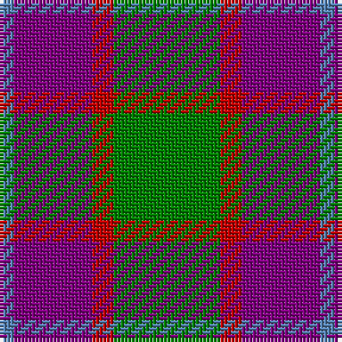

In pattern [BBRG](/stripes/bbrg/).

This was sourced from weddslist.  It is a [4 stripe tartan](/stripes/stripes4/).

Original link http://www.weddslist.com/cgi-bin/tartans/pg.pl?source=sts

## Thread count
G/30 R6 P22 B/4

## Palette
Each colour and the base-6 reference it is a variant of.

| Colour | Shade | Base |
|---|---|---|
| B | <code style="background-color:#5480B0;">#5480B0</code> `oklch(58.8% 0.089 251.5)` <small>#5480B0</small> | B <code style="background-color:#2A418A;">#2A418A</code> |
| G | <code style="background-color:#008000;">#008000</code> `oklch(52.0% 0.177 142.5)` <small>#008000</small> | G <code style="background-color:#006100;">#006100</code> |
| P | <code style="background-color:#800080;">#800080</code> `oklch(42.1% 0.193 328.4)` <small>#800080</small> | B <code style="background-color:#2A418A;">#2A418A</code> |
| R | <code style="background-color:#C00000;">#C00000</code> `oklch(50.7% 0.208 29.2)` <small>#C00000</small> | R <code style="background-color:#CC0000;">#CC0000</code> |

# Sample pattern

## Nearest tartans

The nearest existing variants by ΔTartan distance.

1. [MacNab WI2](/setts/s4/dg15r3dp11lb2/) — ΔT 0.71
1. [Bronte House Check (Fashion)](/setts/s6/r10dy60dt13lb24dt24dy8/) — ΔT 0.98
1. [Nebar (Corporate)](/setts/s4/o24r11k6db4~x4/) — ΔT 1.03
1. [Oban Grey (Fashion)](/setts/s5/k4lb4k4o15r2~x4/) — ΔT 1.05
1. [Wilson's No.195](/setts/s4/r5g7k2t1~x4/) — ΔT 1.06
1. [Delroeux (Personal)](/setts/s4/db3g6ly1r3~x10/) — ΔT 1.08
1. [Dohmen (Personal)](/setts/s4/g30ly3db8r25~x2/) — ΔT 1.10
1. [British Hills](/setts/s5/r2dg17r8db8ly2~x4/) — ΔT 1.12
1. [Ikelman #2 (Personal)](/setts/s5/n11k4r4lo4n1~x4/) — ΔT 1.16
1. [New York State Police Pipe Band](/setts/s5/o5dp3o18k16ly3~x4/) — ΔT 1.16

## Neighbour map

Every grey dot is one of 14299 variants placed by the first two principal components of the ΔTartan feature space (44% of its variance). Red is this tartan; blue dots are its nearest — click one to open its page.

<svg viewBox="0 0 640 380" role="img" style="max-width:100%;height:auto;border:1px solid #e0e0e0;border-radius:4px;display:block" xmlns="http://www.w3.org/2000/svg"><image href="/nn/cloud.v1.png" width="640" height="380"/><a href="/setts/s4/dg15r3dp11lb2/"><circle cx="253.4" cy="254.7" r="4" fill="#3465a4"><title>MacNab WI2</title></circle></a><a href="/setts/s6/r10dy60dt13lb24dt24dy8/"><circle cx="232.2" cy="220.2" r="4" fill="#3465a4"><title>Bronte House Check (Fashion)</title></circle></a><a href="/setts/s4/o24r11k6db4~x4/"><circle cx="268.6" cy="258.4" r="4" fill="#3465a4"><title>Nebar (Corporate)</title></circle></a><a href="/setts/s5/k4lb4k4o15r2~x4/"><circle cx="242.6" cy="217.8" r="4" fill="#3465a4"><title>Oban Grey (Fashion)</title></circle></a><a href="/setts/s4/r5g7k2t1~x4/"><circle cx="232.8" cy="258.8" r="4" fill="#3465a4"><title>Wilson's No.195</title></circle></a><a href="/setts/s4/db3g6ly1r3~x10/"><circle cx="194.8" cy="269.2" r="4" fill="#3465a4"><title>Delroeux (Personal)</title></circle></a><a href="/setts/s4/g30ly3db8r25~x2/"><circle cx="262.9" cy="246.5" r="4" fill="#3465a4"><title>Dohmen (Personal)</title></circle></a><a href="/setts/s5/r2dg17r8db8ly2~x4/"><circle cx="220.6" cy="221.1" r="4" fill="#3465a4"><title>British Hills</title></circle></a><a href="/setts/s5/n11k4r4lo4n1~x4/"><circle cx="266.5" cy="231.7" r="4" fill="#3465a4"><title>Ikelman #2 (Personal)</title></circle></a><a href="/setts/s5/o5dp3o18k16ly3~x4/"><circle cx="235.5" cy="233.9" r="4" fill="#3465a4"><title>New York State Police Pipe Band</title></circle></a><circle cx="252.2" cy="248.6" r="5" fill="#c00000"/></svg>

ID: /setts/s4/g15r3p11t2~x2/
