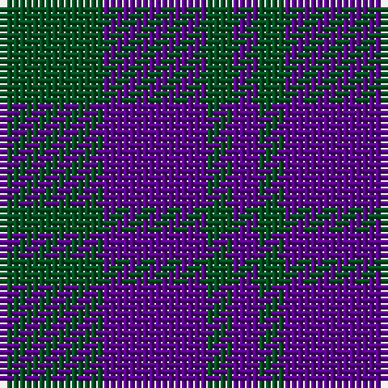

In pattern [BGBG](/patterns/bgbg/).

This was sourced from register-of-tartans.  It is a [4 stripes tartan](/stripes/stripes4/).

Original link https://www.tartanregister.gov.uk/tartanDetails.aspx?ref=4639

## Thread count
G/16 P16 G4 P/4

## Palette
Each colour and its ΔE from the base-6 reference it is a variant of.

| Colour | Shade | Base | ΔE (OKLab) |
|---|---|---|---|
| G | <code style="background-color:#005020;">#005020</code> `#005020` | G <code style="background-color:#006400;">#006400</code> | 0.08 |
| P | <code style="background-color:#5A008C;">#5A008C</code> `#5A008C` | B <code style="background-color:#2C4084;">#2C4084</code> | 0.12 |

# Sample pattern

## Nearest tartans

The nearest existing variants by ΔTartan distance.

1. [Omega Delta Sigma, National Veterans](/setts/s4/k30b80k18r20-b2c2c80-k101010-r888888/) — ΔT 1.44
1. [Omega Delta Sigma, National Veterans Fraternity](/setts/s4/k30b80k18r20-b003c64-k101010-r888888/) — ΔT 1.55
1. [Highland Grey](/setts/s6/b16g16b4g16b16g4-b2c2c80-g006818/) — ΔT 1.78
1. [Unidentified No 78](/setts/s4/b4g14b14w2-b2c4084-g005020-we0e0e0/) — ΔT 1.81
1. [Agnew](/setts/s3/b106g84r28-b2c2c80-g006818-rc80000/) — ΔT 1.83
1. [Agnew Family Tartan Tartan Number: 182. Earliest known date: 1978 Nothing See products available Copyright © Blair Urquhart, Comrie, 2015](/setts/s3/b53g42r14-b2c2c80-g006818-rc80000/) — ΔT 1.83
1. [Baru](/setts/s5/b46g16b46g70w10-b780078-g003820-we0e0e0/) — ΔT 1.86
1. [Robbins](/setts/s6/b8r24b8r24b48g8-b1c0070-g006818-r880000/) — ΔT 1.91
1. [Ferguson](/setts/s3/b24g20r4-b2c4084-g005020-rdc0000/) — ΔT 1.94
1. [Royal Scotsman Train (Corporate)](/setts/s6/b10k4b28k28b4y4-b2c2c80-k101010-yb8b4b8/) — ΔT 1.97

## Neighbour map

Every grey dot is one of 15726 variants placed by the first two principal components of the ΔTartan feature space (44% of its variance). Red is this tartan; blue dots are its nearest — click one to open its page.

<svg viewBox="0 0 640 380" role="img" style="max-width:100%;height:auto;border:1px solid #e0e0e0;border-radius:4px;display:block" xmlns="http://www.w3.org/2000/svg"><image href="/nn/cloud.v1.png" width="640" height="380"/><a href="/setts/s4/k30b80k18r20-b2c2c80-k101010-r888888/"><circle cx="310.0" cy="308.0" r="4" fill="#3465a4"><title>Omega Delta Sigma, National Veterans</title></circle></a><a href="/setts/s4/k30b80k18r20-b003c64-k101010-r888888/"><circle cx="317.9" cy="315.5" r="4" fill="#3465a4"><title>Omega Delta Sigma, National Veterans Fraternity</title></circle></a><a href="/setts/s6/b16g16b4g16b16g4-b2c2c80-g006818/"><circle cx="318.6" cy="345.1" r="4" fill="#3465a4"><title>Highland Grey</title></circle></a><a href="/setts/s4/b4g14b14w2-b2c4084-g005020-we0e0e0/"><circle cx="331.8" cy="299.2" r="4" fill="#3465a4"><title>Unidentified No 78</title></circle></a><a href="/setts/s3/b106g84r28-b2c2c80-g006818-rc80000/"><circle cx="252.6" cy="345.5" r="4" fill="#3465a4"><title>Agnew</title></circle></a><a href="/setts/s3/b53g42r14-b2c2c80-g006818-rc80000/"><circle cx="252.6" cy="345.5" r="4" fill="#3465a4"><title>Agnew Family Tartan Tartan Number: 182. Earliest known date: 1978 Nothing See products available Copyright © Blair Urquhart, Comrie, 2015</title></circle></a><a href="/setts/s5/b46g16b46g70w10-b780078-g003820-we0e0e0/"><circle cx="293.3" cy="276.7" r="4" fill="#3465a4"><title>Baru</title></circle></a><a href="/setts/s6/b8r24b8r24b48g8-b1c0070-g006818-r880000/"><circle cx="331.8" cy="270.0" r="4" fill="#3465a4"><title>Robbins</title></circle></a><a href="/setts/s3/b24g20r4-b2c4084-g005020-rdc0000/"><circle cx="330.7" cy="338.1" r="4" fill="#3465a4"><title>Ferguson</title></circle></a><a href="/setts/s6/b10k4b28k28b4y4-b2c2c80-k101010-yb8b4b8/"><circle cx="351.0" cy="265.8" r="4" fill="#3465a4"><title>Royal Scotsman Train (Corporate)</title></circle></a><circle cx="342.0" cy="338.1" r="5" fill="#c00000"/></svg>

ID: /setts/s4/g16b16g4b4-b5a008c-g005020/
