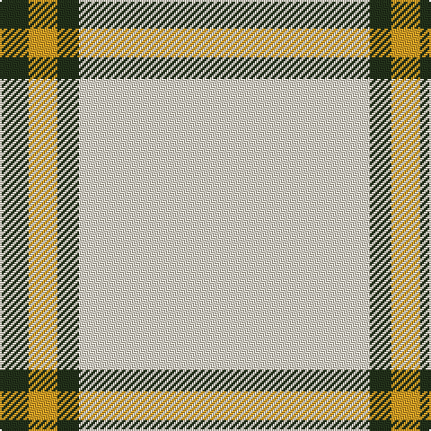

In pattern [GYGW](/patterns/gygw/).

This was sourced from register-of-tartans.  It is a [4 stripes tartan](/stripes/stripes4/).

Original link https://www.tartanregister.gov.uk/tartanDetails.aspx?ref=10241

## Thread count
K/16 Y16 K12 W/162

## Palette
Each colour and its ΔE from the base-6 reference it is a variant of.

| Colour | Shade | Base | ΔE (OKLab) |
|---|---|---|---|
| K | <code style="background-color:#23321B;">#23321B</code> `#23321B` | G <code style="background-color:#006400;">#006400</code> | 0.17 |
| W | <code style="background-color:#E8DDCB;">#E8DDCB</code> `#E8DDCB` | W <code style="background-color:#F4F4F0;">#F4F4F0</code> | 0.07 |
| Y | <code style="background-color:#E0A126;">#E0A126</code> `#E0A126` | Y <code style="background-color:#E8C000;">#E8C000</code> | 0.08 |

# Sample pattern

ID: /setts/s4/g16y16g12w162-g23321b-we8ddcb-ye0a126/
