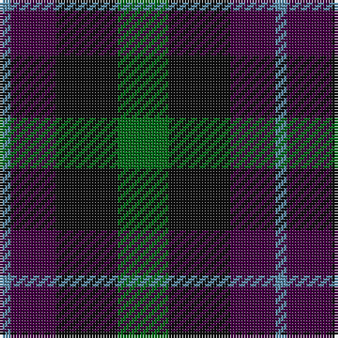

In pattern [BBKG](/patterns/bbkg/).

This was sourced from register-of-tartans.  It is a [4 stripes tartan](/stripes/stripes4/).

Original link https://www.tartanregister.gov.uk/tartanDetails.aspx?ref=4755

## Thread count
B/4 DP16 K22 G/18

## Palette
Each colour and its ΔE from the base-6 reference it is a variant of.

| Colour | Shade | Base | ΔE (OKLab) |
|---|---|---|---|
| B | <code style="background-color:#5C8CA8;">#5C8CA8</code> `#5C8CA8` | B <code style="background-color:#2C4084;">#2C4084</code> | 0.23 |
| DG | <code style="background-color:#003820;">#003820</code> `#003820` | G <code style="background-color:#006400;">#006400</code> | 0.16 |
| DP | <code style="background-color:#440044;">#440044</code> `#440044` | B <code style="background-color:#2C4084;">#2C4084</code> | 0.17 |
| G | <code style="background-color:#006818;">#006818</code> `#006818` | G <code style="background-color:#006400;">#006400</code> | 0.02 |
| K | <code style="background-color:#101010;">#101010</code> `#101010` | K <code style="background-color:#000000;">#000000</code> | 0.17 |
| LG | <code style="background-color:#789484;">#789484</code> `#789484` | G <code style="background-color:#006400;">#006400</code> | 0.23 |

# Sample pattern

## Nearest tartans

The nearest existing variants by ΔTartan distance.

1. [Unidentified pattern #3](/setts/s4/b16k20g16r4-b2c4084-g005020-k101010-rdc0000/) — ΔT 0.60
1. [Norwich Collection No. 60](/setts/s4/b16k22g18r4-b780078-g006818-k101010-rc80000/) — ΔT 0.83
1. [Denholme Family Tartan Tartan Number: 1084. Earliest known date: Unknown This tartan is remarkably similar to the Durham sett designed by Wilson's of Bannockburn around 1819. The variation in proportions may point to a deliberate modification suggested by the links between the names. See products available Copyright © Blair Urquhart, Comrie, 2015](/setts/s5/k4g16k14b16r4-b2c2c80-g006818-k101010-rc80000/) — ΔT 0.88
1. [Unidentified No 60](/setts/s4/b12k10g10r2-b5a008c-g005020-k101010-rdc0000/) — ΔT 1.06
1. [Durham District Tartan Tartan Number: 1089. Earliest known date: 1819 It was Wilson's practice to give the names of towns to many of his new designs. Maybe because the order came from there or because it was the name of the purchaser. There was a family of Durhams associated with the Royal Court in Edinburgh prior to the Union of the Crowns. Wilson was also a collector of tartans, receiving samples from his agents in the Highlands and from purchase orders from around the world. See 'Denholme' and 'Urquhart'. See products available Copyright © Blair Urquhart, Comrie, 2015](/setts/s5/k4g12k12b12r4-b2c2c80-g006818-k101010-rc80000/) — ΔT 1.06
1. [Wilson's No 220](/setts/s4/b16k22g18w4-b5a008c-g005020-k101010-we0e0e0/) — ΔT 1.10
1. [Gunn - 1810 (Clan)](/setts/s6/r8g24k24g4b24g6-b1c0070-g006818-k101010-rc80000/) — ΔT 1.27
1. [Abercrombie (Wilsons No 2/64)](/setts/s7/k24g24y4g24k24b24k4-b5a008c-g005020-k101010-ye8c000/) — ΔT 1.29
1. [Wilson's No 97](/setts/s7/k22g24k4g24k24b24w6-b5a008c-g005020-k101010-we0e0e0/) — ΔT 1.33
1. [MacNeil of Colonsay](/setts/s7/b8g12w2g12k12b12k4-b2c2c80-g285800-k101010-wffffff/) — ΔT 1.35

## Neighbour map

Every grey dot is one of 15726 variants placed by the first two principal components of the ΔTartan feature space (44% of its variance). Red is this tartan; blue dots are its nearest — click one to open its page.

<svg viewBox="0 0 640 380" role="img" style="max-width:100%;height:auto;border:1px solid #e0e0e0;border-radius:4px;display:block" xmlns="http://www.w3.org/2000/svg"><image href="/nn/cloud.v1.png" width="640" height="380"/><a href="/setts/s4/b16k20g16r4-b2c4084-g005020-k101010-rdc0000/"><circle cx="167.5" cy="317.3" r="4" fill="#3465a4"><title>Unidentified pattern #3</title></circle></a><a href="/setts/s4/b16k22g18r4-b780078-g006818-k101010-rc80000/"><circle cx="156.4" cy="294.3" r="4" fill="#3465a4"><title>Norwich Collection No. 60</title></circle></a><a href="/setts/s5/k4g16k14b16r4-b2c2c80-g006818-k101010-rc80000/"><circle cx="140.6" cy="296.3" r="4" fill="#3465a4"><title>Denholme Family Tartan Tartan Number: 1084. Earliest known date: Unknown This tartan is remarkably similar to the Durham sett designed by Wilson's of Bannockburn around 1819. The variation in proportions may point to a deliberate modification suggested by the links between the names. See products available Copyright © Blair Urquhart, Comrie, 2015</title></circle></a><a href="/setts/s4/b12k10g10r2-b5a008c-g005020-k101010-rdc0000/"><circle cx="169.1" cy="297.9" r="4" fill="#3465a4"><title>Unidentified No 60</title></circle></a><a href="/setts/s5/k4g12k12b12r4-b2c2c80-g006818-k101010-rc80000/"><circle cx="128.6" cy="314.3" r="4" fill="#3465a4"><title>Durham District Tartan Tartan Number: 1089. Earliest known date: 1819 It was Wilson's practice to give the names of towns to many of his new designs. Maybe because the order came from there or because it was the name of the purchaser. There was a family of Durhams associated with the Royal Court in Edinburgh prior to the Union of the Crowns. Wilson was also a collector of tartans, receiving samples from his agents in the Highlands and from purchase orders from around the world. See 'Denholme' and 'Urquhart'. See products available Copyright © Blair Urquhart, Comrie, 2015</title></circle></a><a href="/setts/s4/b16k22g18w4-b5a008c-g005020-k101010-we0e0e0/"><circle cx="140.6" cy="292.3" r="4" fill="#3465a4"><title>Wilson's No 220</title></circle></a><a href="/setts/s6/r8g24k24g4b24g6-b1c0070-g006818-k101010-rc80000/"><circle cx="164.8" cy="260.4" r="4" fill="#3465a4"><title>Gunn - 1810 (Clan)</title></circle></a><a href="/setts/s7/k24g24y4g24k24b24k4-b5a008c-g005020-k101010-ye8c000/"><circle cx="190.5" cy="274.7" r="4" fill="#3465a4"><title>Abercrombie (Wilsons No 2/64)</title></circle></a><a href="/setts/s7/k22g24k4g24k24b24w6-b5a008c-g005020-k101010-we0e0e0/"><circle cx="162.9" cy="271.8" r="4" fill="#3465a4"><title>Wilson's No 97</title></circle></a><a href="/setts/s7/b8g12w2g12k12b12k4-b2c2c80-g285800-k101010-wffffff/"><circle cx="159.2" cy="276.1" r="4" fill="#3465a4"><title>MacNeil of Colonsay</title></circle></a><circle cx="166.0" cy="305.3" r="5" fill="#c00000"/></svg>

ID: /setts/s4/g18k22b16ba4-b440044-ba5c8ca8-g006818-k101010/
