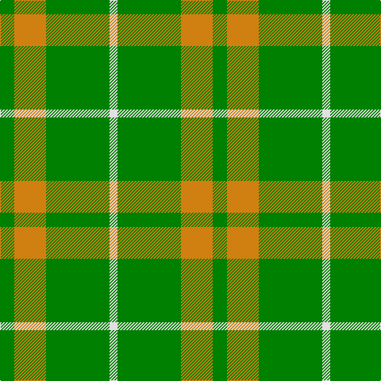

In pattern [GYGW](/patterns/gygw/).

This was sourced from weddslist.  It is a [4 stripes tartan](/stripes/stripes4/).

Original link http://www.weddslist.com/cgi-bin/tartans/pg.pl?source=sts

## Thread count
G/18 O40 G80 LN/10

## Palette
Each colour and its ΔE from the base-6 reference it is a variant of.

| Colour | Shade | Base | ΔE (OKLab) |
|---|---|---|---|
| G | <code style="background-color:#008000;">#008000</code> `#008000` | G <code style="background-color:#006100;">#006100</code> | 0.10 |
| LN | <code style="background-color:#E0E0E0;">#E0E0E0</code> `#E0E0E0` | W <code style="background-color:#F7F7F7;">#F7F7F7</code> | 0.07 |
| O | <code style="background-color:#D08010;">#D08010</code> `#D08010` | Y <code style="background-color:#F2BF00;">#F2BF00</code> | 0.17 |

# Sample pattern

## Nearest tartans

The nearest existing variants by ΔTartan distance.

1. [O'Neill (Australia) (Name)](/setts/s4/g18r40g80w10-g006818-r98481c-we0e0e0/) — ΔT 1.13
1. [Ledford Family Tartan Tartan Number: 835. Earliest known date: 1987 A quantity of this cloth was woven in 1998 for a Ledford family in the USA. See products available Copyright © Blair Urquhart, Comrie, 2015](/setts/s3/g36r16y4-g006818-r888888-ye8c000/) — ΔT 1.31
1. [Wilson's, No 212](/setts/s3/g36r8b8-b5480b0-g008000-rc00000/) — ΔT 1.36
1. [Highland Spring (Green)](/setts/s4/g14r6g46ra14-g008000-rc00000-ra802040/) — ΔT 1.37
1. [O'Neill, Red (Corporate?)](/setts/s4/g18r40g92y10-g006818-rb84c00-y48a4c0/) — ΔT 1.43
1. [O'Neill Irish Family Tartan Tartan Number: 2464. Earliest known date: 1985 O'Neill is an Irish family tartan. The dark yellow stripe is mustard or dark saffron. See products available Copyright © Blair Urquhart, Comrie, 2015](/setts/s4/g18y40g80w10-g006818-we0e0e0-ye8c000/) — ΔT 1.46
1. [McMoosie](/setts/s3/g162r20y40-g006818-rc80000-ye8c000/) — ΔT 1.53
1. [Colonial Marine (Aliens Legacy)](/setts/s4/g112ga26y26w10-g008b45-ga5c4033-we6e6fa-yffc125/) — ΔT 1.68
1. [O'Neill (Australia)](/setts/s6/r40g80w10g80r40g18-g006818-r98481c-we0e0e0/) — ΔT 1.75
1. [O'Neill, Red](/setts/s6/g92r40g18r40g92y10-g006818-rb84c00-y48a4c0/) — ΔT 1.76

## Neighbour map

Every grey dot is one of 15726 variants placed by the first two principal components of the ΔTartan feature space (44% of its variance). Red is this tartan; blue dots are its nearest — click one to open its page.

<svg viewBox="0 0 640 380" role="img" style="max-width:100%;height:auto;border:1px solid #e0e0e0;border-radius:4px;display:block" xmlns="http://www.w3.org/2000/svg"><image href="/nn/cloud.v1.png" width="640" height="380"/><a href="/setts/s4/g18r40g80w10-g006818-r98481c-we0e0e0/"><circle cx="414.1" cy="283.8" r="4" fill="#3465a4"><title>O'Neill (Australia) (Name)</title></circle></a><a href="/setts/s3/g36r16y4-g006818-r888888-ye8c000/"><circle cx="416.4" cy="299.3" r="4" fill="#3465a4"><title>Ledford Family Tartan Tartan Number: 835. Earliest known date: 1987 A quantity of this cloth was woven in 1998 for a Ledford family in the USA. See products available Copyright © Blair Urquhart, Comrie, 2015</title></circle></a><a href="/setts/s3/g36r8b8-b5480b0-g008000-rc00000/"><circle cx="416.3" cy="315.5" r="4" fill="#3465a4"><title>Wilson's, No 212</title></circle></a><a href="/setts/s4/g14r6g46ra14-g008000-rc00000-ra802040/"><circle cx="475.8" cy="285.8" r="4" fill="#3465a4"><title>Highland Spring (Green)</title></circle></a><a href="/setts/s4/g18r40g92y10-g006818-rb84c00-y48a4c0/"><circle cx="464.4" cy="283.7" r="4" fill="#3465a4"><title>O'Neill, Red (Corporate?)</title></circle></a><a href="/setts/s4/g18y40g80w10-g006818-we0e0e0-ye8c000/"><circle cx="364.0" cy="261.1" r="4" fill="#3465a4"><title>O'Neill Irish Family Tartan Tartan Number: 2464. Earliest known date: 1985 O'Neill is an Irish family tartan. The dark yellow stripe is mustard or dark saffron. See products available Copyright © Blair Urquhart, Comrie, 2015</title></circle></a><a href="/setts/s3/g162r20y40-g006818-rc80000-ye8c000/"><circle cx="443.2" cy="273.6" r="4" fill="#3465a4"><title>McMoosie</title></circle></a><a href="/setts/s4/g112ga26y26w10-g008b45-ga5c4033-we6e6fa-yffc125/"><circle cx="364.1" cy="223.2" r="4" fill="#3465a4"><title>Colonial Marine (Aliens Legacy)</title></circle></a><a href="/setts/s6/r40g80w10g80r40g18-g006818-r98481c-we0e0e0/"><circle cx="422.7" cy="290.1" r="4" fill="#3465a4"><title>O'Neill (Australia)</title></circle></a><a href="/setts/s6/g92r40g18r40g92y10-g006818-rb84c00-y48a4c0/"><circle cx="456.3" cy="281.0" r="4" fill="#3465a4"><title>O'Neill, Red</title></circle></a><circle cx="406.7" cy="278.8" r="5" fill="#c00000"/></svg>

ID: /setts/s4/g18y40g80w10-g008000-we0e0e0-yd08010/
