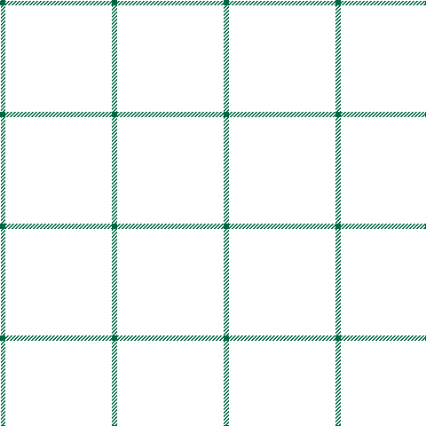

In pattern [GKKG](/stripes/gkkg/).

This was sourced from register-of-tartans.  It is a [4 stripe tartan](/stripes/stripes4/).

Original link https://www.tartanregister.gov.uk/tartanDetails.aspx?ref=5774

## Register references

External register numbers recorded for this tartan.

- Scottish Register of Tartans: [5774](https://www.tartanregister.gov.uk/tartanDetails.aspx?ref=5774)
- Scottish Tartans Authority (ITI): 7817

## Thread count
Gb/6 DR60 DWR60 Gb/6

## Palette
Each colour and the base-6 reference it is a variant of.

| Colour | Shade | Base |
|---|---|---|
| B | <code style="background-color:#487CB8;">#487CB8</code> `oklch(57.7% 0.109 253.2)` <small>#487CB8</small> | B <code style="background-color:#2A418A;">#2A418A</code> |
| Ba | <code style="background-color:#105088;">#105088</code> `oklch(42.4% 0.111 250.4)` <small>#105088</small> | B <code style="background-color:#2A418A;">#2A418A</code> |
| DB | <code style="background-color:#2C2C80;">#2C2C80</code> `oklch(35.0% 0.138 276.6)` <small>#2C2C80</small> | B <code style="background-color:#2A418A;">#2A418A</code> |
| G | <code style="background-color:#006818;">#006818</code> `oklch(45.0% 0.142 145.0)` <small>#006818</small> | G <code style="background-color:#006100;">#006100</code> |
| Ga | <code style="background-color:#449020;">#449020</code> `oklch(58.3% 0.162 137.8)` <small>#449020</small> | G <code style="background-color:#006100;">#006100</code> |
| Gb | <code style="background-color:#006840;">#006840</code> `oklch(45.6% 0.106 158.5)` <small>#006840</small> | G <code style="background-color:#006100;">#006100</code> |
| K | <code style="background-color:#101010;">#101010</code> `oklch(17.3% 0.000 89.9)` <small>#101010</small> | K <code style="background-color:#000000;">#000000</code> |
| LN | <code style="background-color:#E0E0E0;">#E0E0E0</code> `oklch(90.7% 0.000 89.9)` <small>#E0E0E0</small> | W <code style="background-color:#F7F7F7;">#F7F7F7</code> |

# Sample pattern

## Nearest tartans

The nearest existing variants by ΔTartan distance, with this tartan at the top so the swatches line up against it.

ΔTartan

Tartan

Sett

—

<a href="/ttd/edit/#slug=g1k10k10g1~x6">Stirling of Keir</a> <a class="nn-out" href="/setts/s4/g1k10k10g1~x6/" title="open its dictionary page">↗</a>

2.98

<a href="/ttd/edit/#slug=k43dg8k8dt21dg10w2~x2">Longmuir (2014)</a> <a class="nn-out" href="/setts/s6/k43dg8k8dt21dg10w2~x2/" title="open its dictionary page">↗</a>

2.98

<a href="/ttd/edit/#slug=db5k2db14k14db2k2r2~x2">Royal Scotsman Train</a> <a class="nn-out" href="/setts/s7/db5k2db14k14db2k2r2~x2/" title="open its dictionary page">↗</a>

3.25

<a href="/ttd/edit/#slug=dg18db2dg5r2dg5k21k20k5~x2">MacRae, Special Hunting</a> <a class="nn-out" href="/setts/s8/dg18db2dg5r2dg5k21k20k5~x2/" title="open its dictionary page">↗</a>

3.25

<a href="/ttd/edit/#slug=dg7db1dg1k4dp4k1~x4">MacArthur of Milton Hunting</a> <a class="nn-out" href="/setts/s6/dg7db1dg1k4dp4k1~x4/" title="open its dictionary page">↗</a>

3.27

<a href="/ttd/edit/#slug=dt43dg8dt8dt21dg10w2~x2">Longmuir (2014)</a> <a class="nn-out" href="/setts/s6/dt43dg8dt8dt21dg10w2~x2/" title="open its dictionary page">↗</a>

3.28

<a href="/ttd/edit/#slug=db1k8db2dg16dr6dg16db2k8w1~x2">Basel Tattoo (Official)</a> <a class="nn-out" href="/setts/s9/db1k8db2dg16dr6dg16db2k8w1~x2/" title="open its dictionary page">↗</a>

3.33

<a href="/ttd/edit/#slug=m2k13db4k13dg6k17dg23w1~x2">Meiklejohn (Personal)</a> <a class="nn-out" href="/setts/s8/m2k13db4k13dg6k17dg23w1~x2/" title="open its dictionary page">↗</a>

3.41

<a href="/ttd/edit/#slug=dt4k43k20dt7y2~x2">Deighan (Edinburgh)</a> <a class="nn-out" href="/setts/s5/dt4k43k20dt7y2~x2/" title="open its dictionary page">↗</a>

3.49

<a href="/ttd/edit/#slug=dg43k14k14r2~x2">Feddinch Club, St Andrews Limited, The</a> <a class="nn-out" href="/setts/s4/dg43k14k14r2~x2/" title="open its dictionary page">↗</a>

3.50

<a href="/ttd/edit/#slug=db4k4db16k14dg14m3dg3~x2">Inneryne (Personal)</a> <a class="nn-out" href="/setts/s7/db4k4db16k14dg14m3dg3~x2/" title="open its dictionary page">↗</a>

## Neighbour map

Every grey dot is one of 14299 variants placed by the first two principal components of the ΔTartan feature space (44% of its variance). Red is this tartan; blue dots are its nearest — click one to open its page.

<svg viewBox="0 0 640 380" role="img" style="max-width:100%;height:auto;border:1px solid #e0e0e0;border-radius:4px;display:block" xmlns="http://www.w3.org/2000/svg"><image href="/nn/cloud.v1.png" width="640" height="380"/><a href="/setts/s6/k43dg8k8dt21dg10w2~x2/"><circle cx="422.5" cy="251.8" r="4" fill="#3465a4"><title>Longmuir (2014)</title></circle></a><a href="/setts/s7/db5k2db14k14db2k2r2~x2/"><circle cx="431.1" cy="309.7" r="4" fill="#3465a4"><title>Royal Scotsman Train</title></circle></a><a href="/setts/s8/dg18db2dg5r2dg5k21k20k5~x2/"><circle cx="304.4" cy="273.5" r="4" fill="#3465a4"><title>MacRae, Special Hunting</title></circle></a><a href="/setts/s6/dg7db1dg1k4dp4k1~x4/"><circle cx="345.2" cy="314.0" r="4" fill="#3465a4"><title>MacArthur of Milton Hunting</title></circle></a><a href="/setts/s6/dt43dg8dt8dt21dg10w2~x2/"><circle cx="426.2" cy="252.4" r="4" fill="#3465a4"><title>Longmuir (2014)</title></circle></a><a href="/setts/s9/db1k8db2dg16dr6dg16db2k8w1~x2/"><circle cx="400.8" cy="251.1" r="4" fill="#3465a4"><title>Basel Tattoo (Official)</title></circle></a><a href="/setts/s8/m2k13db4k13dg6k17dg23w1~x2/"><circle cx="454.5" cy="266.5" r="4" fill="#3465a4"><title>Meiklejohn (Personal)</title></circle></a><a href="/setts/s5/dt4k43k20dt7y2~x2/"><circle cx="533.0" cy="302.7" r="4" fill="#3465a4"><title>Deighan (Edinburgh)</title></circle></a><a href="/setts/s4/dg43k14k14r2~x2/"><circle cx="480.3" cy="288.6" r="4" fill="#3465a4"><title>Feddinch Club, St Andrews Limited, The</title></circle></a><a href="/setts/s7/db4k4db16k14dg14m3dg3~x2/"><circle cx="292.3" cy="331.0" r="4" fill="#3465a4"><title>Inneryne (Personal)</title></circle></a><circle cx="418.3" cy="343.6" r="5" fill="#c00000"/></svg>

ID: /setts/s4/g1k10k10g1~x6/
