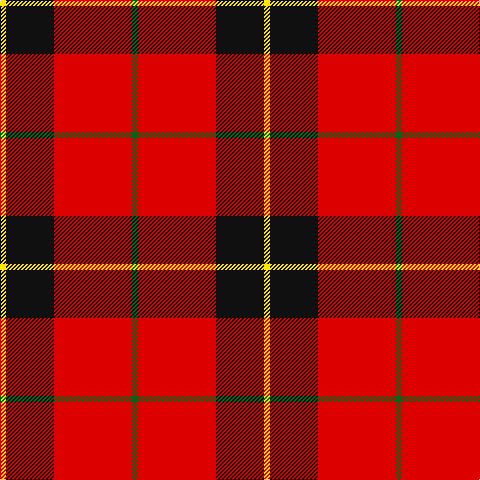

In pattern [GRKY](/stripes/grky/).

This was sourced from register-of-tartans.  It is a [4 stripe tartan](/stripes/stripes4/).

Original link https://www.tartanregister.gov.uk/tartanDetails.aspx?ref=11143

## Register references

External register numbers recorded for this tartan.

- Scottish Register of Tartans: [11143](https://www.tartanregister.gov.uk/tartanDetails.aspx?ref=11143)

## Thread count
Y/6 K48 R78 G/6

## Palette
Each colour and the base-6 reference it is a variant of.

| Colour | Shade | Base |
|---|---|---|
| G | <code style="background-color:#006818;">#006818</code> `oklch(45.0% 0.142 145.0)` <small>#006818</small> | G <code style="background-color:#006100;">#006100</code> |
| K | <code style="background-color:#101010;">#101010</code> `oklch(17.3% 0.000 89.9)` <small>#101010</small> | K <code style="background-color:#000000;">#000000</code> |
| R | <code style="background-color:#DC0000;">#DC0000</code> `oklch(56.2% 0.230 29.2)` <small>#DC0000</small> | R <code style="background-color:#CC0000;">#CC0000</code> |
| Y | <code style="background-color:#FFE600;">#FFE600</code> `oklch(91.7% 0.192 101.4)` <small>#FFE600</small> | Y <code style="background-color:#F2BF00;">#F2BF00</code> |

# Sample pattern

## Nearest tartans

The nearest existing variants by ΔTartan distance.

1. [Oklahoma State University (Corporate](/setts/s4/r80k52w7o12/) — ΔT 0.97
1. [Dunbar #2](/setts/s6/k4r26k4w2k13ly4~x2/) — ΔT 1.14
1. [Dunbar (District)](/setts/s4/r28k4w2k13~x2/) — ΔT 1.17
1. [MacKintosh #4](/setts/s6/r5w2r28k12dg16r3~x2/) — ΔT 1.17
1. [MacGregor, Black (Personal)](/setts/s5/r41k19r7k9w3~x2/) — ΔT 1.19
1. [Turner (Personal)](/setts/s5/r48k12o7k5w3~x2/) — ΔT 1.23
1. [MacKeane](/setts/s5/r4k8r12k1ly1~x2/) — ΔT 1.28
1. [Hopkins (Name)](/setts/s5/r36k18r4k7w2~x2/) — ΔT 1.32
1. [Masai Shuka 26 (Artefact)](/setts/s4/ly3k2r10k1~x4/) — ΔT 1.34
1. [Sturrock](/setts/s6/r52k32dg22r16ly3r16/) — ΔT 1.35

## Neighbour map

Every grey dot is one of 14299 variants placed by the first two principal components of the ΔTartan feature space (44% of its variance). Red is this tartan; blue dots are its nearest — click one to open its page.

<svg viewBox="0 0 640 380" role="img" style="max-width:100%;height:auto;border:1px solid #e0e0e0;border-radius:4px;display:block" xmlns="http://www.w3.org/2000/svg"><image href="/nn/cloud.v1.png" width="640" height="380"/><a href="/setts/s4/r80k52w7o12/"><circle cx="289.6" cy="205.7" r="4" fill="#3465a4"><title>Oklahoma State University (Corporate</title></circle></a><a href="/setts/s6/k4r26k4w2k13ly4~x2/"><circle cx="281.4" cy="165.5" r="4" fill="#3465a4"><title>Dunbar #2</title></circle></a><a href="/setts/s4/r28k4w2k13~x2/"><circle cx="375.2" cy="209.8" r="4" fill="#3465a4"><title>Dunbar (District)</title></circle></a><a href="/setts/s6/r5w2r28k12dg16r3~x2/"><circle cx="301.3" cy="181.1" r="4" fill="#3465a4"><title>MacKintosh #4</title></circle></a><a href="/setts/s5/r41k19r7k9w3~x2/"><circle cx="382.7" cy="201.8" r="4" fill="#3465a4"><title>MacGregor, Black (Personal)</title></circle></a><a href="/setts/s5/r48k12o7k5w3~x2/"><circle cx="395.1" cy="161.0" r="4" fill="#3465a4"><title>Turner (Personal)</title></circle></a><a href="/setts/s5/r4k8r12k1ly1~x2/"><circle cx="384.8" cy="212.9" r="4" fill="#3465a4"><title>MacKeane</title></circle></a><a href="/setts/s5/r36k18r4k7w2~x2/"><circle cx="399.6" cy="189.5" r="4" fill="#3465a4"><title>Hopkins (Name)</title></circle></a><a href="/setts/s4/ly3k2r10k1~x4/"><circle cx="367.3" cy="212.0" r="4" fill="#3465a4"><title>Masai Shuka 26 (Artefact)</title></circle></a><a href="/setts/s6/r52k32dg22r16ly3r16/"><circle cx="328.7" cy="189.6" r="4" fill="#3465a4"><title>Sturrock</title></circle></a><circle cx="330.1" cy="191.1" r="5" fill="#c00000"/></svg>

ID: /setts/s4/g1r13k8ly1~x6/
